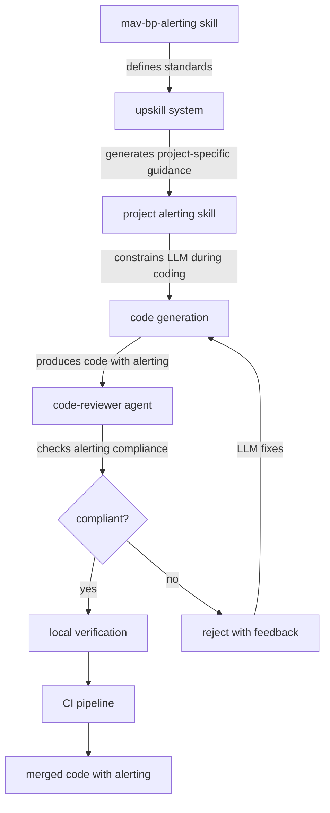
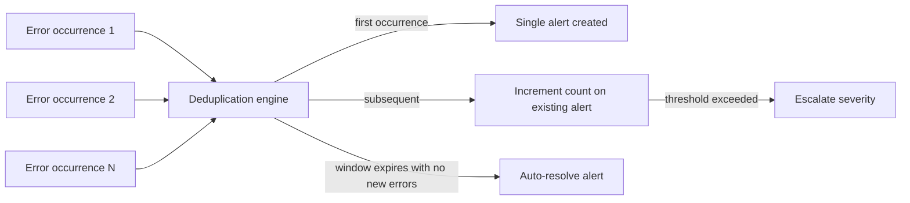

# Alerting Standards

Alerting notifies operations teams when systems fail or degrade beyond acceptable thresholds. In LLM-driven development, alerting is a critical safety net: code generated without human oversight must be instrumented to signal when it misbehaves in production. Without enforced alerting standards, failures in LLM-generated code go undetected until users report them.

## Why Alerting Matters for LLM-Generated Code

### LLMs write error handling that hides failures

LLMs produce error-handling patterns optimised for code that compiles and runs without crashing, not for code that surfaces problems. Common failure modes in LLM-generated error handling:

- **Empty catch blocks** - exceptions caught and silently discarded, with no logging or alerting
- **Generic catch-all handlers** - broad exception types caught with a generic error message, losing the specific failure context
- **Swallowed errors in async code** - promises that catch errors and resolve successfully, hiding failures from calling code
- **Retry without escalation** - retry logic that silently retries indefinitely without ever alerting on persistent failures
- **Graceful degradation without visibility** - fallback behaviour that masks the fact that the primary path is broken

### Unattended development means nobody is watching

In attended development, a human developer may notice test failures, error logs, or degraded performance during development and deployment. In unattended LLM development:

- The LLM generates, tests, and ships code without a human reviewing operational behaviour
- If the generated code handles errors silently, no human is in the loop to catch it
- Failures may accumulate for hours or days before a user reports a visible symptom
- By the time the failure is noticed, the root cause may be buried under subsequent deployments

This makes alerting the primary mechanism for detecting problems in LLM-generated code after it reaches production.

### Alert fatigue is an LLM-amplified risk

An LLM that is told to "add alerting" without constraints will alert on every error condition. This produces a system that alerts constantly, causing teams to ignore alerts entirely. Alert fatigue is worse than no alerting because it creates a false sense of coverage while providing no actual detection capability. Maverick constrains alerting to prevent this: alert on patterns and thresholds, not individual occurrences; classify severity to route alerts appropriately; deduplicate repeated alerts for the same underlying issue.

## How Maverick Enforces Alerting Standards

Maverick enforces alerting through the same multi-layer pattern used for all best practices.

### Layer 1: mav-bp-alerting skill

The mav-bp-alerting skill defines universal alerting standards: severity levels, context requirements, deduplication rules, and anti-patterns to avoid. This skill is loaded into every LLM session.

### Layer 2: project-specific alerting skill

The upskill system analyses a project's existing alerting infrastructure and generates a project-specific alerting guide. This tells the LLM which alerting service the project uses (SNS, PagerDuty, Opsgenie, custom), what severity thresholds apply, and how alerts should be routed. Without this layer, the LLM applies generic alerting patterns that may not integrate with the project's operational setup.

### Layer 3: code-reviewer agent

The code-reviewer agent inspects error-handling code for alerting compliance. It checks that unrecoverable errors trigger alerts, that alert severity is appropriate, that alert context includes required fields, and that recoverable errors are not over-alerted. Violations are flagged with specific guidance.

## Severity Levels

Maverick defines three severity levels that map to different response expectations.

| Severity | Definition                                   | Response expectation                      | Examples                                                                                             |
| -------- | -------------------------------------------- | ----------------------------------------- | ---------------------------------------------------------------------------------------------------- |
| critical | System is down or data integrity is at risk  | Immediate response required, page on-call | Database connection pool exhausted, data corruption detected, authentication service unreachable     |
| high     | Service is degraded but partially functional | Response within SLA (typically 1 hour)    | External API returning errors above threshold, queue processing stalled, cache layer unavailable     |
| warning  | Emerging issue that may escalate             | Review during business hours              | Error rate trending upward, disk usage approaching threshold, deprecated API still receiving traffic |

### Severity assignment principles

- Severity must reflect business impact, not technical severity
- A failed background job that affects no users is not critical, even if it throws an unhandled exception
- A subtle data inconsistency that affects billing is critical, even if the application continues running
- When in doubt, the LLM should default to high and let the project-specific alerting skill adjust

## Alert Context Requirements

Every alert must include sufficient context for an on-call responder to begin investigation without reading source code.

| Field             | Required           | Description                                        |
| ----------------- | ------------------ | -------------------------------------------------- |
| severity          | Yes                | One of critical, high, warning                     |
| service           | Yes                | Name of the service that generated the alert       |
| error_message     | Yes                | Human-readable description of what failed          |
| timestamp         | Yes                | ISO 8601 timestamp of when the failure occurred    |
| affected_resource | Yes                | The entity, endpoint, or operation that failed     |
| correlation_id    | If available       | Request or trace ID for log correlation            |
| error_count       | If threshold-based | Number of occurrences that triggered the threshold |
| log_pointer       | If available       | Direct link or query to related log entries        |
| runbook_url       | If available       | Link to the relevant runbook for this failure type |

## Deduplication and Throttling

Alert deduplication prevents the same underlying failure from generating hundreds of individual alerts.

### Deduplication rules

- Alerts for the same error type from the same service within a configurable window (default 5 minutes) must be deduplicated into a single alert with an occurrence count
- The first occurrence triggers the alert; subsequent occurrences increment the count
- If the error stops occurring, the alert resolves automatically after the deduplication window expires
- If the error rate exceeds a higher threshold during the deduplication window, the severity may be escalated

### Throttling rules

- No service should generate more than one alert per error type per deduplication window
- Burst protection: if a service generates alerts for more than N distinct error types within a window, a single aggregate alert should replace the individual alerts
- Suppression during maintenance windows must be supported

## Relationship Between Alerting and Logging

Alerting and logging serve different purposes and must not be conflated.

| Aspect      | Logging                                 | Alerting                                                       |
| ----------- | --------------------------------------- | -------------------------------------------------------------- |
| Purpose     | Record what happened for later analysis | Notify that something requires attention now                   |
| Audience    | Engineers investigating after the fact  | On-call responders who need to act immediately                 |
| Volume      | High - every significant event          | Low - only actionable conditions                               |
| Trigger     | Every occurrence of a loggable event    | Thresholds, patterns, or unrecoverable failures                |
| Persistence | Stored in aggregation platform          | Delivered via notification channel, tracked in incident system |

### The correct pattern

1. Log the error with full structured context (see logging-standards.md)
2. Evaluate whether the error meets alerting thresholds
3. If yes, trigger an alert that references the log entries
4. Never alert without logging - the alert must have logs to correlate with
5. Never log without considering whether alerting is needed - error-level logs should always have an alerting decision

### Anti-patterns

- **Alert instead of log** - sending an alert but not logging the error means responders have no diagnostic data
- **Log instead of alert** - logging an unrecoverable error but not alerting means nobody knows until they happen to check logs
- **Alert on every error** - alerting on every individual error occurrence creates noise; use thresholds
- **Alert on recoverable errors** - retry-succeeded, validation-failed, and expected-error-response conditions should be logged but not alerted

## Centralised Alerting

Alerts must be routed through a centralised alerting platform, not sent ad-hoc via email, Slack messages, or custom notification code.

### Requirements

- All services must route alerts through the same platform
- Alert routing rules must be configurable without code changes
- Escalation policies must be defined for each severity level
- Alert history must be retained for post-incident analysis
- The project-specific alerting skill generated by upskill specifies which platform the project uses

## Common Alerting Anti-Patterns in LLM-Generated Code

The following anti-patterns appear frequently in LLM-generated code and are flagged by the code-reviewer agent.

| Anti-pattern                | Description                                                                                          | Correct approach                                                                           |
| --------------------------- | ---------------------------------------------------------------------------------------------------- | ------------------------------------------------------------------------------------------ |
| Alert on every exception    | Triggering an alert for every caught exception regardless of recoverability                          | Classify errors by severity; only alert on unrecoverable or threshold-exceeding conditions |
| Silent catch blocks         | Catching exceptions with no logging and no alerting                                                  | At minimum log the error; evaluate whether alerting is warranted based on severity         |
| Alert without context       | Sending alerts with only an error message and no operational metadata                                | Include all required context fields: service, resource, correlation ID, timestamp          |
| Hardcoded alert thresholds  | Embedding numeric thresholds directly in application code                                            | Use configuration that can be adjusted without redeployment                                |
| Alerting on expected errors | Alerting on validation failures, 404 responses, or other expected error conditions                   | Log expected errors at warn or debug level; do not alert                                   |
| Custom notification code    | Writing bespoke email or Slack notification logic instead of using the centralised alerting platform | Route all alerts through the project's designated alerting service                         |

## The Upskill System and Alerting

When the upskill system analyses a project for alerting, it examines:

- Which alerting platform the project uses (SNS, PagerDuty, Opsgenie, custom)
- What severity thresholds are configured and how they map to routing rules
- Which services are considered critical versus non-critical
- What existing alert definitions look like (format, context fields, deduplication settings)
- Whether the project has runbooks linked to specific alert types

The output is a project-specific alerting skill that gives the LLM concrete implementation guidance rather than abstract principles. This is essential because alerting integration is highly project-specific - the correct way to trigger an alert in one project may be completely different from another.

## Scope Boundaries and Alerting

The mav-scope-boundaries skill interacts with alerting in an important way: when the LLM generates code that handles errors near the boundary of its assigned scope, it must still add appropriate alerting even if the error originates in code outside its scope. The LLM should alert on failures it observes, not only failures it causes. See scope-boundaries.md for details on how scope constraints work.

## Further Reading

- [Alarm fatigue](https://en.wikipedia.org/wiki/Alarm_fatigue)
- [Incident management](https://en.wikipedia.org/wiki/Incident_management)
- [Site reliability engineering](https://en.wikipedia.org/wiki/Site_reliability_engineering)
- [Monitoring (computing)](https://en.wikipedia.org/wiki/Website_monitoring)
