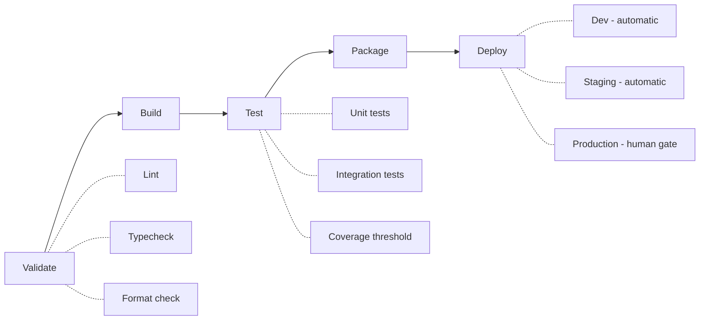
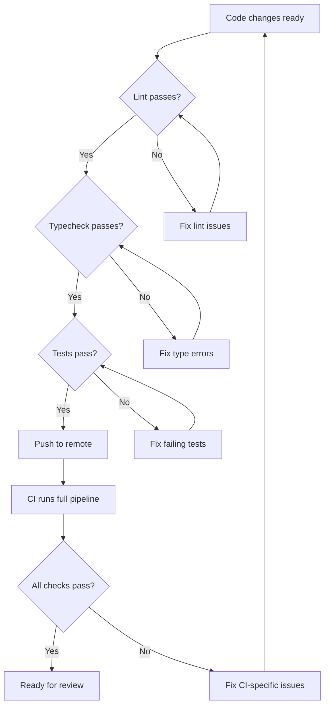

# CI/CD Integration

## The Problem

LLMs generate code that compiles and looks correct but may fail under automated verification. Type errors, linting violations, missing imports, and broken tests are common in LLM output. Without CI, these defects reach the codebase silently. In unattended development, there is no human running the tests manually.

## Why This Is Central to Maverick

In unattended LLM development, CI is the last line of defence. The verification chain works as follows:

1. The LLM generates code
2. Local verification catches obvious issues before push
3. CI catches everything else before merge
4. If both miss something, it reaches the codebase

Without CI, step 3 is absent and the only barrier is the LLM's own judgement about code correctness - which is unreliable. CI is the impartial, deterministic safety net that does not hallucinate, does not skip steps, and does not declare success prematurely.

## How Maverick Enforces It

| Skill                | Responsibility                                                            |
| -------------------- | ------------------------------------------------------------------------- |
| `mav-bp-cicd`              | Defines platform-agnostic pipeline standards and quality gates            |
| `mav-bp-cicd-github`       | GitHub Actions-specific monitoring, status checks, and workflow awareness |
| `mav-bp-cicd-gitlab`       | GitLab CI-specific pipeline monitoring and job awareness                  |
| `mav-bp-cicd-azure`        | Azure DevOps-specific pipeline monitoring and build awareness             |
| `mav-local-verification`   | Runs lint, typecheck, and tests before push (shift-left verification)     |
| `upskill`            | Detects the project's CI platform and generates project-specific guidance |

The `upskill` skill is important here: it examines the repository for CI configuration files and generates a project-level skill that tells the LLM how this specific project's pipeline works. This means the LLM knows not just generic CI practices but the actual pipeline stages, required checks, and deployment targets for the project it is working on.

## Platform Support

Maverick supports three CI platforms with dedicated skills and detects several more for project-level guidance.

### Dedicated platform skills

| Platform       | Config detection                           | Skill         |
| -------------- | ------------------------------------------ | ------------- |
| GitHub Actions | `.github/workflows/*.yml`                  | `mav-bp-cicd-github` |
| GitLab CI      | `.gitlab-ci.yml`                           | `mav-bp-cicd-gitlab` |
| Azure DevOps   | `azure-pipelines.yml`, `.azure-pipelines/` | `mav-bp-cicd-azure`  |

### Auto-detected platforms

| Platform  | Config detection          | Guidance                    |
| --------- | ------------------------- | --------------------------- |
| Jenkins   | `Jenkinsfile`             | Project skill via `upskill` |
| CircleCI  | `.circleci/config.yml`    | Project skill via `upskill` |
| Buildkite | `.buildkite/pipeline.yml` | Project skill via `upskill` |
| Travis CI | `.travis.yml`             | Project skill via `upskill` |
| TeamCity  | `.teamcity/`              | Project skill via `upskill` |

When `upskill` detects a CI platform, it generates a project-level skill describing the pipeline configuration, stages, and any platform-specific requirements the LLM must respect.

## Pipeline Stages

A well-structured CI pipeline progresses through ordered stages. Each stage gates the next - failure at any stage halts the pipeline.

### Stage definitions

| Stage    | Purpose                        | Typical tools                     | Failure action                    |
| -------- | ------------------------------ | --------------------------------- | --------------------------------- |
| Validate | Static analysis of source code | ESLint, Pylint, tsc, Prettier     | Block pipeline, fix locally       |
| Build    | Compile source into artefacts  | tsc, javac, go build, cargo build | Block pipeline, fix build errors  |
| Test     | Execute automated test suites  | Jest, pytest, JUnit, go test      | Block pipeline, fix failing tests |
| Package  | Create deployable artefacts    | Docker, npm pack, wheel           | Block pipeline, fix packaging     |
| Deploy   | Release to target environment  | Platform-specific                 | Human approval for production     |

## Quality Gates

Quality gates are pass/fail checks that must all succeed before code can merge. They are non-negotiable because LLMs will declare work "complete" before all checks pass if not explicitly constrained.

### Required quality gates

| Gate               | What it checks                            | Why LLMs need it                                            |
| ------------------ | ----------------------------------------- | ----------------------------------------------------------- |
| Lint               | Code style, potential bugs, anti-patterns | LLMs produce inconsistent style and miss anti-patterns      |
| Typecheck          | Type safety across the codebase           | LLMs hallucinate types and miss interface mismatches        |
| Format             | Consistent code formatting                | LLMs mix formatting conventions within a single session     |
| Unit tests         | Individual function/module correctness    | LLMs produce code that appears correct but fails edge cases |
| Integration tests  | Cross-module interaction                  | LLMs miss interaction effects between components            |
| Coverage threshold | Minimum test coverage percentage          | LLMs skip tests for "obvious" code if not required          |

### Gate enforcement

- All gates must pass before a PR can merge
- The LLM must not bypass gates (no `--no-verify`, no force merge)
- If a gate fails, the LLM must fix the issue and re-push, not skip the gate
- Gate configuration lives in the project's CI config and must not be modified by the LLM

## Local Verification

Local verification is the "shift left" principle applied to LLM development. Running checks locally before pushing means:

- CI failures are caught before they consume pipeline resources
- The feedback loop is faster (seconds locally vs minutes in CI)
- Other developers are not disrupted by broken builds on shared branches
- The LLM gets immediate signal about code quality

### Local verification sequence

The `mav-local-verification` skill enforces this sequence. It requires the LLM to run lint, typecheck, and tests before pushing. This means CI runs should be confirmations, not first-pass debugging sessions.

## Environment Promotion

Code moves through environments in a fixed sequence. The same artefact is promoted, not rebuilt.

| Environment | Deployment trigger                      | Rollback            | Who approves       |
| ----------- | --------------------------------------- | ------------------- | ------------------ |
| Development | Automatic on merge to `develop`         | Automatic           | No approval needed |
| Staging     | Automatic on release candidate tag      | Automatic           | No approval needed |
| Production  | Manual trigger after staging validation | Manual or automatic | Human required     |

### Key principles

- **Same artefact** - the artefact deployed to staging is identical to what reaches production. No rebuilding.
- **Environment parity** - staging mirrors production as closely as possible.
- **Human-gated production** - LLMs must never trigger production deployments. The blast radius of a bad deployment exceeds what an LLM can assess.
- **Rollback capability** - every deployment must be reversible. If something goes wrong in production, the previous version can be restored.

## CI Monitoring

After pushing code, the LLM must monitor CI status rather than declaring work complete. The sequence is:

1. Push changes to remote
2. Check CI pipeline status
3. Wait for all checks to complete
4. If checks fail, diagnose the failure and fix
5. Only declare work complete when all checks pass

This is enforced by the platform-specific skills (`mav-bp-cicd-github`, `mav-bp-cicd-gitlab`, `mav-bp-cicd-azure`) which instruct the LLM on how to check pipeline status for each platform.

## What LLMs Must Not Do

| Prohibited action                         | Reason                                              |
| ----------------------------------------- | --------------------------------------------------- |
| Modify CI pipeline configuration          | Infrastructure change outside scope                 |
| Skip or disable quality gates             | Undermines the entire verification chain            |
| Use `--no-verify` on commits or pushes    | Bypasses pre-commit and pre-push hooks              |
| Force-merge past failing checks           | Defeats the purpose of CI                           |
| Trigger production deployments            | Unacceptable blast radius for autonomous action     |
| Declare work complete before CI passes    | Premature declaration masks defects                 |
| Retry CI without fixing the issue         | Wastes resources and delays resolution              |
| Modify test thresholds to make tests pass | Gaming the quality gate rather than fixing the code |

## CI Failure Triage

When CI fails, the LLM must diagnose rather than retry blindly.

| Failure type  | Diagnosis approach                                   | Fix approach                                            |
| ------------- | ---------------------------------------------------- | ------------------------------------------------------- |
| Lint failure  | Read the lint output, identify the rule              | Fix the code to comply with the rule                    |
| Type error    | Read the type error, trace the type chain            | Fix the type mismatch at its source                     |
| Test failure  | Read the test output, identify the assertion         | Fix the code or update the test if requirements changed |
| Build failure | Read the build output, identify missing dependencies | Add dependencies or fix import paths                    |
| Timeout       | Check if tests are hanging or taking too long        | Optimise slow tests or increase timeout if justified    |
| Flaky test    | Identify non-deterministic behaviour                 | Flag for human attention, do not auto-fix               |

Flaky tests deserve special mention: an LLM should never auto-fix a flaky test because the flakiness usually indicates a deeper design issue (race conditions, external dependencies, time-sensitive assertions) that requires human judgement.

## Key Constraints for LLMs

- Always run local verification before pushing
- Always monitor CI status after pushing
- Never bypass or modify quality gates
- Never trigger production deployments
- Never declare work complete until CI passes
- Never modify CI pipeline configuration without explicit instruction
- Diagnose CI failures rather than retrying blindly
- Flag flaky tests for human attention
