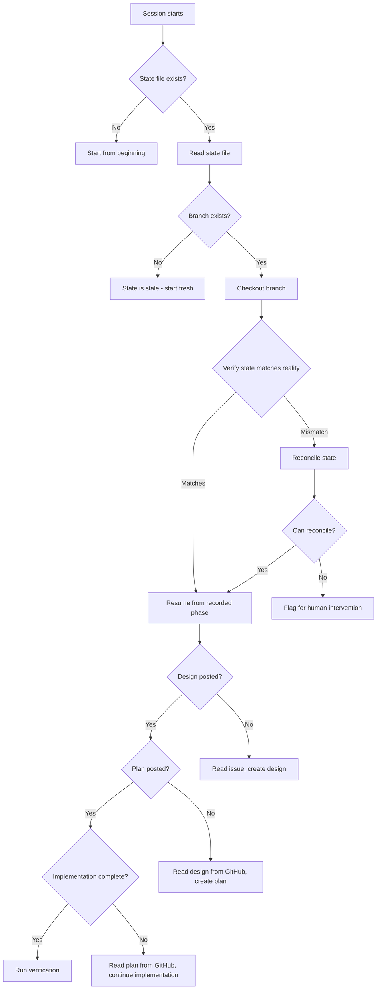
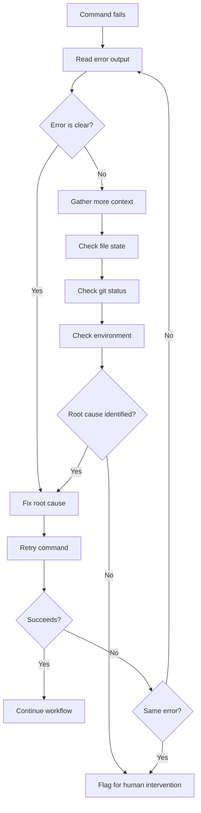
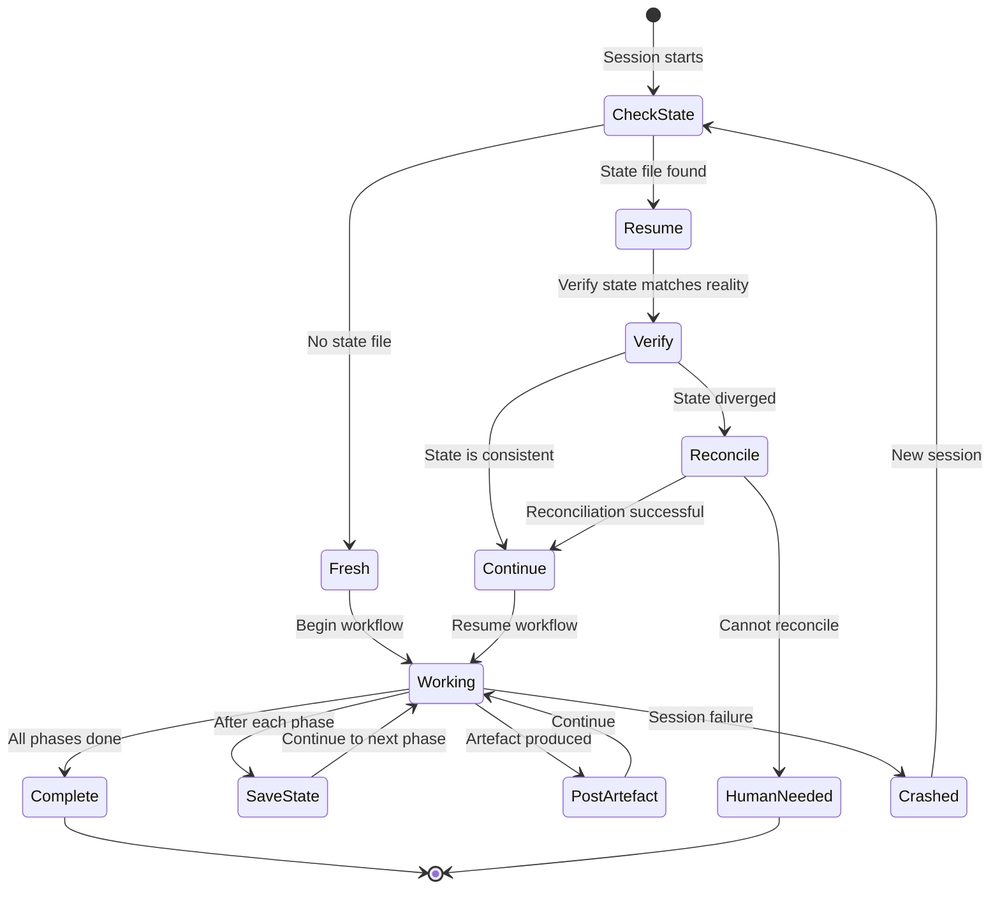

# Claude Code Error Handling and Recovery

## The Problem

LLM sessions are inherently fragile. Context windows overflow, API calls time out, network connections drop, and tools return unexpected errors. Unlike a human developer who can resume work from memory, an LLM returning to a task has zero memory of its previous reasoning. Without explicit recovery mechanisms, every interruption means starting from scratch - re-reading files, re-analysing the problem, and potentially producing conflicting changes on a branch that already has partial work.

## Why This Is Central to Maverick

Unattended LLM development WILL encounter failures. The question is not whether sessions will crash but how often and how gracefully the system recovers. Consider the failure modes:

- **Session crash mid-implementation** - code is half-written on a branch, some files changed, some not
- **Context window overflow** - the LLM loses its working memory mid-task
- **Tool failure** - a git command, build step, or API call returns an error
- **Subagent failure** - a dispatched subagent fails to complete its assigned work
- **Partial state** - the state file says "phase 3 complete" but the branch does not reflect it

Without recovery mechanisms, each of these scenarios produces inconsistent state that a new session cannot reason about. Maverick encodes recovery patterns so the LLM can resume work rather than creating a mess.

## How Maverick Enforces It

| Skill                   | Responsibility                                                                 |
| ----------------------- | ------------------------------------------------------------------------------ |
| `mav-claude-code-recovery`  | Defines crash recovery patterns, state verification, and diagnostic procedures |
| `mav-plan-execution`        | Tracks progress via state files, enabling resume from last completed phase     |
| `mav-github-issue-workflow` | Posts artefacts (designs, plans, progress) to GitHub comments for durability   |
| `mav-scope-boundaries`      | Prevents destructive operations that would make recovery harder                |

These skills create a layered recovery system: state files track progress locally, GitHub comments preserve artefacts durably, and recovery patterns define how to resume safely.

## State Persistence

State persistence bridges the gap between stateless LLM sessions and multi-session workflows. The state file records what the LLM has done so that a new session can continue rather than restart.

### State file location

`.claude/issue-state.json` in the repository root.

### State file contents

| Field             | Purpose                                                      |
| ----------------- | ------------------------------------------------------------ |
| `phase`           | Current workflow phase (design, plan, implement, verify, PR) |
| `branch`          | Branch name created for this work                            |
| `issueNumber`     | The GitHub issue driving this work                           |
| `designCommentId` | GitHub comment ID where the solution design was posted       |
| `planCommentId`   | GitHub comment ID where the implementation plan was posted   |
| `completedSteps`  | List of implementation steps already completed               |
| `lastAction`      | Description of the last action taken before session ended    |

### Why each field matters

- **phase** - tells the new session where to resume, preventing duplicate work
- **branch** - prevents creating a second branch for the same issue
- **comment IDs** - allows the new session to read back its own artefacts from GitHub
- **completedSteps** - prevents re-implementing work that is already on the branch
- **lastAction** - provides context about what was happening when the session ended

## Crash Recovery Flow

When a new session starts and finds existing state, it must verify and resume rather than start fresh.

### Recovery phases

| Phase          | On resume                                  | Verification                                       |
| -------------- | ------------------------------------------ | -------------------------------------------------- |
| Design         | Read design from GitHub comment            | Comment exists and contains design content         |
| Plan           | Read plan from GitHub comment              | Comment exists and contains plan steps             |
| Implementation | Check completed steps against branch state | Each completed step has corresponding code changes |
| Verification   | Re-run all checks                          | Lint, typecheck, and tests all pass                |
| PR             | Check if PR exists                         | PR is open and linked to the issue                 |

## Artefact Durability

Artefacts must survive session failure. The principle is simple: if the LLM produces something valuable (a design, a plan, a progress update), post it to GitHub immediately. Do not wait until the end.

### Why GitHub comments

| Property                 | Local files        | GitHub comments    |
| ------------------------ | ------------------ | ------------------ |
| Survives session crash   | Yes (if committed) | Yes (always)       |
| Survives branch deletion | No                 | Yes                |
| Readable by new session  | Yes (if on branch) | Yes (via API)      |
| Readable by humans       | Requires checkout  | Visible in browser |
| Versioned                | Via git history    | Via comment edits  |

GitHub comments are the durable store because they persist independent of branch state and are accessible to both LLMs and humans without requiring a checkout.

### What to post immediately

| Artefact            | When to post                  | Why                                   |
| ------------------- | ----------------------------- | ------------------------------------- |
| Solution design     | As soon as design is complete | Most expensive artefact to regenerate |
| Implementation plan | As soon as plan is complete   | Defines the work breakdown            |
| Progress updates    | After each major step         | Shows what is done and what remains   |
| Blockers            | As soon as identified         | Enables human intervention            |

## Command Failure Handling

When a command fails, the LLM must diagnose the root cause rather than retrying blindly. Blind retries are a known LLM failure mode that wastes time and can compound errors.

### Diagnosis procedure

### Common failure patterns

| Failure             | Wrong response    | Correct response                                              |
| ------------------- | ----------------- | ------------------------------------------------------------- |
| `git push` rejected | Retry push        | Check if branch is behind remote, pull/rebase first           |
| Test failure        | Re-run tests      | Read failure output, fix the code                             |
| Build failure       | Retry build       | Read build output, fix missing imports or type errors         |
| API timeout         | Retry immediately | Wait briefly, check connectivity, then retry once             |
| Permission denied   | Retry with sudo   | Stop and flag for human - permission issues are outside scope |
| Merge conflict      | Auto-resolve      | Stop and flag for human resolution                            |

### Retry limits

- Maximum 2 retries for any single command
- Each retry must include a diagnostic step (not just re-running the same command)
- After 2 failed retries, flag for human intervention
- Never retry destructive commands (force push, hard reset, delete)

## Subagent Failure Handling

When maverick dispatches subagents for parallel work, those subagents can fail independently. The orchestrating session must handle this gracefully.

### Subagent failure protocol

| Situation                                | Action                                                               |
| ---------------------------------------- | -------------------------------------------------------------------- |
| Subagent times out                       | Dispatch a new subagent with the same task and context               |
| Subagent produces incorrect output       | Dispatch a new subagent with corrective context describing the error |
| Subagent partially completes             | Assess what was done, dispatch a new subagent for the remainder      |
| Multiple subagents fail on the same task | Flag for human intervention - the task may be ill-defined            |

The key principle is: do not attempt to manually fix a subagent's failed work in the orchestrating session. Dispatch a new subagent with corrective context instead. This maintains separation of concerns and prevents the orchestrator from getting pulled into implementation details.

## Partial State Detection

Partial state is the most dangerous failure mode. It occurs when the state file and the actual branch/repository state diverge.

### Common causes of partial state

| Cause                                                      | Result                                                 |
| ---------------------------------------------------------- | ------------------------------------------------------ |
| Session crashed after updating state but before committing | State says "done" but branch does not have the changes |
| Session crashed after committing but before updating state | Branch has the changes but state says "not done"       |
| Force push by another process                              | Branch history differs from what state records         |
| Manual intervention between sessions                       | Files changed outside the recorded workflow            |

### Verification checklist on resume

| Check                        | How to verify                       | If mismatch                                    |
| ---------------------------- | ----------------------------------- | ---------------------------------------------- |
| Branch exists                | `git branch --list`                 | Reset state, start fresh                       |
| Branch has expected commits  | Check git log for expected messages | Reconcile by checking actual progress          |
| GitHub design comment exists | Read comment via API                | Re-post design if available, regenerate if not |
| GitHub plan comment exists   | Read comment via API                | Re-post plan if available, regenerate if not   |
| Completed steps match branch | Check files for expected changes    | Update state to match reality                  |

### The golden rule

When state and reality conflict, reality wins. Update the state file to match what actually exists on the branch and in GitHub, then resume from there. Never force the branch to match stale state - that path leads to data loss.

## Session Lifecycle

## Key Constraints for LLMs

- Always check for existing state before starting work
- Always verify state matches reality before resuming
- Always post artefacts to GitHub immediately upon creation
- Never retry commands blindly - diagnose first
- Never retry more than twice without human escalation
- Never manually fix subagent failures - dispatch a new subagent
- When state and reality conflict, trust reality
- Always update state after completing each phase
- Never perform destructive operations to force state consistency
