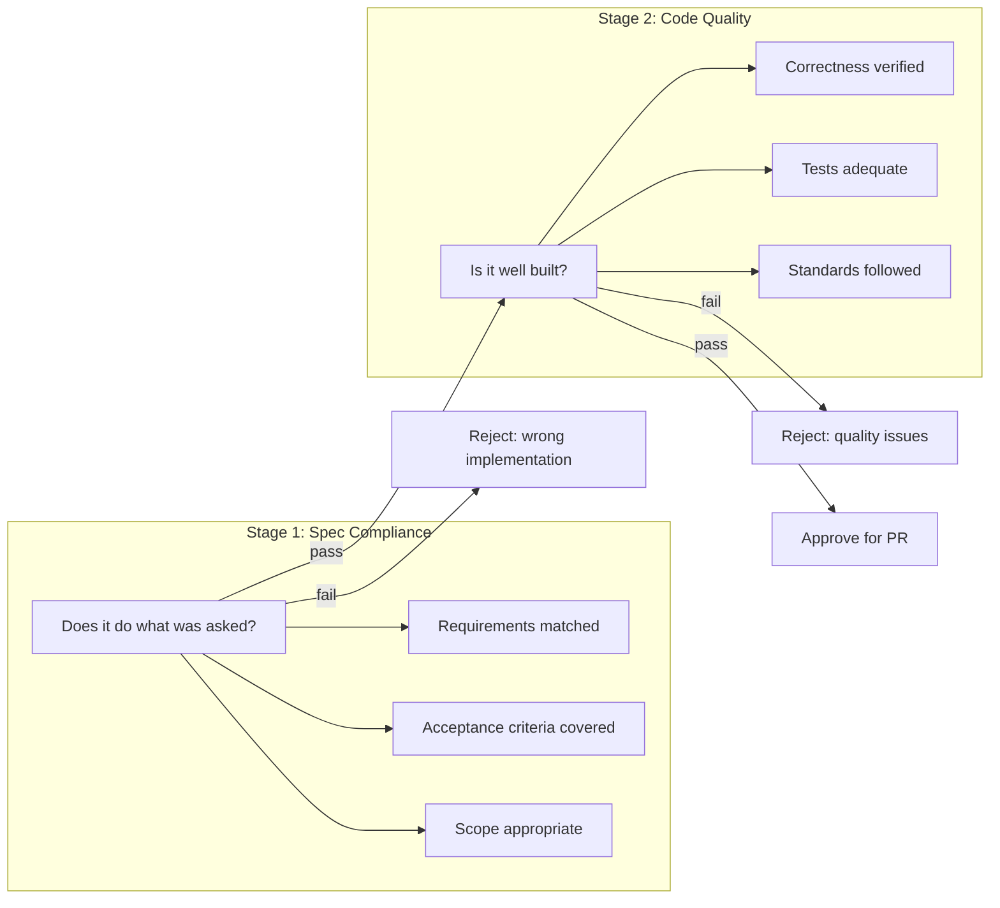

# Code Review

Code review is the practice of examining source code before it is merged to catch defects, enforce standards, and verify intent. In LLM-driven development, code review takes on a fundamentally different role: the code-reviewer agent provides autonomous review for every change, ensuring that even unattended LLM sessions produce code that meets project standards before it reaches a human reviewer.

## Why Code Review Matters for LLM-Generated Code

### LLMs do not self-review

A human developer naturally re-reads their code, questions their assumptions, and catches mistakes before submitting for review. An LLM does not. It generates code in a forward pass and moves on. Without an explicit review step:

- Logical errors that a developer would catch on re-reading persist into the commit
- Requirement misinterpretations are not caught until a human reads the PR
- Convention violations accumulate because the LLM does not compare its output against project patterns
- Security issues go unnoticed because the LLM optimises for functionality, not safety

### LLM code looks correct, which makes it dangerous

LLM-generated code is syntactically clean, well-structured, and reads convincingly. This is precisely what makes unreviewed LLM code risky: it passes casual inspection. A human glancing at a well-formatted function with clear variable names may approve it without noticing that it handles errors incorrectly, misses an edge case, or implements the wrong business rule. Automated review with explicit criteria catches issues that visual inspection misses.

### Unattended development requires autonomous review

In attended development, a human reviews code before creating a PR. In unattended LLM development:

- The LLM generates code, tests it, and creates a PR without human involvement
- If there is no review step between code generation and PR creation, the PR contains unreviewed code
- Human reviewers then face a large diff of LLM-generated code with no pre-screening
- The code-reviewer agent fills this gap by reviewing every change before it becomes a PR

## How Maverick Enforces Code Review

Maverick implements a multi-stage review process that combines autonomous agent review with human review.

```mermaid
flowchart TD
    A[LLM generates code] --> B[local-verification skill]
    B -->|tests pass| C[code-reviewer agent: Stage 1]
    C -->|spec compliance check| D{matches requirements?}
    D -->|no| E[reject with specific feedback]
    E -->|LLM revises| A
    D -->|yes| F[code-reviewer agent: Stage 2]
    F -->|code quality check| G{meets quality standards?}
    G -->|no| H[reject with specific feedback]
    H -->|LLM revises| A
    G -->|yes| I[PR created]
    I --> J[human review]
    J -->|feedback via pullrequest-review skill| K{approved?}
    K -->|no| L[LLM addresses feedback]
    L --> A
    K -->|yes| M[merged]
```

### Stage 1: Spec compliance

The first review stage answers one question: does this code do what was asked?

This check happens before code quality evaluation because there is no value in reviewing the quality of code that solves the wrong problem. The spec compliance stage verifies:

- The implementation matches the requirements specified in the issue or task
- All acceptance criteria are addressed
- No requirements are missing or partially implemented
- The scope of changes matches the scope of the task (no unrelated changes)
- Edge cases mentioned in the requirements are handled

### Stage 2: Code quality

The second review stage evaluates how well the code is built, independent of whether it meets requirements.

#### What the reviewer checks

| Category             | Checks                                                                                    |
| -------------------- | ----------------------------------------------------------------------------------------- |
| Correctness          | Logic errors, off-by-one errors, null handling, race conditions, resource leaks           |
| Maintainability      | Clear naming, appropriate abstraction, no unnecessary complexity, consistent patterns     |
| Test coverage        | Tests exist for new code, cover success and error paths, meet coverage targets            |
| Error handling       | Errors are caught and handled appropriately, not swallowed silently, logged with context  |
| Conventions          | Project naming conventions, file organisation, import ordering, code style                |
| Security             | No hardcoded secrets, input validation present, authentication checks in place            |
| Performance          | No obvious performance issues (N+1 queries, unbounded loops, memory leaks)                |
| Logging and alerting | Error paths include structured logging, critical errors trigger alerts                    |
| Scope discipline     | Changes are limited to what was asked, no drive-by refactoring or unrelated modifications |

### The two-stage structure

The two-stage structure is deliberate and serves a specific purpose in LLM-driven development.

LLMs can misinterpret requirements while producing clean, well-tested code that solves the wrong problem. A single-stage review that checks both spec compliance and code quality simultaneously risks approving beautifully written code that does not meet the actual requirements. By checking spec compliance first, the review process avoids wasting effort on quality-reviewing code that needs to be rewritten.

## Pre-PR vs Post-PR Review

### Why review happens before the PR

Maverick's code-reviewer agent runs before a PR is created, not after. This ordering is important:

- If review happens after PR creation, the LLM has already published unreviewed code to the team
- Issues found post-PR require rework that creates noise in the PR history (force pushes, fixup commits)
- Human reviewers see a cleaner PR because the autonomous reviewer has already caught obvious issues
- The LLM can fix problems while it still has full context from the development session

### Human review as the final gate

Autonomous review does not replace human review. It augments it. The code-reviewer agent catches mechanical issues (missing tests, convention violations, error handling gaps) so that human reviewers can focus on higher-order concerns:

- Does the design approach make sense for this project?
- Are there architectural implications the agent could not evaluate?
- Does this change interact correctly with other in-flight work?
- Is there domain knowledge that affects correctness?

## Processing Review Feedback

The pullrequest-review skill handles the feedback loop when human reviewers request changes on a PR.

### Feedback processing workflow

1. Human reviewer leaves comments on the PR with requested changes
2. The pullrequest-review skill parses the review comments
3. Each comment is categorised: required change, suggestion, question, or nitpick
4. Required changes are addressed by the LLM with corresponding code modifications
5. Suggestions are evaluated and either adopted or responded to with rationale
6. Questions are answered with references to the relevant code or requirements
7. Modified code goes through the code-reviewer agent again before pushing

### Feedback principles

- Every review comment must receive a response (code change or explanation)
- Required changes must be implemented, not argued against
- If a suggestion conflicts with project conventions, the LLM explains the conflict rather than silently ignoring the suggestion
- Nitpicks that improve consistency should be adopted; purely stylistic nitpicks may be deferred

## Review Scope and Boundaries

### What is in scope for review

- All code changes in the current PR or commit
- Test code associated with the changes
- Configuration changes that affect application behaviour
- Changes to build or deployment scripts

### What is out of scope for review

- Code that was not modified in this change (pre-existing issues)
- Third-party library internals
- Auto-generated code (unless the generation configuration was modified)
- Documentation changes (reviewed for accuracy but not for code quality)

### Scope discipline in review

The code-reviewer agent also checks that the LLM's changes are appropriately scoped. LLMs sometimes make drive-by improvements to code near their changes, refactor unrelated functions, or "fix" pre-existing issues outside the task scope. While individually beneficial, these unscoped changes:

- Make PRs harder to review by mixing intentional changes with incidental ones
- Increase the risk of unintended side effects
- Obscure the purpose of the PR

The reviewer flags unscoped changes and asks the LLM to remove them or split them into a separate PR.

## Relationship to Other Standards

### Code review and testing

The code-reviewer agent checks test adequacy as part of Stage 2. It verifies that new code has tests, that tests are meaningful (not superficial), and that coverage targets are met. See comprehensive-testing.md for test quality criteria.

### Code review and security

Security checks are part of the Stage 2 code quality review. The code-reviewer agent checks for hardcoded secrets, missing input validation, and authentication gaps. For deeper security analysis, the security-review process provides additional scrutiny. See security-review.md for details.

### Code review and CI/CD

The code-reviewer agent runs before CI. If code passes review but fails CI, the failure is typically an environment-specific issue rather than a code quality issue. The CI pipeline provides a final verification layer after human review and before merge. See cicd.md for pipeline details.

## Further Reading

- [Code review](https://en.wikipedia.org/wiki/Code_review)
- [Software inspection](https://en.wikipedia.org/wiki/Software_inspection)
- [Automated code review](https://en.wikipedia.org/wiki/Automated_code_review)
- [Peer review](https://en.wikipedia.org/wiki/Peer_review)
