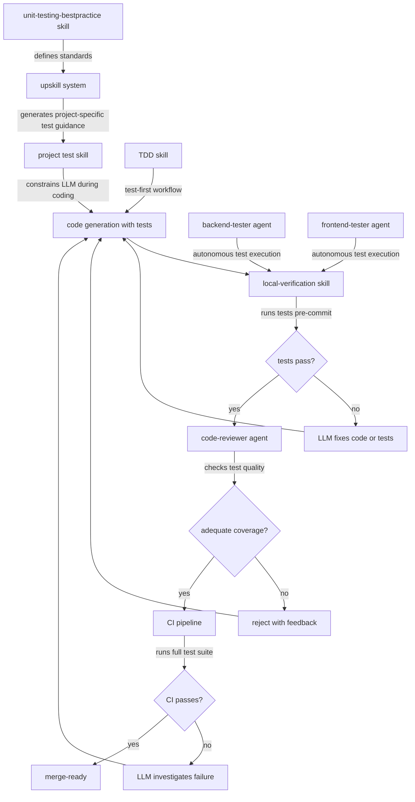

# Comprehensive Testing

Testing verifies that software behaves as intended. In LLM-driven development, testing is not just a quality practice - it is the primary mechanism that determines whether generated code actually works. An LLM cannot mentally execute the code it produces. Tests close this gap by providing concrete, automated evidence of correctness.

## Why Testing Is Critical for LLM-Generated Code

### LLMs produce plausible code, not verified code

An LLM generates code from statistical patterns in training data. It produces output that looks correct, follows conventions, and reads convincingly. But looking correct and being correct are different things. LLM-generated code can:

- Implement the wrong algorithm while using correct syntax
- Miss boundary conditions that a human developer would catch through experience
- Produce logic that works for common inputs but fails for edge cases
- Use API methods that existed in training data but have since changed
- Generate race conditions in concurrent code that only manifest under load

Tests are the only automated mechanism that distinguishes "looks right" from "is right."

### In unattended development, tests ARE the human

In attended development, a human developer runs the code, observes its behaviour, and catches problems that tests might miss. In unattended LLM development:

- No human is executing the code and observing results
- No human is checking whether the output matches the requirement
- No human is verifying that error paths behave correctly
- The LLM's only feedback on correctness comes from test results

This makes tests the automated substitute for human judgment. If the tests are weak, there is no safety net. If the tests are comprehensive, they constrain the LLM to produce code that demonstrably works.

### LLM-generated tests can be superficial

LLMs are prone to generating tests that inflate coverage metrics without catching real bugs:

- **Mirror tests** - tests that restate the implementation rather than verifying behaviour (asserting that a function returns what it returns, rather than what it should return)
- **Mock-heavy tests** - tests that mock every dependency and only verify that mocks were called, testing nothing about actual behaviour
- **Happy-path-only tests** - tests that verify the success case but never test error paths, boundary conditions, or invalid inputs
- **Tautological assertions** - assertions that are always true regardless of implementation correctness
- **Framework testing** - tests that verify third-party library behaviour rather than application logic

Maverick enforces test quality standards to prevent coverage numbers from masking inadequate testing.

## How Maverick Enforces Testing Standards

Maverick enforces testing through multiple reinforcing mechanisms across the development lifecycle.



### Skills that enforce testing

| Skill                                     | Role                                                                                     |
| ----------------------------------------- | ---------------------------------------------------------------------------------------- |
| unit-testing-bestpractice                 | Defines universal test standards: strategy, coverage targets, quality criteria           |
| TDD skill                                 | Encourages test-first development workflow where tests are written before implementation |
| local-verification                        | Requires all tests to pass locally before code is committed                              |
| Project-specific test skill (via upskill) | Specifies the project's test framework, conventions, and additional requirements         |

### Agents that enforce testing

| Agent           | Role                                                                |
| --------------- | ------------------------------------------------------------------- |
| backend-tester  | Autonomously runs backend test suites and reports results           |
| frontend-tester | Autonomously runs frontend test suites and reports results          |
| code-reviewer   | Checks that tests exist, are meaningful, and cover the changed code |

### The local-verification gate

The local-verification skill is a critical enforcement point. It requires that tests pass locally before the LLM commits code. This prevents the pattern where an LLM pushes broken code to CI and waits for remote feedback. By catching failures locally:

- The LLM still has full context to fix the issue
- Branch history is not polluted with broken commits
- CI resources are not wasted on code that was never tested locally
- Feedback loops are measured in seconds, not minutes

## Test Strategy

Maverick defines a three-tier test strategy that balances thoroughness with maintenance cost.

### Tier 1: Unit tests

- **Scope**: Individual functions, methods, classes, and modules in isolation
- **Target**: Business logic, data transformations, validation rules, utility functions
- **Characteristics**: Fast (milliseconds per test), no external dependencies, deterministic
- **Coverage target**: 90%+ for business logic code
- **What to test**: Behaviour and output for given inputs, including edge cases and error conditions
- **What NOT to test**: Framework internals, third-party library behaviour, trivial getters/setters

### Tier 2: Integration tests

- **Scope**: Interactions between components, services, and external systems
- **Target**: API endpoints, database queries, message queue consumers, external service clients
- **Characteristics**: Slower (seconds per test), may use test databases or mock servers, may require setup/teardown
- **Coverage target**: 80%+ for API controllers and data access layers
- **What to test**: Request/response contracts, data persistence, error responses, authentication/authorisation
- **What NOT to test**: Internal implementation details of integrated components

### Tier 3: End-to-end tests

- **Scope**: Complete user workflows through the full system
- **Target**: Critical user journeys only - login, checkout, data submission
- **Characteristics**: Slowest (seconds to minutes), requires full environment, most fragile
- **Coverage target**: Critical paths only, no percentage target
- **What to test**: The most important user workflows that, if broken, would have immediate business impact
- **What NOT to test**: Every possible user interaction - E2E tests are expensive to write and maintain

```mermaid
pyramid
    title Test Strategy Pyramid
    "E2E Tests" : 10
    "Integration Tests" : 30
    "Unit Tests" : 60
```

## Coverage Targets

| Scope                    | Target      | Rationale                                                                            |
| ------------------------ | ----------- | ------------------------------------------------------------------------------------ |
| Overall codebase         | 60% minimum | Ensures baseline coverage without incentivising superficial tests                    |
| Business logic           | 90%+        | Core logic is where bugs have the highest impact and tests have the highest value    |
| API controllers          | 80%+        | API contracts must be verified for all success and error cases                       |
| Utility functions        | 80%+        | Shared utilities are used widely, so bugs propagate broadly                          |
| Configuration and wiring | No target   | Setup code changes rarely and testing it adds maintenance without catching real bugs |
| Generated code           | No target   | Auto-generated code (ORM models, API clients from specs) should not be unit tested   |

### Coverage as a floor, not a ceiling

Coverage targets are minimum thresholds, not goals to optimise for. A codebase with 60% coverage and meaningful tests is better than one with 95% coverage full of tautological assertions. The code-reviewer agent evaluates test quality, not just coverage numbers.

## Test Quality Criteria

Maverick defines specific quality criteria that distinguish useful tests from superficial ones.

### A good test must

- Test behaviour, not implementation - assert on outputs and side effects, not internal method calls
- Be independent - each test must pass or fail regardless of other tests and execution order
- Be deterministic - same inputs must produce same results every time, with no flaky tests
- Be readable - the test name and body should make the tested behaviour obvious without reading the implementation
- Test one thing - each test should verify a single behaviour or scenario
- Include negative cases - test what happens with invalid input, missing data, and error conditions

### Test naming convention

Tests should be named to describe the behaviour being verified, not the method being called. The pattern "should [expected behaviour] when [condition]" communicates intent clearly to both humans and LLMs reviewing test output.

## Relationship to Other Standards

### Testing and code review

The code-reviewer agent checks test adequacy as part of its code quality review. It verifies that:

- New code has corresponding tests
- Tests cover both success and error paths
- Test quality meets the criteria defined above
- Coverage targets are met for the changed code

See code-review.md for the full review process.

### Testing and CI/CD

The CI pipeline runs the full test suite on every push. Tests that pass locally but fail in CI indicate environment-dependent behaviour that must be fixed. The local-verification skill reduces but does not eliminate this gap. See cicd.md for pipeline details.

### Testing and the feedback loop

Tests are the LLM's primary feedback mechanism during development. When a test fails:

1. The LLM reads the failure output
2. The failure identifies the specific behaviour that is broken
3. The LLM modifies the code to fix the failing test
4. The test suite runs again to verify the fix and check for regressions

This cycle is how an LLM iterates toward correctness. Without tests, the LLM has no signal that its code is wrong until a human reviews it or users encounter the bug.

## Further Reading

- [Software testing](https://en.wikipedia.org/wiki/Software_testing)
- [Code coverage](https://en.wikipedia.org/wiki/Code_coverage)
- [Test-driven development](https://en.wikipedia.org/wiki/Test-driven_development)
- [Regression testing](https://en.wikipedia.org/wiki/Regression_testing)
- [Test pyramid](https://en.wikipedia.org/wiki/Test_automation#Testing_at_different_levels)
