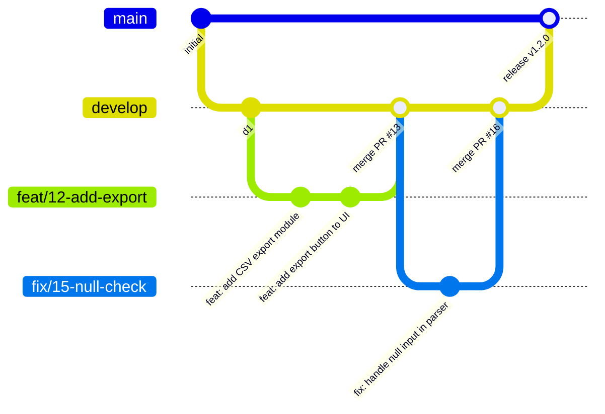
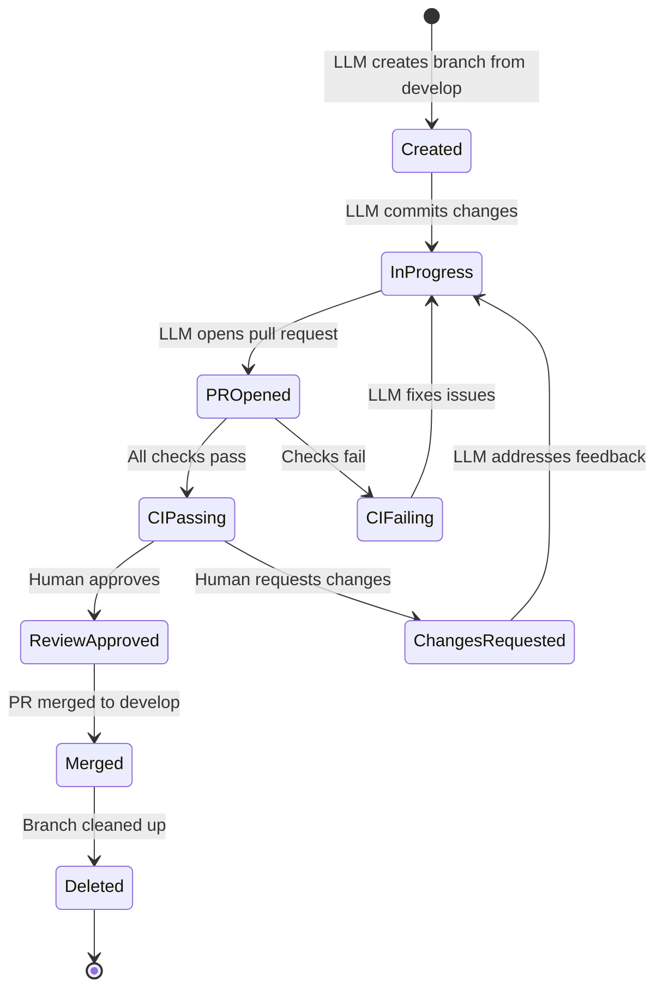

# Git Workflow

## The Problem

LLMs do not naturally understand branching strategy. Without constraints, an LLM will commit directly to whatever branch it is on, produce monolithic commits with vague messages, and skip the pull request process entirely. In attended development a human catches this. In unattended development nobody does.

## Why This Is Central to Maverick

In unattended LLM development, the git workflow IS the audit trail. Every change must be:

- **Traceable** - linked to a specific issue that requested the work
- **Reviewable** - isolated in a pull request with conventional commit messages
- **Reversible** - contained on a feature branch that can be deleted without affecting shared branches

Without workflow discipline, an autonomous agent produces a tangle of unattributed changes on shared branches that no human can audit after the fact.

## How Maverick Enforces It

| Skill                   | Responsibility                                                                  |
| ----------------------- | ------------------------------------------------------------------------------- |
| `git-workflow`          | Defines the branching strategy, naming conventions, and commit format           |
| `github-issue-workflow` | Manages issue interaction: reading requirements, posting artefacts, linking PRs |
| `scope-boundaries`      | Prevents destructive git operations (force push, hard reset, branch deletion)   |
| `plan-execution`        | Tracks which phase of work is in progress, preventing duplicate branches        |

These skills work together to constrain the LLM into a disciplined workflow that produces auditable, reversible changes.

## Branching Strategy

Maverick uses a simplified Gitflow model with two long-lived branches and short-lived feature branches.



### Long-lived branches

| Branch    | Purpose                                                 | Direct commits allowed |
| --------- | ------------------------------------------------------- | ---------------------- |
| `main`    | Production-ready code. Tagged with release versions.    | Never                  |
| `develop` | Integration branch. All feature work merges here first. | Never                  |

### Short-lived branches

Feature and fix branches are created per issue and deleted after merge.

| Branch type | Naming pattern                 | Merges into          |
| ----------- | ------------------------------ | -------------------- |
| Feature     | `feat/<issue>-<description>`   | `develop`            |
| Fix         | `fix/<issue>-<description>`    | `develop`            |
| Chore       | `chore/<issue>-<description>`  | `develop`            |
| Hotfix      | `hotfix/<issue>-<description>` | `main` and `develop` |

## Branch Naming Convention

Format: `<type>/<issue-number>-<short-description>`

- **type** - one of `feat`, `fix`, `chore`, `hotfix`, `docs`, `refactor`, `test`
- **issue-number** - the GitHub issue number that authorised the work
- **short-description** - 2-4 lowercase words separated by hyphens

Examples:

| Issue                           | Branch name                    |
| ------------------------------- | ------------------------------ |
| #42: Add CSV export             | `feat/42-add-csv-export`       |
| #15: Fix null pointer in parser | `fix/15-null-pointer-parser`   |
| #88: Update dependencies        | `chore/88-update-dependencies` |
| #3: Critical auth bypass        | `hotfix/3-auth-bypass`         |

The issue number in the branch name is mandatory. It creates a machine-readable link between the branch and the authorising issue. An LLM creating a branch without an issue number is creating unaccountable work.

## Conventional Commits

All commit messages follow the Conventional Commits specification. This is critical for LLM-generated code because:

- It forces the LLM to categorise each change explicitly
- It produces machine-parseable commit history
- It enables automated changelog generation
- It makes review of LLM work faster for humans

### Commit message format

```
<type>: <description>

[optional body]

[optional footer(s)]
```

### Commit types

| Type       | When to use                                      |
| ---------- | ------------------------------------------------ |
| `feat`     | New functionality visible to users               |
| `fix`      | Bug fix                                          |
| `chore`    | Maintenance (dependencies, configs, tooling)     |
| `refactor` | Code restructuring with no behaviour change      |
| `test`     | Adding or updating tests only                    |
| `docs`     | Documentation changes only                       |
| `style`    | Formatting, whitespace, linting fixes            |
| `perf`     | Performance improvement with no behaviour change |

### Rules for LLM-generated commits

- One logical change per commit - do not bundle unrelated changes
- Reference the issue number in the commit body or footer
- Keep the description line under 72 characters
- Use imperative mood ("add export" not "added export")
- Never use `--no-verify` to skip pre-commit hooks

## Pull Request Discipline

All work reaches shared branches via pull request. No exceptions.

### PR requirements

| Requirement                                 | Rationale                                |
| ------------------------------------------- | ---------------------------------------- |
| Title follows conventional commit format    | Consistency and parseability             |
| Body describes what changed and why         | Context for reviewers                    |
| Links to originating issue with `Closes #N` | Traceability and automatic issue closure |
| All CI checks pass                          | Automated quality gate                   |
| Feature branch is up to date with target    | No merge conflicts at merge time         |

### Issue linking

Every PR must include `Closes #N` in the body where N is the originating issue number. This:

- Automatically closes the issue when the PR merges
- Creates a bidirectional link between issue and implementation
- Provides audit trail for why the change was made
- Enables traceability from requirement to code

An LLM opening a PR without issue linking is producing unaccountable work. The `github-issue-workflow` skill enforces this by requiring the issue number throughout the workflow.

## Branch Lifecycle



### Branch creation

- Always branch from `develop` (or `main` for hotfixes)
- Always use the naming convention
- Always verify the branch does not already exist

### During work

- Commit frequently with conventional messages
- Push regularly to preserve work (protects against session crashes)
- Keep the branch up to date with its target by rebasing or merging

### After merge

- Delete the feature branch (remote and local)
- Verify the issue was closed by the `Closes #N` reference
- Do not reuse branches for new work

## Merge Conflict Handling

LLMs must not auto-resolve merge conflicts. This is a firm rule because:

- Merge conflicts indicate two changes touched the same code for potentially different reasons
- The correct resolution requires understanding the intent of both changes
- An LLM resolving conflicts may silently discard another developer's work
- The consequences of incorrect resolution may not surface until production

### Required behaviour

| Situation                   | Action                                                                              |
| --------------------------- | ----------------------------------------------------------------------------------- |
| Conflict on rebase or merge | Stop work and flag for human resolution                                             |
| Conflict in CI              | Report the conflict in the PR, do not push resolution                               |
| Conflict in unrelated files | Still flag for human - "unrelated" is a judgement call the LLM cannot reliably make |

## Destructive Operations

The following git operations are prohibited without explicit human instruction:

| Operation                       | Risk                                                       |
| ------------------------------- | ---------------------------------------------------------- |
| `git push --force`              | Overwrites remote history, destroys other developers' work |
| `git reset --hard`              | Discards uncommitted work irreversibly                     |
| `git branch -D` (remote)        | Deletes branches that may contain others' work             |
| `git rebase` on shared branches | Rewrites history visible to other developers               |
| `git clean -fd`                 | Deletes untracked files irreversibly                       |

The `scope-boundaries` skill encodes these prohibitions. An LLM operating without this skill will use destructive operations whenever they appear to be the fastest path to completing a task.

## Workflow Summary

| Phase   | Action                                            | Skill enforcing                         |
| ------- | ------------------------------------------------- | --------------------------------------- |
| Start   | Read issue, create branch from `develop`          | `github-issue-workflow`, `git-workflow` |
| Develop | Commit with conventional messages, push regularly | `git-workflow`                          |
| Verify  | Run local checks before push                      | `local-verification`                    |
| PR      | Open PR linking to issue, wait for CI             | `github-issue-workflow`, `git-workflow` |
| Review  | Address feedback, push fixes                      | `git-workflow`                          |
| Merge   | Human merges, branch deleted                      | `git-workflow`                          |

## Key Constraints for LLMs

- Never commit directly to `main` or `develop`
- Never create a branch without an issue number
- Never use `--no-verify` to skip hooks
- Never force push to any branch
- Never auto-resolve merge conflicts
- Never reuse a merged branch
- Always include `Closes #N` in PR descriptions
- Always use conventional commit format
- Always delete feature branches after merge
