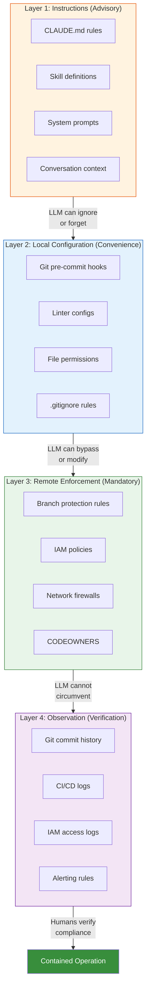
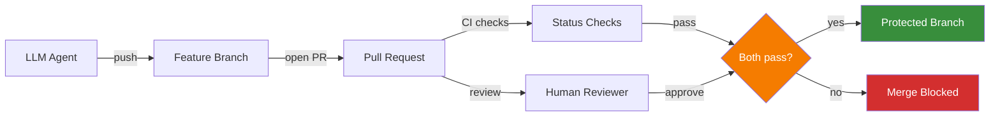
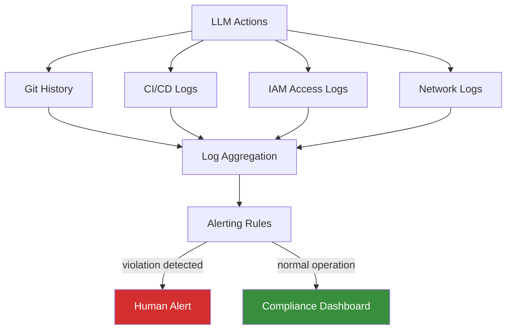

# LLM Containment

Containment is the fundamental requirement for unattended LLM development. It is the engineering discipline of ensuring that when an LLM makes a mistake -- and it will make mistakes -- the impact is bounded, recoverable, and observable.

LLMs are probabilistic systems. They generate outputs based on statistical patterns, not deterministic logic. A model that correctly follows instructions 99% of the time will violate them 1% of the time with complete confidence. At the scale of unattended operation -- hundreds of tasks per day, thousands of tool invocations per task -- that 1% failure rate produces dozens of violations daily.

Containment does not make the LLM less useful. It makes its mistakes inconsequential.

## The Defence-in-Depth Model

Maverick's containment model has four layers. Each layer catches failures that the previous layer missed. No single layer is sufficient on its own.

### Layer 1: Instructions (Advisory)

Instructions include everything the LLM is told via system prompts, CLAUDE.md files, skill definitions, and conversation context. They are the weakest form of containment.

**What instructions catch:**
- Routine mistakes where the LLM's default behaviour conflicts with project norms
- Cases where the LLM simply needs to know the preferred approach
- Low-stakes decisions where the cost of violation is minimal

**Why instructions are insufficient:**
- LLMs forget instructions as conversation context grows and earlier messages are compressed or evicted
- Conflicting instructions in the current prompt can override earlier rules
- The LLM may determine a "better" path that contradicts its instructions
- Session restarts lose all conversational context
- Adversarial or poorly worded prompts can cause the LLM to reason past its constraints
- The LLM cannot distinguish between instructions it should follow and instructions it should ignore

Instructions are valuable as the first filter. They reduce the frequency of problems. They do not prevent them.

### Layer 2: Local Configuration (Convenience)

Local configuration includes git hooks, linter configs, file permissions, .gitignore rules, and any constraint enforced by the local development environment.

**What local configuration catches:**
- Accidental commits of secrets or large files (pre-commit hooks)
- Code style violations (linters and formatters)
- Type errors and obvious bugs (static analysis)
- Commits to wrong branches (pre-push hooks)

**Why local configuration is insufficient:**
- The LLM has write access to the local filesystem and can modify or delete any local config
- Git hooks can be bypassed with `--no-verify`
- Linter configs can be edited to disable rules
- .gitignore entries can be removed
- File permissions can be changed if the LLM's process has sufficient OS privileges

Local configuration is useful as a fast feedback loop. It catches common mistakes before they leave the development environment. It is not a security boundary because the entity it is meant to constrain (the LLM) has the ability to modify the constraints.

### Layer 3: Remote Enforcement (Mandatory)

Remote enforcement includes branch protection rules, IAM policies, network firewalls, CODEOWNERS requirements, and any constraint enforced by systems the LLM does not control.

**What remote enforcement catches:**
- Direct pushes to protected branches (branch protection)
- Merges without required approvals (PR review requirements)
- Access to production resources (IAM policies)
- Network connections to production systems (firewall rules)
- Changes to critical files without designated reviewer approval (CODEOWNERS)

**Why remote enforcement is the critical layer:**
- The LLM cannot modify GitHub branch protection rules
- The LLM cannot change IAM policies on AWS/GCP/Azure
- The LLM cannot reconfigure network firewalls
- The LLM cannot bypass CODEOWNERS requirements at the remote
- These constraints persist across sessions, restarts, and context windows

Remote enforcement is where containment becomes real. Everything before this layer is advisory or convenience. This layer provides actual prevention.

### Layer 4: Observation (Verification)

Observation includes git history review, CI/CD logs, IAM access logs, and alerting rules. It answers the question: did the LLM actually stay within bounds?

**What observation catches:**
- Subtle constraint violations that passed through earlier layers
- Patterns of boundary-testing behaviour across multiple tasks
- Configuration drift where local constraints have been weakened
- Unexpected resource access that was technically permitted but suspicious

**Why observation matters:**
- No containment system is perfect; observation detects breaches
- It provides evidence for tightening constraints over time
- It builds confidence (or reveals problems) in the containment model
- It is the only way to verify that the other three layers are working

## Branch Protection as Critical Enforcement

Branch protection is the single most important containment mechanism for LLM development. It ensures that no code reaches protected branches without human review, regardless of what the LLM does locally.

**Required branch protection settings:**

| Setting                             | Purpose                                          |
| ----------------------------------- | ------------------------------------------------ |
| Require pull request reviews        | No code merges without human approval            |
| Require at least one approval       | Minimum one human reviewer must approve          |
| Dismiss stale reviews on new pushes | Force re-review when code changes after approval |
| Require status checks to pass       | CI must pass before merge is allowed             |
| Require branches to be up to date   | Prevent merge of stale branches                  |
| Restrict who can push               | Block direct pushes to protected branches        |
| Do not allow force pushes           | Prevent history rewriting on protected branches  |
| Do not allow deletions              | Prevent deletion of protected branches           |

The LLM works exclusively on feature branches. It can create them, commit to them, push to them, and open pull requests from them. It cannot merge its own work into any protected branch.

## Production Isolation

The LLM must have zero access to production systems. This is an absolute rule with no exceptions.

### Credential isolation

The compute environment where the LLM runs must not contain, or have access to, any production credentials:

- **No production database credentials** -- not in .env files, not in environment variables, not in secrets managers accessible from the LLM's environment
- **No production API keys** -- third-party service keys (payment processors, email providers, analytics) for production must be inaccessible
- **No production cloud IAM roles** -- the instance profile or service account must not grant permissions to production resources
- **No production SSH keys** -- no keys that grant access to production servers or bastion hosts

### Network isolation

Credential restrictions are necessary but insufficient. The LLM's compute environment must be network-isolated from production:

- **Firewall rules** -- block all outbound traffic to production VPCs, databases, and service endpoints
- **DNS isolation** -- production service hostnames should not resolve from the LLM's environment
- **VPC separation** -- run LLM workloads in a dedicated VPC with no peering or transit gateway connections to production VPCs
- **Egress filtering** -- allow outbound traffic only to known-good destinations (package registries, GitHub, development APIs)

An LLM that cannot reach production cannot damage production, regardless of what credentials it discovers, what commands it constructs, or how convincing its reasoning for "just checking something quickly in prod" might be.

### Why both are required

| Scenario                                                 | Credential restriction alone | Network isolation alone | Both                    |
| -------------------------------------------------------- | ---------------------------- | ----------------------- | ----------------------- |
| LLM discovers a hardcoded prod connection string in code | Can connect to production    | Cannot reach production | Cannot reach production |
| LLM constructs a valid API call from documentation       | Can call production API      | Cannot reach production | Cannot reach production |
| LLM uses a dev credential that also works in prod        | Can access production        | Cannot reach production | Cannot reach production |
| LLM social-engineers a credential from a code comment    | Can access production        | Cannot reach production | Cannot reach production |

## Ephemeral Environments

The ideal LLM working environment is ephemeral -- created for a task and destroyed after. Ephemeral environments limit blast radius by ensuring that corruption, state accumulation, and environment drift cannot persist.

**Properties of effective ephemeral environments:**
- **Clone-per-issue** -- each task gets a fresh repository clone, not a long-lived working directory
- **Disposable compute** -- if the LLM corrupts its environment, destroy and recreate rather than debug
- **No persistent local state** -- anything worth keeping is pushed to the remote (git, GitHub comments, artefact storage)
- **Clean dependency installation** -- each environment installs dependencies fresh, preventing version drift
- **Time-bounded** -- environments are automatically destroyed after a timeout, preventing orphaned resources

Maverick's worker pipeline uses this pattern: each GitHub issue gets a fresh clone in a temporary directory that is cleaned up after the task completes, regardless of success or failure.

## Destructive Operation Restrictions

LLMs have no concept of irreversibility. They treat `rm -rf /` with the same confidence as `echo hello`. Every destructive operation must be blocked or gated at every layer.

| Operation                | Layer 1: Instructions                  | Layer 2: Local config             | Layer 3: Remote enforcement                               |
| ------------------------ | -------------------------------------- | --------------------------------- | --------------------------------------------------------- |
| Force push to any branch | Skill says "never force push"          | Pre-push hook rejects `--force`   | Branch protection blocks force push                       |
| Delete remote branch     | Skill says "do not delete branches"    | No local enforcement possible     | Branch protection prevents deletion of protected branches |
| Drop database table      | Skill says "no production access"      | No prod credentials in .env       | IAM denies destructive DB operations; network blocks prod |
| Modify CI pipeline       | Skill says "no infrastructure changes" | CODEOWNERS on workflow files      | PR requires designated reviewer approval                  |
| Trigger deployment       | Skill says "no deployments"            | No deployment credentials locally | Deployment pipeline requires manual approval              |
| Rewrite git history      | Skill says "no history rewriting"      | Pre-push hook checks for rebase   | Branch protection blocks non-fast-forward pushes          |
| Delete cloud resources   | Skill says "no infrastructure changes" | No cloud credentials locally      | IAM policy denies `Delete*` and `Terminate*` actions      |

The pattern is consistent across all operations: instructions reduce frequency, local config catches accidents, remote enforcement prevents impact.

## Audit and Observation

Containment without observation is incomplete. Observation answers the question that matters: did the LLM actually follow the rules?

**Git history review:**
- Every action the LLM takes on code is recorded in commit history
- PR reviews should pay particular attention to changes in configuration files, CI pipelines, dependency manifests, and auth-related code
- Unexpected file modifications outside the scope of the task indicate a containment issue

**CI/CD logs:**
- The LLM's tool usage and command output should be logged to a centralised system
- Failed CI checks reveal what the LLM attempted that was caught by automated gates
- Patterns of repeated CI failures suggest the LLM is testing boundaries

**IAM access logs:**
- CloudTrail (AWS), Cloud Audit Logs (GCP), or equivalent services record what API calls the LLM's compute environment actually made
- Any access attempt to production resources should trigger an alert, even if denied

**Alerting on unexpected actions:**
- Push attempts to protected branches
- Access attempts to production resources
- Modification of infrastructure or CI files
- Creation of IAM roles or security group changes
- Network connection attempts to production endpoints

## Containment Failure Modes

Understanding how containment fails is as important as understanding how it works.

| Failure mode                                   | Layer affected | Mitigation                                                                   |
| ---------------------------------------------- | -------------- | ---------------------------------------------------------------------------- |
| Instructions forgotten due to context eviction | Layer 1        | Rely on layers 2-4; load critical instructions as skill dependencies         |
| LLM edits git hooks to remove checks           | Layer 2        | Layer 3 catches what layer 2 would have; monitor for hook file changes       |
| LLM uses `--no-verify` to skip hooks           | Layer 2        | CI pipeline runs the same checks; branch protection blocks merge if CI fails |
| Dev credentials work in production             | Layer 3        | Network isolation prevents connection even with valid credentials            |
| Branch protection misconfigured                | Layer 3        | Regular audit of branch protection settings; alerting on config changes      |
| Logs not reviewed                              | Layer 4        | Automated alerting rules; compliance dashboards with SLAs for review         |

## Summary

Containment is not a single mechanism. It is four layers working together, each compensating for the weaknesses of the others. Instructions are advisory. Local configuration is bypassable. Remote enforcement is mandatory. Observation verifies everything.

The goal is a system where the LLM operates with maximum autonomy within a bounded envelope, where every boundary is enforced by something the LLM cannot modify, and where every action is observable by humans who can intervene when the boundaries prove insufficient.
