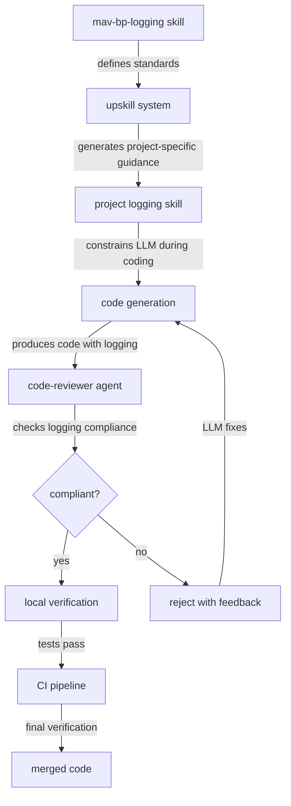
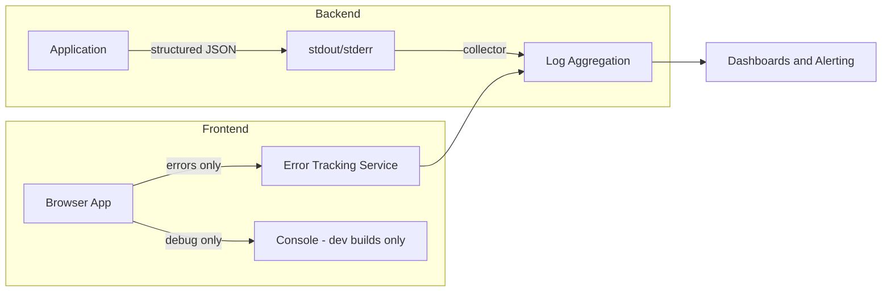

# Logging Standards

Logging records events during program execution to support debugging, monitoring, and auditing. In LLM-driven development, logging takes on heightened importance: code generated at speed without human oversight must produce operational telemetry that allows teams to diagnose failures after the fact. Without enforced logging standards, LLM-generated code is functionally a black box in production.

## Why Logging Standards Are Critical for LLM-Generated Code

### LLMs default to primitive logging

Left unconstrained, LLMs produce logging that reflects training data patterns rather than operational needs:

- **console.log everywhere** - the most common pattern in LLM training data is unstructured console output, so LLMs default to it regardless of whether the target environment has a structured logger available
- **No operational context** - LLMs do not model who reads logs or why; they add logging as a debugging convenience, not as operational telemetry
- **Missing correlation** - LLMs rarely add request IDs, trace IDs, or session identifiers that allow log entries to be correlated across services
- **Inconsistent levels** - without guidance, LLMs assign log levels arbitrarily, using info for errors and debug for critical failures
- **Sensitive data exposure** - LLMs working with user data, API responses, or configuration values may log them verbatim, exposing PII, credentials, or business-sensitive information in aggregation systems

### Unattended development amplifies logging failures

In attended development, a human developer reviews code before it ships and can spot missing or poorly structured logging. In unattended LLM development:

- No developer is watching the generated code in real time
- Logging deficiencies only surface during production incidents, when it is too late to add them
- Multiple LLM sessions working on different parts of a codebase can each introduce different logging libraries, formats, or conventions
- The volume of generated code means logging inconsistencies accumulate faster than in human-written codebases

### Consequences of poor logging

| Failure mode                            | Impact                                                          |
| --------------------------------------- | --------------------------------------------------------------- |
| Unstructured log output                 | Log aggregation queries fail to find relevant entries           |
| Missing error context                   | Incident responders cannot determine root cause                 |
| Excessive info-level logging            | Signal-to-noise ratio drops, alert thresholds become unreliable |
| Inconsistent log format across services | Cross-service tracing becomes impossible                        |
| Sensitive data in logs                  | Compliance violations, security incidents                       |
| No centralised aggregation              | Logs lost on container restart, no historical analysis          |

## How Maverick Enforces Logging Standards

Maverick treats logging as a first-class quality gate through a multi-layer enforcement chain.

### The enforcement chain

### Layer 1: mav-bp-logging skill

The mav-bp-logging skill defines universal logging standards that apply to all projects. It specifies log levels, structured format requirements, centralisation expectations, and data sensitivity rules. This skill is loaded into every LLM session that generates or modifies code.

### Layer 2: project-specific logging skill

The upskill system analyses a project's existing codebase and generates a project-specific logging implementation guide. This guide tells the LLM exactly which logging library to use, what format to follow, where logs are aggregated, and what project-specific fields are required. Without this layer, the LLM knows the principles but not the project's implementation.

### Layer 3: code-reviewer agent

The code-reviewer agent inspects every change for logging compliance. It checks that error paths include structured logging, that log levels are appropriate, that no sensitive data is logged, and that the project's logging library is used consistently. Violations are flagged with specific remediation guidance.

## Log Levels

Maverick enforces a three-level logging model that prioritises actionable output over verbosity.

| Level | Purpose                                | When to use                                                                                 | When NOT to use                                                       |
| ----- | -------------------------------------- | ------------------------------------------------------------------------------------------- | --------------------------------------------------------------------- |
| error | Failures requiring human attention     | Unrecoverable errors, data integrity issues, external service failures that exhaust retries | Validation failures, expected error responses, recoverable conditions |
| warn  | Recoverable issues worth noting        | Deprecated API usage, fallback behaviour triggered, retry succeeded after failure           | Normal operational events, expected conditions                        |
| debug | Development and troubleshooting detail | Variable state, execution flow, query results                                               | Production-visible output (debug should be off in production)         |

### Why no info level

The info level is deliberately excluded. In practice, info-level logging becomes a dumping ground for messages that are neither errors nor debug traces. Teams log routine operations at info level ("user logged in", "request processed", "cache hit"), creating massive log volumes that obscure genuine problems. By removing info, Maverick forces a binary decision: is this an issue (error/warn) or is it diagnostic detail (debug)?

## Structured Logging Format

All log output must be structured as JSON with consistent fields.

### Required fields

| Field         | Description                                               |
| ------------- | --------------------------------------------------------- |
| timestamp     | ISO 8601 format with timezone                             |
| level         | One of error, warn, debug                                 |
| message       | Human-readable description of the event                   |
| service       | Name of the service or application                        |
| correlationId | Request or trace identifier for cross-service correlation |

### Contextual fields for errors

| Field         | Description                                   |
| ------------- | --------------------------------------------- |
| error.name    | Error class or type name                      |
| error.message | Error message text                            |
| error.stack   | Stack trace (backend only, never frontend)    |
| error.code    | Application-specific error code if applicable |
| resource      | The entity or resource affected by the error  |

## Backend vs Frontend Logging

Logging requirements differ significantly between backend and frontend contexts.

### Backend logging

- Full structured JSON output to stdout or stderr for container-based collection
- Stack traces included in error-level entries
- Database query identifiers and durations at debug level
- Request/response metadata (excluding bodies with sensitive data) at debug level
- Centralised aggregation to CloudWatch, Datadog, ELK, or equivalent

### Frontend logging

- Minimal logging in production builds to avoid performance impact and data exposure
- Error-level entries sent to a remote error-tracking service (Sentry, Datadog RUM, or equivalent)
- No stack traces in client-visible output
- No sensitive data under any circumstances, including in debug builds
- Console output acceptable only in development builds behind feature flags

## Centralised Aggregation

Logs must be routed to a centralised aggregation service rather than stored locally. Local log files are lost on container restart, cannot be queried across services, and do not support alerting. The project-specific logging skill generated by upskill specifies which aggregation service the project uses and how logs are shipped.

### Aggregation requirements

- All services in a project must route logs to the same aggregation platform
- Log retention must meet the project's compliance requirements
- Queries must be possible by correlationId, service name, time range, and log level
- Alerting rules must be configurable on aggregated log patterns (see alerting-standards.md)

## Consistency Requirements

- All modules in a project must use the same logging library
- No mixing of console.log with structured loggers
- Log format must be identical across all services to enable cross-service queries
- The LLM must check for an existing logging setup before introducing any logging code
- If no logging setup exists, the LLM must follow the project-specific logging skill or fall back to the mav-bp-logging skill defaults

## Common Logging Anti-Patterns in LLM-Generated Code

The following anti-patterns appear frequently in LLM-generated code and are specifically flagged by the code-reviewer agent.

| Anti-pattern                        | Description                                                                                      | Correct approach                                                                  |
| ----------------------------------- | ------------------------------------------------------------------------------------------------ | --------------------------------------------------------------------------------- |
| Console logging in production code  | Using console.log, console.error, or print statements instead of the project's structured logger | Use the project's designated logging library for all log output                   |
| Logging without context             | Log messages like "Error occurred" with no identifying information                               | Include the operation, affected resource, and error details in every log entry    |
| Logging sensitive data              | Logging request bodies, user records, or configuration values that contain PII or credentials    | Sanitise or redact sensitive fields before logging; log identifiers, not payloads |
| Logging at wrong level              | Using error level for expected conditions or debug level for critical failures                   | Match log level to operational significance as defined in the log levels table    |
| Introducing a second logger         | Adding a new logging library when the project already has one configured                         | Check for existing logging setup before adding any logging code                   |
| Logging in a loop                   | Adding log statements inside tight loops that execute thousands of times                         | Log aggregated results or use debug level with sampling                           |
| Missing timestamp or correlation ID | Structured log entries that omit required fields                                                 | Include all required fields as defined in the structured logging format section   |

## The Upskill System and Logging

The upskill system is central to making logging standards actionable for each project. When upskill analyses a project, it examines:

- Which logging library the project uses and how it is configured
- What structured format the project follows (field names, nesting, additional metadata)
- Where logs are aggregated and what retention policies apply
- What project-specific fields are required (tenant ID, environment, deployment version)
- Whether the project has different logging configurations for different environments

The output is a project-specific logging skill that the LLM loads alongside the universal mav-bp-logging skill. This layered approach means the LLM knows both the general principles (from the bestpractice skill) and the specific implementation details (from the project skill). Without the project-specific layer, the LLM would follow correct principles but produce logging that does not integrate with the project's existing observability stack.

## Relationship to Other Standards

### Logging and alerting

Logging and alerting are complementary but distinct. Logging records what happened; alerting notifies teams that something requires attention. The correct pattern is: log the error with full context, then trigger an alert if the error meets severity thresholds. Never alert instead of logging, and never log instead of alerting. See alerting-standards.md for alert severity levels and context requirements.

### Logging and testing

Tests should verify that error paths produce appropriate log output. The code-reviewer agent checks that error-handling code includes logging, and tests should confirm that the logged output contains the expected structured fields. See comprehensive-testing.md for test strategy details.

### Logging and code review

The code-reviewer agent specifically checks logging compliance as part of its code quality review stage. It verifies correct log levels, structured format, no sensitive data, and consistent library usage. See code-review.md for the full review process.

## Further Reading

- [Logging (computing)](https://en.wikipedia.org/wiki/Logging_(computing))
- [Log management](https://en.wikipedia.org/wiki/Log_management)
- [Observability (software)](https://en.wikipedia.org/wiki/Observability_(software))
- [Structured logging](https://en.wikipedia.org/wiki/Logging_(computing)#Structured_logging)
