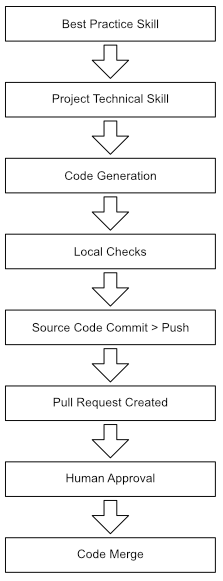

## Overview

Maverick is a Claude Code plugin and local application that enables autonomous AI-driven software development while enforcing quality, security, and operational best practices.

It provides skills, agents, and hooks that constrain and guide LLM behaviour - making unattended development safe and reliable.

## The Problem Maverick Solves

LLMs generate code fast but dont come with any concept of quality, best practice or constraint. Claude Code will happily agree to build the worlds worst idea, with a smile, because without guardrails:

- **No operational awareness** - LLMs don't add structured logging, alerting, or monitoring unless explicitly told to. Production code becomes undiagnosable.
- **No security reasoning** - LLMs reproduce vulnerable patterns from training data. SQL injection, XSS, and secrets exposure go unnoticed. It wont make any effort to ensure cybersecurity is maintined.
- **No testing discipline** - LLMs write working code and you can think youve got a product. Until it runs anywhere except on your machine because its filled with bugs you cant see. Without tests, those bugs ship.
- **No workflow discipline** - LLMs commit to main, skip CI, ignore conventions, and produce untraceable changes. If you ask an LLM to create a large ammount of changes ina single attempt it will try and you'll regret it.
- **No self-review** - LLMs don't question their own output. Code that looks correct may miss requirements or violate project conventions.

These risks multiply enourmously in unattended development when no human is watching the LLM work. There is no developer catching issues in real-time, no reviewer glancing at the diff, no operator noticing silent failures. Every quality gap becomes a production risk.

## How Maverick Solves It

Maverick is comprised of three parts:

### Claude Code Plugin: Best practice

Maverick comes with Claude Code skills that defines how to write quality code. These are not detailed technical skills, they are the why and how of software development practices. These skills are part of the plugin and get loaded into Claude Code.

There are also a few technical skills that are so common, they have been predefined in the plugin.

### Claude Code Plugin: Skills creation

Because every codebase is unique, there is no way to ship defined skills that are needed to enable Claude Code. So Maverick builds them when it is initialised in a project.

- First it looks to see if you have them already, and uses yours if they are there.
- If it cant find any, it reads your codebase and builds technical skills that match your tech stack and align with its best practice skills
- These become part of your code and you can change them as required

### Infrastructure as Code solution for remote Claude Code instances

There are multiple ways to run Claude Code, the most obvious being the software runnign locally on your machine.  This works well for interactive development where you ask Claude Code to complete a task, answer any questions as they come up and monitor the progress.

It falls down when you need to complete multiple features or bug fixes at the same time. Claude Code on local machines, doesnt scale.

Maverick resolves this by deploying Claude Code workers to remote Claude platforms such as Amazon Web Services. Those workers are triggered by creating tickets (issues) in GitHub. The worker will autonomously complete the requirements and keep you up to date by update the ticket.

This is more complicated than many cassual users would require and its not required to use Maverick. You can just use the plugin on your local machine and either ask Claude to complete a task solo or with assistance.

You can read more details about remote workers here [claude-code-workers.md]

## Why Each Practice Area Is Central

Every practice area in maverick exists because it addresses a specific failure mode of LLM-generated code. These failures are things the tech industry has learned through decades of watching humans crate the same mistake, that now get automated by unconstrained LLM's.

None are optional - they form an interlocking system where each practice reinforces the others.

| Practice                                                     | Failure mode it prevents                         | Why unattended development needs it                                     |
| ------------------------------------------------------------ | ------------------------------------------------ | ----------------------------------------------------------------------- |
| [Logging](logging-standards.md)                              | Silent failures, undiagnosable production issues | No human watching logs - structured logging enables automated diagnosis |
| [Alerting](alerting-standards.md)                            | Errors swallowed silently, nobody notified       | No human monitoring - alerts are the only way failures reach operations |
| [Testing](comprehensive-testing.md)                          | Subtle bugs in plausible-looking code            | Tests ARE the human - automated verification that code actually works   |
| [Linting](code-review.md)                                    | Style drift, inconsistency, detectable bugs      | Automated consistency enforcement without human style policing          |
| [CI/CD](cicd.md)                                             | Broken builds, untested code reaching main       | Last line of defence - catches what local verification misses           |
| [Git Workflow](git-workflow.md)                              | Untraceable changes, broken main branch          | Audit trail and reversibility - every change linked to an issue via PR  |
| [Code Review](code-review.md)                                | Requirement mismatches, convention violations    | Autonomous reviewer catches what the generating LLM missed              |
| [Security](security-review.md)                               | OWASP vulnerabilities, exposed secrets           | LLMs reproduce vulnerable patterns - review catches them before merge   |
| [Scope Boundaries](scope-boundaries.md)                      | Infrastructure damage, data loss                 | Hard limits prevent catastrophic actions even when they seem logical    |
| [LLM Containment](llm-containment.md)                        | Instruction bypass, production access            | Defence-in-depth ensures constraints hold even when instructions fail   |
| [Error Recovery](claude-code-error-handling-and-recovery.md) | Lost work, inconsistent state after crashes      | Sessions will fail - recovery prevents starting from scratch            |

Maverick encodes best practices as machine-readable artefacts that the LLM must follow. Three mechanisms work together:

| Mechanism  | Role                                                            | Example                                                           |
| ---------- | --------------------------------------------------------------- | ----------------------------------------------------------------- |
| **Skills** | Define what good looks like - standards, conventions, workflows | `mav-bp-logging` defines log levels and structured format   |
| **Agents** | Verify compliance autonomously - review, test, document         | `code-reviewer` catches convention violations and security issues |
| **Hooks**  | Enforce rules automatically at tool-call boundaries             | Block commits to protected branches, prevent secret exposure      |

### The Enforcement Chain

Every practice area follows the same enforcement pattern:



Each link in this chain catches different classes of issues:

- **Best-practice skill** - prevents the LLM from using anti-patterns (e.g., console.log instead of structured logger)
- **Project skill** - ensures the LLM uses the project's specific technology (e.g., Pino with CloudWatch transport)
- **Local verification** - catches syntax errors, lint failures, and test failures before push
- **CI pipeline** - catches environment-specific issues, dependency problems, cross-platform failures
- **Agent review** - catches spec violations, missing tests, security issues, convention drift
- **Human review** - final gate for production-bound code

## Project Structure

```
maverick/
├── skills/                     # Machine-readable guidance (26 skills)
│   ├── *-bestpractice/         # Universal standards per topic
│   ├── cicd-*/                 # Platform-specific CI/CD skills
│   ├── do-issue-*/             # Workflow entry points
│   ├── upskill/                # Project skill generation
│   └── ...                     # Execution, governance, debugging
├── agents/                     # Autonomous verifiers (4 agents)
│   ├── code-reviewer.md
│   ├── backend-tester.md
│   ├── frontend-tester.md
│   └── tech-docs-writer.md
├── hooks/                      # Tool-call enforcement rules
├── docs/                       # Philosophy and rationale (this directory)
├── cli/                        # Maverick CLI (init, cloud, worker)
└── .claude-plugin/             # Plugin manifest
```

## Design Decisions

- **Skills over prompts**: Skills are version-controlled, reviewable, and composable. System prompts are monolithic and opaque. Skills can be updated independently and loaded selectively.
- **Best-practice + project split**: Universal standards change slowly. Project implementations change frequently. Separating them means updating a project's logging library doesn't require changing the logging standard.
- **Upskill generates, humans review**: The upskill system generates recommended implementations automatically, but writes them as version-controlled files with `status: recommended`. The team reviews and adopts on their own schedule.
- **Agents over inline checks**: Code review in a separate context window avoids the "marking your own homework" problem. The reviewer agent has no memory of writing the code.
- **Solo + guided workflows**: Some teams trust unattended operation. Others want human checkpoints. Both use the same underlying phases - the difference is where approval gates sit.
- **Platform-agnostic best practices**: CI/CD, logging, alerting, and testing standards are platform-agnostic. Platform-specific skills (GitHub Actions, GitLab CI, Azure DevOps) implement the standards for each platform.
