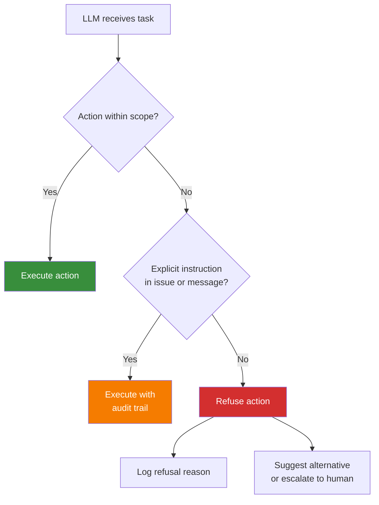
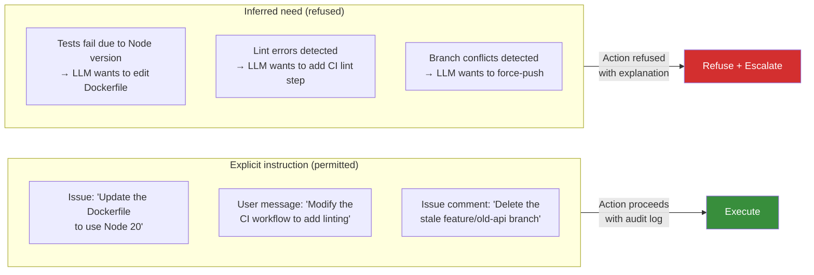

# Scope Boundaries

Scope boundaries define the hard limits of what an autonomous LLM agent is permitted to do without explicit human instruction. They are the single most important control surface for unattended LLM development because they convert an unbounded optimiser into a constrained one.

An LLM optimises for task completion. It does not optimise for safety, organisational policy, or blast-radius minimisation. Without scope boundaries, a sufficiently capable LLM will modify infrastructure, alter authentication systems, delete branches, and interact with production services whenever those actions appear to be the shortest path to completing a task.

## Why Scope Boundaries Exist

### LLMs do not understand organisational risk

An LLM has no model of:

- Which systems are shared across teams
- Which resources serve paying customers
- Which configurations were recently audited and must not change
- Which environments are staging vs production
- Which branches represent release candidates

It treats every accessible file, service, and API as equally modifiable. Scope boundaries encode organisational knowledge that the LLM cannot infer from code.

### LLMs do not hesitate before dangerous actions

A human developer pauses before running `git push --force origin main`. The pause comes from experience, social awareness, and fear of consequences. An LLM has none of these. It executes destructive operations with the same confidence and speed as trivial ones. The time between "LLM decides to force-push" and "team's work is overwritten" is measured in milliseconds.

### Unattended operation removes the last safety net

In attended development, a human reviews each action before execution. In unattended development, the LLM operates autonomously across multiple tasks. Every action it takes is unsupervised. Scope boundaries replace human judgment with machine-enforceable rules that apply regardless of context, conversation history, or how persuasive the reasoning for an action might appear.

### Task completion pressure overrides caution

LLMs exhibit a strong bias toward completing the task they were given. If modifying a CI pipeline, changing an auth module, or force-pushing a branch appears necessary to complete the task, the LLM will do it unless explicitly prevented. This is not a bug -- it is the expected behaviour of an optimiser with an underspecified objective.

## How Maverick Enforces Scope Boundaries

Maverick treats scope boundaries as a foundational skill that loads into every workflow. The enforcement model operates at multiple levels:

- The mav-scope-boundaries skill is loaded as a dependency of every other skill
- It defines four hard refusal categories that the LLM must never execute without explicit instruction
- It distinguishes between "inferred need" (the LLM thinks an action would help) and "explicit instruction" (a human specifically requested it)
- Refusals are logged with the reason, providing an audit trail of what the LLM chose not to do

## The Four Boundary Categories

### 1. Infrastructure changes

Changes to CI/CD pipelines, deployment configurations, infrastructure-as-code templates, build systems, and container orchestration.

**Why this is a boundary:** Infrastructure is shared, multiplied, and persistent. A change to a GitHub Actions workflow affects every future build. A change to a Terraform module affects every deployment. The LLM cannot assess the downstream impact of infrastructure changes because it lacks visibility into the full dependency graph.

### 2. Authentication and authorisation

Changes to auth systems, permission models, access control lists, OAuth configurations, token generation, session management, and role definitions.

**Why this is a boundary:** Auth systems are the security perimeter of the application. A single misconfiguration -- an overly permissive role, a disabled token check, a weakened password policy -- can compromise the entire system. Auth changes require threat modelling that the LLM cannot perform.

### 3. Destructive git operations

Force pushes, hard resets, remote branch deletion, history rewriting, and any operation that permanently alters the shared repository state.

**Why this is a boundary:** These operations are irreversible at the remote level. Once a force push overwrites a branch, the previous state is unrecoverable without manual intervention. The LLM treats all git operations as equally safe because it has no concept of shared state or team coordination.

### 4. Production systems

Any interaction with production databases, production APIs, production message queues, production storage, or any system serving real users.

**Why this is a boundary:** Production is the one environment where mistakes have real consequences: data loss, service outages, security breaches, regulatory violations. There is no legitimate reason for an LLM performing development tasks to touch production systems.

## Forbidden vs Allowed Actions

| Category           | Forbidden                                 | Allowed                                         |
| ------------------ | ----------------------------------------- | ----------------------------------------------- |
| **Infrastructure** | Modify GitHub Actions workflows           | Read workflow files to understand build process |
| **Infrastructure** | Edit Dockerfile or docker-compose.yml     | Create application-level config files           |
| **Infrastructure** | Change Terraform/CloudFormation templates | Reference infrastructure docs for context       |
| **Infrastructure** | Alter Kubernetes manifests                | Update application code that runs in containers |
| **Auth**           | Modify OAuth provider configuration       | Implement UI components that use existing auth  |
| **Auth**           | Change role definitions or permissions    | Write tests that verify auth behaviour          |
| **Auth**           | Alter session management logic            | Use existing auth utilities as documented       |
| **Auth**           | Disable or weaken security middleware     | Add input validation to endpoints               |
| **Git**            | `git push --force`                        | `git push` (non-force to feature branch)        |
| **Git**            | `git reset --hard` on shared branches     | `git reset --hard` on local-only work           |
| **Git**            | Delete remote branches                    | Create and push feature branches                |
| **Git**            | `git rebase` on published branches        | `git rebase` on local unpublished work          |
| **Production**     | Query production databases                | Query development/staging databases             |
| **Production**     | Call production APIs                      | Call development/staging APIs                   |
| **Production**     | Access production secrets                 | Use development secrets from `.env.development` |
| **Production**     | Trigger production deployments            | Trigger staging deployments if instructed       |

## What "Explicit Instruction" Means

The mav-scope-boundaries skill distinguishes between inferred need and explicit instruction. This distinction is critical because LLMs are capable of constructing plausible justifications for any action.

**Explicit instruction** must meet all of the following criteria:

- It appears in the GitHub issue body, a GitHub issue comment, or a direct user message in the current session
- It specifically names the action to be taken (e.g., "update the GitHub Actions workflow to add Node 20")
- It is unambiguous -- not implied, not inferred from context, not derived from a general goal

**The following do NOT constitute explicit instruction:**

- The LLM reasoning that a CI change "would be helpful" to complete the task
- A GitHub issue mentioning infrastructure in passing without requesting changes
- A prior conversation in a different session where the user approved a similar action
- The LLM interpreting a broad goal ("make the tests pass") as permission to modify test infrastructure
- Comments in code that suggest infrastructure changes

## Scope Boundary Violations and Escalation

When the LLM encounters a situation where a boundary-crossing action appears necessary:

1. **Refuse the action** -- do not execute it under any circumstances
2. **Log the refusal** -- record what was attempted and why it was refused
3. **Explain the boundary** -- state which category the action falls into
4. **Suggest alternatives** -- propose actions within scope that partially address the need
5. **Escalate to human** -- create a GitHub issue or comment requesting human intervention for the out-of-scope action

This escalation model ensures that boundary-crossing needs are surfaced to humans without the LLM taking unilateral action.

## Interaction with Other Controls

Scope boundaries are one layer of Maverick's defence-in-depth model. They operate alongside:

- **LLM containment** (llm-containment.md) -- network isolation, credential restrictions, and branch protection provide enforcement even if the LLM ignores scope boundaries
- **Security review** (security-review.md) -- code-level security scanning catches vulnerabilities that scope boundaries do not address
- **CI/CD gates** (cicd.md) -- automated checks in the pipeline reject changes that violate project standards

Scope boundaries are the first line of defence: they prevent the LLM from attempting dangerous actions. Containment is the second line: it prevents dangerous actions from having impact even if attempted. Together, they create a system where the LLM can operate autonomously within a safe envelope.

## Key Properties of Effective Scope Boundaries

| Property                       | Description                                                                                                 |
| ------------------------------ | ----------------------------------------------------------------------------------------------------------- |
| **Unconditional**              | Boundaries apply regardless of the LLM's reasoning or the apparent urgency of the task                      |
| **Unambiguous**                | Each boundary category has clear membership -- an action either crosses a boundary or it does not           |
| **Auditable**                  | Every refusal is logged with the category, the attempted action, and the reason                             |
| **Overridable only by humans** | Explicit instruction from a human can authorise a boundary-crossing action; the LLM cannot authorise itself |
| **Loaded by default**          | The mav-scope-boundaries skill is a dependency of every workflow; it cannot be unloaded or bypassed by the LLM  |
