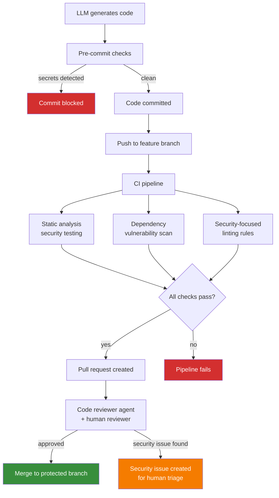

# Security Review

Security review is the practice of systematically identifying vulnerabilities in code before it reaches production. For LLM-generated code, security review is not optional -- it is the primary mechanism for catching an entire class of defects that the LLM is structurally incapable of detecting in its own output.

LLMs generate code by pattern matching against training data. A significant portion of publicly available source code contains security vulnerabilities. The LLM does not distinguish between secure and insecure patterns. It reproduces whatever pattern is statistically likely given the prompt. This means LLM-generated code has a baseline probability of introducing exploitable vulnerabilities even when the task has nothing to do with security.

## Why Security Review Is Critical for LLM Code

### LLMs reproduce vulnerable patterns from training data

LLMs are trained on billions of lines of code from public repositories, Stack Overflow answers, blog posts, and documentation. Much of this code contains:

- SQL queries constructed via string concatenation
- User input passed directly to shell commands
- Hardcoded credentials and API keys
- Missing input validation on API endpoints
- Insecure deserialisation of untrusted data
- Cross-site scripting vulnerabilities in template rendering
- Broken authentication and session management

The LLM does not flag these patterns as dangerous. It reproduces them because they are statistically common in its training data. The more common a vulnerable pattern is in public code, the more likely the LLM is to generate it.

### LLMs do not reason about attack surfaces

A human security engineer considers:

- Who are the adversaries?
- What assets are they targeting?
- What are the entry points into the system?
- What is the trust boundary between components?

An LLM has no concept of adversaries, trust boundaries, or attack motivation. It generates code that is functionally correct -- it does what the task asked for -- without considering how that code might be exploited. Security review fills this gap by applying threat-aware analysis that the LLM cannot perform.

### A single vulnerability can compromise an entire system

One SQL injection in LLM-generated code can expose an entire database. One hardcoded credential committed to a public repository can grant attackers access to production infrastructure. One missing authentication check on an API endpoint can expose all user data. The asymmetry between the effort to introduce a vulnerability (zero, for an LLM) and the impact of exploitation (potentially catastrophic) makes security review non-negotiable.

### Without review, nobody catches it

In attended development, a human developer might notice a suspicious pattern during coding. In code review, a colleague might flag an insecure approach. In unattended LLM development, neither of these checkpoints exists unless explicitly implemented. Maverick's security review process ensures that every piece of LLM-generated code passes through automated and human security checks before reaching production.

## How Maverick Enforces Security Review

Maverick implements security review at multiple stages of the development pipeline.

**Enforcement mechanisms:**

- **Scope-boundaries skill** prevents the LLM from modifying auth systems, credential stores, or security middleware without explicit instruction
- **Code-reviewer agent** performs automated review of every PR, with specific focus on security patterns
- **Pre-commit hooks** run secrets detection before any code is committed
- **CI pipeline** runs static analysis security testing (SAST) and dependency vulnerability scanning
- **Human reviewer** provides final approval with security context the automated tools lack

## Pre-PR Security Scan Process

Before a pull request is created, the following security checks must pass:

| Check              | What it detects                                              | Enforcement point |
| ------------------ | ------------------------------------------------------------ | ----------------- |
| Secrets scan       | API keys, passwords, tokens, private keys in code or config  | Pre-commit hook   |
| SAST               | Injection flaws, XSS, insecure deserialization, broken auth  | CI pipeline       |
| Dependency audit   | Known CVEs in direct and transitive dependencies             | CI pipeline       |
| Security linting   | Insecure function usage, dangerous patterns, missing headers | CI pipeline       |
| License compliance | Copyleft or restricted licenses in dependencies              | CI pipeline       |

If any check fails, the PR cannot be created. The LLM must fix the issue or escalate to a human if the fix requires security domain expertise.

## OWASP Top 10 Awareness

Every security review must check for the OWASP Top 10 vulnerability categories. These represent the most common and impactful web application security risks.

| OWASP Category                     | LLM Risk Level | Why LLMs are prone to this                                                                             |
| ---------------------------------- | -------------- | ------------------------------------------------------------------------------------------------------ |
| **A01: Broken Access Control**     | High           | LLMs implement the happy path; they rarely add authorisation checks unless prompted                    |
| **A02: Cryptographic Failures**    | High           | LLMs use outdated or weak cryptographic algorithms from training data (MD5, SHA1, ECB mode)            |
| **A03: Injection**                 | Critical       | String concatenation for SQL/commands is the most common pattern in training data                      |
| **A04: Insecure Design**           | High           | LLMs implement what was asked, not what should have been asked; they do not challenge requirements     |
| **A05: Security Misconfiguration** | Medium         | LLMs copy configuration patterns without understanding their security implications                     |
| **A06: Vulnerable Components**     | Medium         | LLMs suggest packages they have seen frequently, not packages that are currently maintained or patched |
| **A07: Auth Failures**             | High           | Session management, token handling, and password policies require security reasoning LLMs lack         |
| **A08: Data Integrity Failures**   | Medium         | LLMs do not verify the integrity of data from external sources or CI/CD pipelines                      |
| **A09: Logging Failures**          | High           | LLMs under-log security events and over-log sensitive data; both are security failures                 |
| **A10: SSRF**                      | Medium         | LLMs pass URLs from user input to server-side HTTP clients without validation                          |

The code-reviewer agent checks for these patterns in every PR. Human reviewers should pay particular attention to A01, A03, and A07 as these are the categories where LLM-generated code is most likely to be vulnerable.

## Secrets Detection and Prevention

Secrets exposure is the highest-frequency security risk in LLM-generated code. LLMs work with configuration files, environment variables, and credentials as part of normal development. Without explicit constraints, they will:

- Commit `.env` files containing API keys
- Hardcode credentials in source files for "testing"
- Include secrets in error messages or log output
- Copy example configurations that contain real credentials
- Generate test fixtures with production-like secrets

**Detection layers:**

```mermaid
flowchart LR
    subgraph Prevention["Prevention"]
        P1[".gitignore rules for<br/>secret file patterns"]
        P2["Scope-boundaries skill:<br/>no credential modification"]
        P3["No production credentials<br/>in LLM environment"]
    end

    subgraph Detection["Detection"]
        D1["Pre-commit hook:<br/>pattern-based secrets scan"]
        D2["CI pipeline:<br/>secrets scanning tool"]
        D3["PR review:<br/>manual secrets check"]
    end

    subgraph Response["Response"]
        R1["Commit blocked"]
        R2["Pipeline fails"]
        R3["Credential rotation<br/>if secret was exposed"]
    end

    Prevention --> Detection --> Response
```

**Secret patterns to detect:**

- API keys (AWS, GCP, Azure, Stripe, SendGrid, Twilio)
- Database connection strings with embedded credentials
- Private keys (RSA, EC, PGP)
- OAuth client secrets
- JWT signing keys
- Webhook secrets
- Personal access tokens (GitHub, GitLab, Bitbucket)
- Base64-encoded credentials
- High-entropy strings that match credential patterns

**Response to detected secrets:**

- If caught at pre-commit: block the commit, remove the secret, and verify it was not a real credential
- If caught in CI: fail the pipeline, alert the developer, and rotate the credential if it was real
- If found in git history: rotate the credential immediately; rewriting git history is insufficient because the secret may already be cached

## Dependency Security

LLM-generated code frequently introduces new dependencies. Each dependency expands the attack surface.

**Risks of LLM-selected dependencies:**

- LLMs suggest packages they encountered frequently in training data, not packages that are currently maintained
- LLMs do not check whether a package has known CVEs
- LLMs may suggest packages that have been deprecated, abandoned, or compromised
- LLMs cannot assess the trustworthiness of a package maintainer

**Dependency security checks:**

| Check                            | Tool examples                              | When it runs                 |
| -------------------------------- | ------------------------------------------ | ---------------------------- |
| Known CVE scan                   | `npm audit`, `pip audit`, Snyk, Dependabot | CI pipeline on every PR      |
| License compliance               | FOSSA, license-checker                     | CI pipeline on every PR      |
| Maintenance status               | Manual review                              | Human PR review              |
| Download statistics / popularity | Manual review                              | Human PR review              |
| Typosquatting detection          | Socket, manual review                      | CI pipeline and human review |

When a new dependency is introduced, the PR review should verify:

- The package is actively maintained (commits within the last 6 months)
- The package has no unpatched critical or high CVEs
- The package license is compatible with the project
- The package name is not a typosquat of a popular package
- The package is necessary and not duplicating existing functionality

## Input Validation at System Boundaries

Every point where data enters the system from an external source is a potential attack vector. LLMs consistently under-validate input because validation is not part of the "complete the task" objective.

**System boundaries requiring validation:**

- HTTP request parameters (query strings, path parameters, headers)
- HTTP request bodies (JSON, form data, file uploads)
- WebSocket messages
- Message queue payloads
- Database query results (when the database is shared with other systems)
- File system reads (when file paths come from user input)
- Environment variables (when used in security-sensitive operations)

**Validation principles:**

- Validate at the boundary, not deep in the call stack
- Use allowlists over denylists (define what is permitted, not what is forbidden)
- Validate type, length, format, and range
- Reject invalid input; do not attempt to sanitise and use it
- Log validation failures as potential attack indicators

**Common LLM validation failures:**

| Failure                             | Example                                        | Consequence                       |
| ----------------------------------- | ---------------------------------------------- | --------------------------------- |
| No validation at all                | User input passed directly to database query   | SQL injection                     |
| Type coercion instead of validation | `parseInt(userInput)` without checking for NaN | Logic errors, potential injection |
| Denylist instead of allowlist       | Blocking `<script>` but not other XSS vectors  | Cross-site scripting              |
| Validation in the wrong layer       | Checking input in the frontend but not the API | Bypassed by direct API calls      |
| Partial validation                  | Checking length but not format                 | Format-based injection attacks    |

## Escalation: When to Create a Security Issue

Not every security finding can be auto-fixed. The LLM must escalate to human triage when:

- The vulnerability requires architectural changes (e.g., adding an auth layer that does not exist)
- The fix requires security domain expertise the LLM does not have (e.g., implementing CSP headers correctly)
- The vulnerability is in a dependency and requires upgrading to a version with breaking changes
- The finding might be a false positive but the LLM cannot determine this with confidence
- The vulnerability involves cryptographic implementation (the LLM must never implement custom cryptography)
- The fix would require modifying auth systems, which is outside scope boundaries

**Escalation process:**

1. Create a GitHub issue with the `security` and `bug` labels
2. Include the vulnerability type (OWASP category if applicable)
3. Include the file and line number where the vulnerability exists
4. Describe the potential impact without including exploit details in the public issue
5. If the vulnerability is critical, note the urgency in the issue title
6. Do not attempt to fix security issues that require expertise beyond the LLM's scope

## Interaction with Other Controls

Security review operates alongside Maverick's other containment and quality mechanisms:

- **Scope boundaries** (scope-boundaries.md) prevent the LLM from modifying auth systems or security infrastructure, reducing the surface area where security-critical mistakes can be introduced
- **LLM containment** (llm-containment.md) ensures that even if the LLM generates code with vulnerabilities, it cannot deploy that code to production or access production data
- **Code review** (code-review.md) provides the human review stage where security context and threat modelling supplement automated scanning
- **CI/CD** (cicd.md) provides the automated pipeline where security scans run on every push

Security review is not a substitute for containment, and containment is not a substitute for security review. Containment prevents the LLM from accessing systems it should not touch. Security review prevents the LLM from introducing vulnerabilities in the systems it is allowed to touch.
