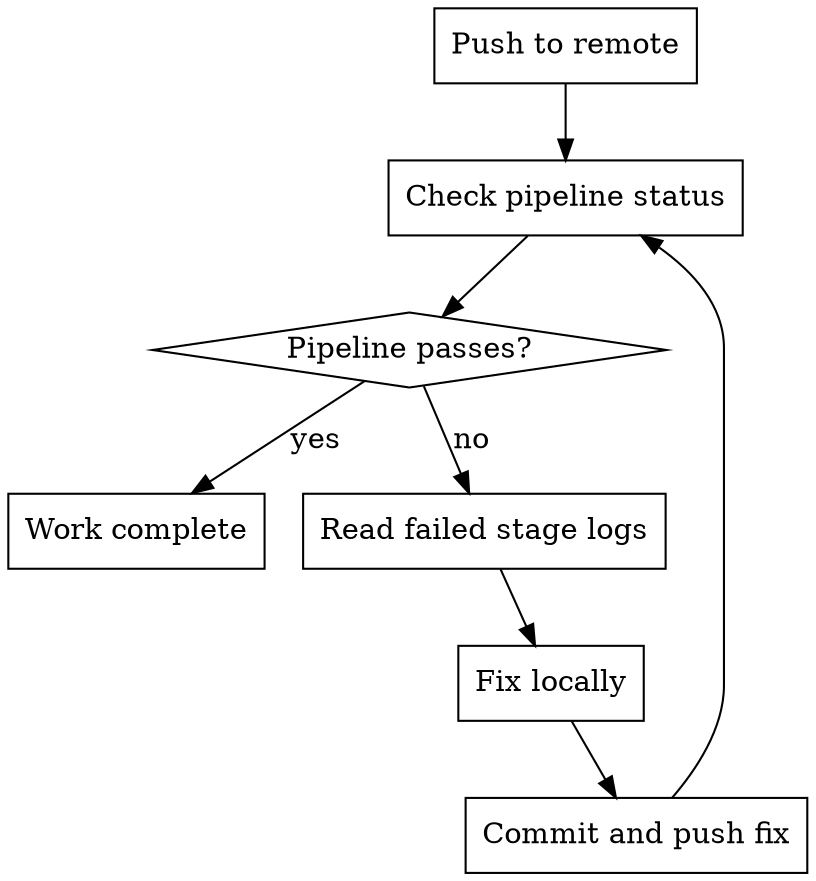

# CI Awareness — Azure DevOps

After pushing, monitor Azure DevOps pipelines and do not declare work complete until CI passes. This skill implements the platform-specific behaviours defined in the `cicd-bestpractice` skill.

## Prerequisites

- Azure CLI (`az`) installed and authenticated with the DevOps extension
- Or direct API access via `curl` with an Azure DevOps personal access token

```bash
# Install Azure DevOps extension if needed
az extension add --name azure-devops

# Configure defaults
az devops configure --defaults organization=https://dev.azure.com/<org> project=<project>
```

## Check CI Status

```bash
# List recent pipeline runs for the current branch
BRANCH=$(git branch --show-current)
az pipelines runs list --branch "refs/heads/$BRANCH" --top 1

# Show details of a specific run
az pipelines runs show --id <run-id>

# View build logs
az pipelines runs logs show --id <run-id>

# List pipeline runs with a specific status
az pipelines runs list --branch "refs/heads/$BRANCH" --status failed --top 5
```

### Without Azure CLI

```bash
# Using Azure DevOps REST API directly
ORG="<org>"
PROJECT="<project>"
BRANCH=$(git branch --show-current)

# List builds for branch
curl -u ":$AZURE_DEVOPS_PAT" \
  "https://dev.azure.com/$ORG/$PROJECT/_apis/build/builds?branchName=refs/heads/$BRANCH&\$top=1&api-version=7.0"

# Get build timeline (stages/jobs/tasks)
curl -u ":$AZURE_DEVOPS_PAT" \
  "https://dev.azure.com/$ORG/$PROJECT/_apis/build/builds/<build-id>/timeline?api-version=7.0"

# Get build logs
curl -u ":$AZURE_DEVOPS_PAT" \
  "https://dev.azure.com/$ORG/$PROJECT/_apis/build/builds/<build-id>/logs?api-version=7.0"
```

## Process After Push



1. After pushing, run `az pipelines runs list` to check pipeline status
2. If pipeline passes — work is complete
3. If pipeline fails:
   - Identify the failed stage/job with `az pipelines runs show --id <run-id>`
   - Read the logs with `az pipelines runs logs show --id <run-id>`
   - Fix the issue locally
   - Run local verification again (see local-verification skill)
   - Commit the fix and push
   - Monitor the pipeline again
4. Do not declare work complete until the pipeline passes

## Common CI Failures Not Caught Locally

| CI failure | Why it wasn't caught locally | Fix |
| --- | --- | --- |
| Agent pool mismatch | Pipeline requires specific agent | Check `pool` specification in pipeline YAML |
| Missing pipeline variable | Variable defined in pipeline settings | Check Pipeline > Variables in Azure DevOps UI |
| Service connection issue | Azure resource access differs | Check service connections and permissions |
| NuGet/npm feed auth | Private feed requires pipeline auth | Check feed permissions and pipeline identity |
| Template resolution | Extends templates not available locally | Check template repository references |

## Azure DevOps Concepts

| Concept | Description |
| ------- | ----------- |
| Pipeline | CI/CD definition, either YAML or classic editor |
| Stage | Major phase (Build, Test, Deploy) — stages run sequentially by default |
| Job | Collection of steps that run on an agent — jobs within a stage can run in parallel |
| Step/Task | Individual action (script, built-in task) |
| Agent pool | Collection of machines that run pipeline jobs (Microsoft-hosted or self-hosted) |
| Variable group | Shared set of variables linked to one or more pipelines |
| Service connection | Authenticated link to external services (Azure, Docker Hub, etc.) |
| Environment | Deployment target with approval gates and checks |
| Artifact | Published output (build artifact, pipeline artifact) available to downstream stages |

## Boundaries

### Never Do Without Explicit Instruction

- Modify `azure-pipelines.yml` or pipeline template files
- Add, remove, or change pipeline stages, jobs, or tasks
- Modify deployment configurations or environments
- Change pipeline variables or variable groups
- Disable or skip pipeline checks or approvals
- Trigger release pipelines or deployment stages
- Modify service connections or agent pool configurations

### Always Do

- Monitor pipeline status after pushing
- Fix CI failures before declaring work complete
- Report CI failures clearly if you cannot fix them
