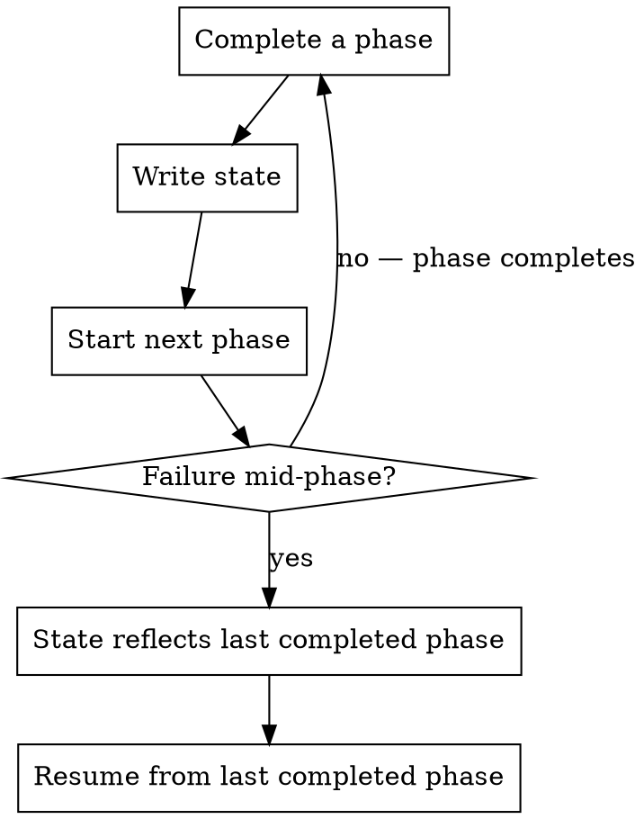
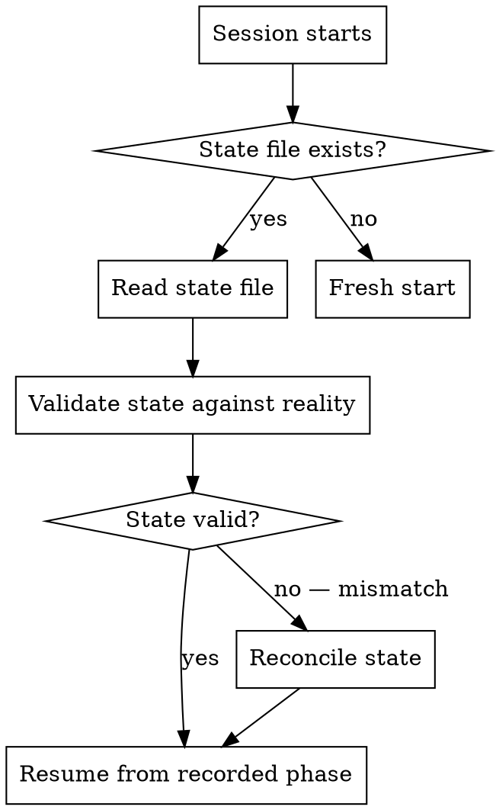
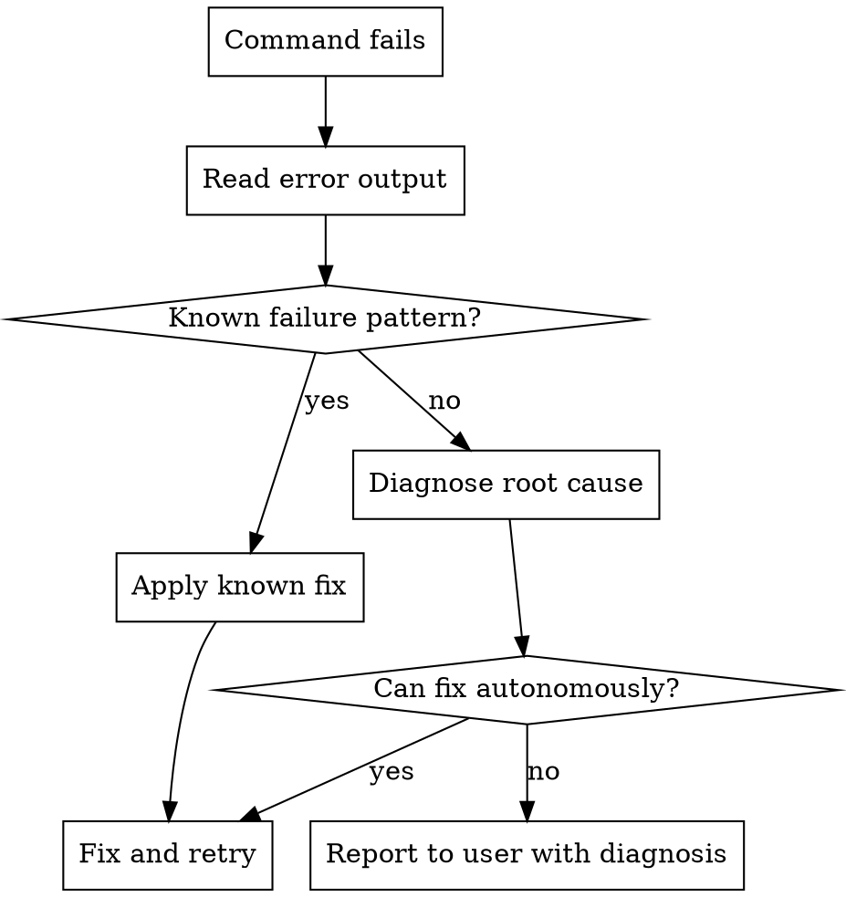
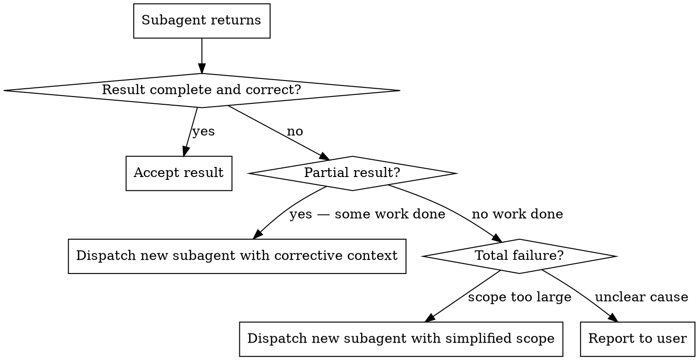

# Claude Code Error Handling and Recovery

Patterns for making Claude Code workflows resilient to failures. This covers Claude Code's own recovery mechanisms, not error handling in generated application code.

## Principles

1. **Persist state early and often** — write progress to a state file after each phase so work can be resumed
2. **Post artefacts immediately** — designs, plans, and status updates go to GitHub as soon as they are ready, not at the end
3. **Diagnose before retrying** — when something fails, understand why before trying again
4. **Verify before continuing** — on resume, confirm recorded state matches reality
5. **Isolate failures** — subagent failures stay in the subagent; fix via a new subagent, not by polluting the main session

## State Persistence

Maintain a state file to track workflow progress. The github-issue-workflow skill defines the canonical state file format for issue-driven work (`.claude/issue-state.json`). This section covers the general principles.

### What to Persist

| Field | Why |
|---|---|
| Current phase | Resume from the right point |
| Branch name | Avoid re-deriving or creating duplicates |
| GitHub comment IDs | Update existing comments instead of posting new ones |
| Issue/task reference | Know what we're working on |

### When to Write State

Write to the state file **after** each significant milestone, not before:



Writing **after** completion means the state file always reflects a consistent, completed milestone. If a failure occurs mid-phase, the state file points to the last successfully completed phase, and the incomplete phase can be re-executed from scratch.

### State File Hygiene

- **Gitignore** — state files are session artefacts, not project code. Always gitignore them.
- **One file per workflow** — if working on multiple issues concurrently (e.g., in worktrees), use separate state files.
- **Clean up on completion** — delete the state file after the workflow completes successfully (PR created, issue updated).
- **Atomic writes** — write to a temp file then rename, to avoid corruption from partial writes:
  ```bash
  jq '.phase = "design"' .claude/issue-state.json > .claude/issue-state.tmp && mv .claude/issue-state.tmp .claude/issue-state.json
  ```

## Artefact Durability

Post artefacts (designs, plans, status updates) to GitHub immediately after they are produced. This ensures they survive Claude Code session failures.

### What Counts as an Artefact

| Artefact | Where to post | When |
|---|---|---|
| Solution design | Issue comment | Immediately after design is approved/produced |
| Implementation plan | Issue comment | Immediately after plan is approved/produced |
| Completion summary | Issue comment | After all steps pass verification |
| Blocking questions | Issue comment | When blocked and unable to resolve |

### Why Not Wait

If you batch artefacts and post them at the end:
- A crash loses all intermediate work
- The human has no visibility into progress
- Recovery requires re-doing the design/planning work

Post each artefact as soon as it is ready. Use the github-issue-workflow comment patterns to capture comment IDs for later updates.

## Crash Recovery (Session Resume)

When starting a session that may be resuming previous work:



### Validating State Against Reality

Before resuming, verify that the recorded state matches what actually exists:

| State field | Validation check |
|---|---|
| Branch | Does the branch exist locally? `git branch --list $BRANCH` |
| Branch | Does it exist on remote? `git ls-remote --heads origin $BRANCH` |
| Phase | Are the expected commits present? `git log --oneline -5` |
| Comment IDs | Do the comments exist on the issue? `gh api repos/$REPO/issues/comments/$ID --jq '.id'` |
| Issue | Is the issue still open? `gh issue view $ISSUE --json state -q '.state'` |

### Reconciling Mismatched State

If validation finds discrepancies:

| Mismatch | Action |
|---|---|
| Branch exists locally but not on remote | Branch was never pushed — continue from implementation phase |
| Branch exists on remote but not locally | `git fetch origin && git checkout $BRANCH` |
| Branch does not exist anywhere | State is stale — start fresh, but check if a PR was already created |
| Comment ID does not exist | Comment was deleted — post a new one and update state |
| Issue is closed | Check if a PR was merged — work may already be complete |
| Phase says `implement` but no commits on branch | Implementation was interrupted — restart implementation phase |

### Reporting Recovery

When resuming, briefly report to the user what was recovered:

```
Resuming work on issue #42 (feat/42-add-export).
- Phase: implementation (3 of 5 steps completed)
- Branch: feat/42-add-export (exists locally and on remote)
- Design and plan already posted to issue
- Continuing from step 4.
```

## Command Failure Handling

When a tool or command fails during execution:



### Known Failure Patterns

| Error pattern | Likely cause | Fix |
|---|---|---|
| `ENOENT` / file not found | Wrong path or file not yet created | Verify path, check if a prerequisite step was skipped |
| `EACCES` / permission denied | File permissions or sandbox restriction | Check permissions, do not bypass sandbox |
| `npm ERR!` / dependency resolution | Lock file out of sync or missing dependency | Run `pnpm install` / `npm install` |
| `tsc` type errors after code change | Introduced type mismatch | Read the error, fix the type issue |
| Test timeout | Test is hanging or async issue | Check for missing `await`, unclosed handles |
| `gh: Not Found` | Wrong repo, issue number, or permissions | Verify repo and issue exist, check auth |
| Git conflict markers in file | Unresolved merge conflict | Follow git-workflow merge conflict procedure |

### Rules

- **Never retry blindly** — if a command fails, understand why before running it again. The same command will produce the same failure.
- **Never brute-force past failures** — do not add `--force`, `--no-verify`, or `|| true` to make a failing command succeed. Fix the root cause.
- **Limit retry attempts** — if a fix-and-retry cycle fails 3 times, stop and report to the user with full context.
- **Preserve error output** — include the actual error message when reporting to the user, not just "it failed".

## Subagent Failure Handling

When a subagent fails or returns incomplete results:



### Rules

- **Do not fix subagent failures in the main session** — this pollutes the main context with debugging detail. Dispatch a new subagent.
- **Provide corrective context** — when dispatching a fix subagent, include what the previous subagent did, what it got wrong, and what specifically needs to be fixed.
- **Reduce scope on repeated failure** — if a subagent fails twice on the same task, split the task into smaller pieces and dispatch subagents for each piece.
- **Never silently swallow failures** — if a subagent fails and you cannot recover, report the failure clearly to the user.
