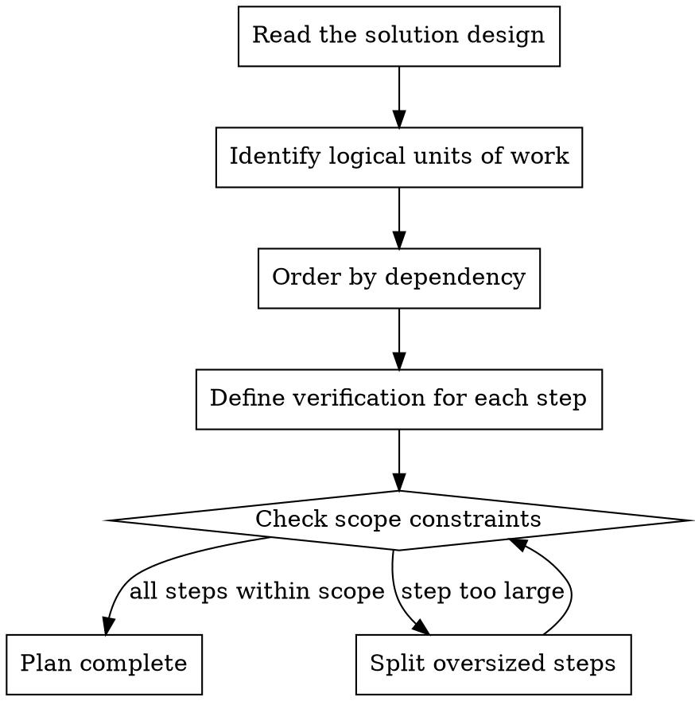
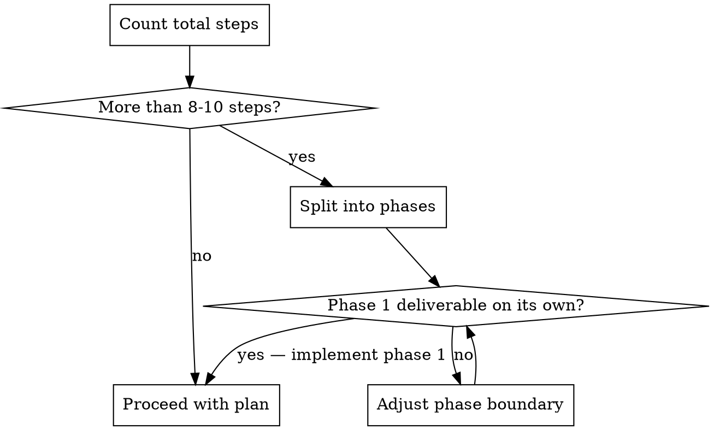

# Create Implementation Plan

Break a solution design into small, ordered implementation steps that can be individually implemented, verified, and committed.

## Principles

1. **Each step is independently verifiable** — you can confirm it works before moving to the next
2. **Each step is independently committable** — it leaves the codebase in a working state
3. **Each step is small** — touches no more than 2-3 files
4. **Steps are ordered by dependency** — later steps build on earlier ones
5. **The sum of all steps satisfies the design** — nothing is missing, nothing is extra

## Process



### 1. Identify Logical Units of Work

From the solution design's "Areas Affected" and "Approach", identify natural boundaries:

- A new file or module
- A modification to an existing function
- A new test suite
- A configuration change
- A database migration

### 2. Order by Dependency

Arrange steps so each builds on the previous:

- Data models before business logic
- Business logic before API endpoints
- API endpoints before UI integration
- Implementation before tests (or tests before implementation if using TDD)

### 3. Define Verification

Every step must have a concrete verification method:

- `pnpm test path/to/file.test.ts` — run specific tests
- `pnpm lint` — lint passes
- `pnpm typecheck` — types compile
- Manual check — describe what to inspect

### 4. Check Scope Constraints

Each step must satisfy:

- **File limit** — touches no more than 2-3 files
- **Single concern** — does one logical thing
- **Verifiable** — has a concrete verification command or check
- **Committable** — the codebase works after this step (no broken intermediate states)

If a step violates any constraint, split it further.

## Step Structure

Use checkbox format so progress can be tracked by updating the plan comment on the GitHub issue.

```markdown
## Implementation Plan

- [ ] **Step 1: <imperative description>**
  - Files: `path/to/file.ts`, `path/to/file.test.ts`
  - Change: <what this step does>
  - Verify: `<command to verify>`

- [ ] **Step 2: <imperative description>**
  - Files: `path/to/file.ts`
  - Change: <what this step does>
  - Verify: `<command to verify>`

...
```

## Scope Control

### Session Scope Check

Before finalising the plan, assess whether all steps can be completed in a single session:



- **8-10 steps or fewer** — proceed as a single plan
- **More than 10 steps** — split into phases, each deliverable on its own. Implement phase 1, then reassess. Create additional issues for later phases if needed.

### Red Flags: Step is Too Large

- "Update the API layer" — which files? Which endpoints? Split.
- "Add tests" — for what? Split by test file or test suite.
- "Refactor the module" — what specifically changes? Split by function or concern.
- Step touches more than 3 files — split by file group.
- Verification is "check that everything works" — too vague, split into specific checks.

### Red Flags: Step is Too Small

- "Add import statement" — combine with the step that uses the import.
- "Create empty file" — combine with the step that adds content.
- "Update a single line" — combine with related changes unless the line is independently significant.

## Execution

Once the plan is approved, follow the plan-execution skill to execute it step-by-step.
