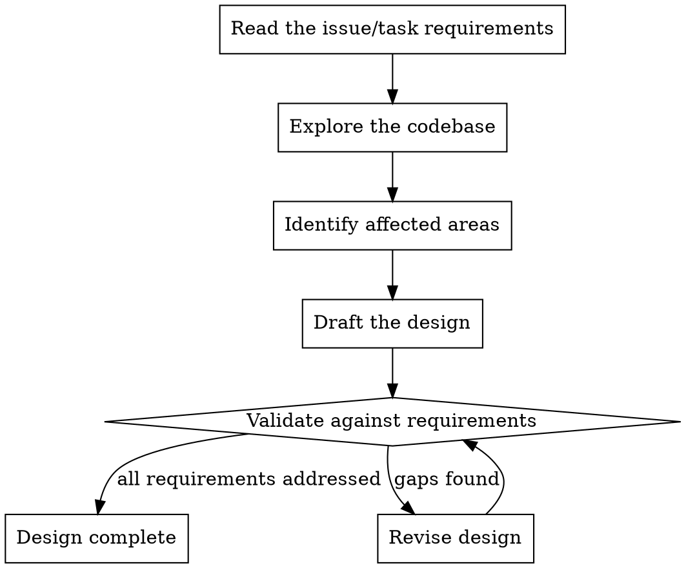

# Create Solution Design

Produce a solution design before any implementation begins. The design validates the approach, surfaces risks early, and creates a shared understanding of what will be built.

## When to Create a Design

Always. Even for small tasks. A design for a one-line fix might be two sentences, but it forces you to confirm you understand the problem and have identified the right place to make the change.

## Process



### 1. Read the Requirements

Extract from the issue or task:

- What is being requested (the outcome)
- Why it matters (the motivation)
- Constraints or acceptance criteria
- Any referenced files, APIs, or systems

### 2. Explore the Codebase

Use Glob, Grep, Read, and subagents to understand:

- Where the relevant code lives
- Existing patterns and conventions in the area
- Related functionality that might be affected
- Test coverage in the affected area
- Dependencies (internal and external)

### 3. Identify Affected Areas

List every file, module, or system that will be created or modified. Be specific — name files, not just "the API layer".

### 4. Draft the Design

Use the structure below.

### 5. Validate Against Requirements

Walk through each requirement or acceptance criterion from the issue and confirm the design addresses it. If any are missed, revise.

## Design Structure

```markdown
## Solution Design

### Approach

<1-2 paragraphs describing the solution at a high level. What will be built/changed and how it fits into the existing architecture.>

### Areas Affected

- `path/to/file.ts` — <what changes and why>
- `path/to/other-file.ts` — <what changes and why>
- `path/to/new-file.ts` — <new file, purpose>

### Key Decisions

- <Decision 1> — <rationale, alternatives considered>
- <Decision 2> — <rationale, alternatives considered>

### Risks / Open Questions

- <Risk or unknown that might complicate implementation>
- <Question that needs answering before or during implementation>

### Acceptance Criteria Mapping

- [ ] <Criterion from issue> → addressed by <which part of the approach>
- [ ] <Criterion from issue> → addressed by <which part of the approach>
```

## Design Sizing

Scale the design to the task:

| Task size                                | Design depth                                   |
| ---------------------------------------- | ---------------------------------------------- |
| Trivial (typo, config change)            | 2-3 sentences: what file, what change, why     |
| Small (single function, simple bug fix)  | Approach + areas affected                      |
| Medium (new endpoint, feature addition)  | Full design structure                          |
| Large (new system, cross-cutting change) | Full design + architecture diagram description |

## Validation Checklist

Before the design is considered complete:

- [ ] Every acceptance criterion from the issue is mapped to a part of the design
- [ ] All affected files are identified (not just "the API")
- [ ] Key decisions include rationale (not just "I chose X")
- [ ] Risks are honest — if there are none, you haven't looked hard enough
- [ ] The approach is achievable in a single session (if not, flag for further decomposition)
