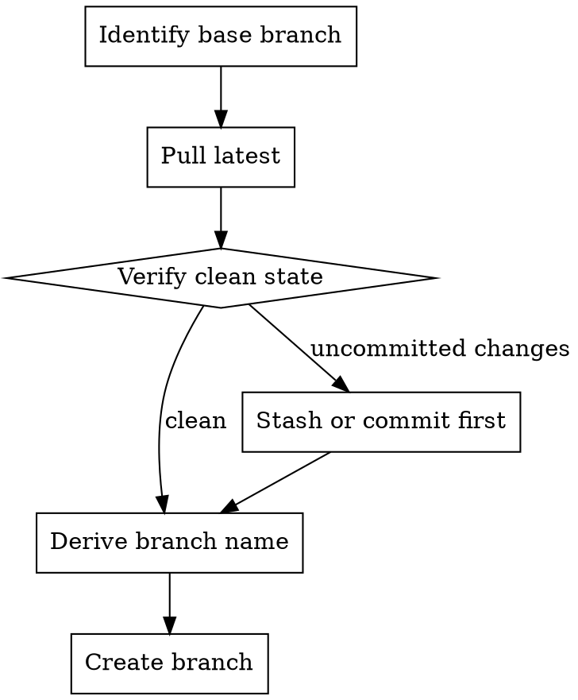
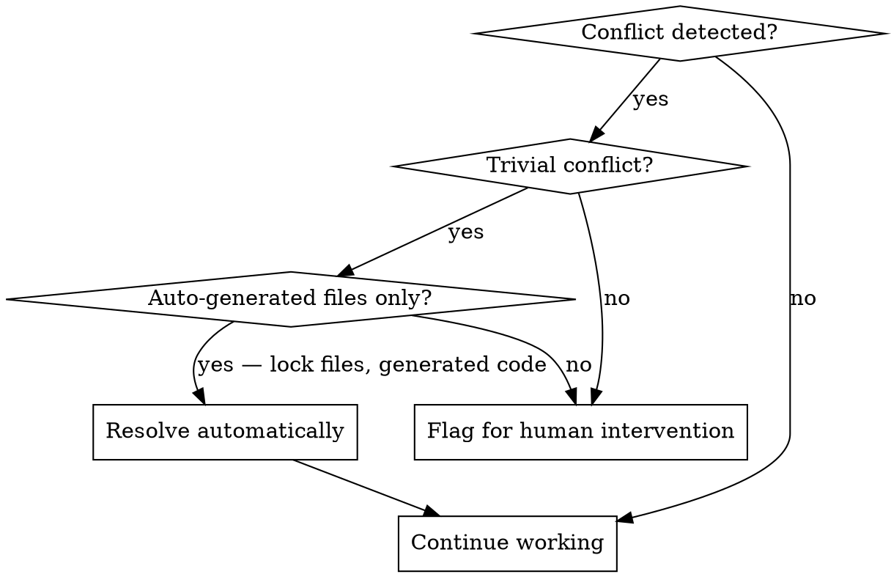

# Git Workflow

A simplified Gitflow strategy for all development work. This skill defines how branches, commits, and merges are managed.

## Branch Strategy

```
main (production — never touched directly)
  └── develop (integration branch — never committed to directly)
        ├── feat/42-add-export
        ├── fix/57-login-crash
        └── chore/63-update-deps
```

### Branch Roles

| Branch | Purpose | Who commits | Protected |
|---|---|---|---|
| `main` | Production releases | Merge from `develop` only (human-gated) | Yes |
| `develop` | Integration branch | Merge from feature/fix branches via PR only | Yes |
| Feature/fix branches | Active development | Claude Code and developers | No |

### Rules

- **Never commit directly to `main` or `develop`**. All changes reach these branches via pull request.
- **All work happens on feature/fix branches** created from `develop`.
- **One branch per issue/task**. Do not combine unrelated work on a single branch.

## Branch Naming

Format: `<type>/<issue-number>-<short-description>`

### Deriving the Type

Infer from issue labels, title, or the nature of the work:

| Label or keyword | Branch prefix |
|---|---|
| `bug`, `fix`, `defect` | `fix/` |
| `feature`, `enhancement` | `feat/` |
| `docs`, `documentation` | `docs/` |
| `refactor`, `tech-debt` | `refactor/` |
| `chore`, `maintenance`, `deps` | `chore/` |
| `test`, `testing` | `test/` |
| Default (when unclear) | `feat/` |

### Deriving the Description

- Use 2-4 lowercase words separated by hyphens
- Describe the outcome, not the method
- Keep it short — branch names appear in logs and PRs

**Good:** `feat/42-add-rubric-export`, `fix/57-prevent-login-crash`
**Bad:** `feature/issue-42-implement-the-new-rubric-export-feature-for-teachers`

## Creating a Branch



### Identify the Base Branch

The base branch is typically `develop`. To confirm, check:

```bash
# Check default branch
gh repo view --json defaultBranchRef -q '.defaultBranchRef.name'

# Check if develop exists
git branch -r | grep -q 'origin/develop'
```

- If `develop` exists — branch from `develop`
- If only `main` exists — branch from `main`
- If uncertain — ask the user

### Create the Branch

```bash
git checkout $BASE_BRANCH && git pull origin $BASE_BRANCH && git checkout -b $BRANCH_NAME
```

## Conventional Commits

All commits must follow the [Conventional Commits](https://www.conventionalcommits.org/) specification.

### Format

```
<type>(<optional scope>): <description> (#<issue-number>)
```

### Types

| Type | When to use |
|---|---|
| `feat` | New feature or functionality |
| `fix` | Bug fix |
| `docs` | Documentation only |
| `refactor` | Code change that neither fixes a bug nor adds a feature |
| `test` | Adding or updating tests |
| `chore` | Build process, dependencies, tooling |
| `style` | Formatting, whitespace (no logic change) |
| `perf` | Performance improvement |
| `ci` | CI/CD configuration changes |

### Rules

- **Always reference the issue number** in the commit message: `(#42)`
- **Use imperative mood**: "add export" not "added export" or "adds export"
- **Keep the first line under 72 characters**
- **One logical change per commit** — do not batch unrelated changes

### Examples

```
feat: add rubric export endpoint (#42)
fix: prevent crash when rubric is empty (#57)
test: add integration tests for grading service (#42)
refactor: extract token cost calculation into utility (#63)
chore: update vitest to v3.1 (#71)
```

### Multi-line Commits

For commits that need more context:

```
feat: add rubric export endpoint (#42)

Adds a new GET /api/assessments/:id/export endpoint that returns
the assessment rubric as a downloadable CSV file. Includes proper
content-type headers and filename disposition.
```

## Merge Conflicts



### When to Resolve Automatically

Only resolve conflicts in **auto-generated files** where the resolution is unambiguous:
- Lock files (`package-lock.json`, `pnpm-lock.yaml`, `yarn.lock`) — regenerate with `pnpm install` / `npm install`
- Generated type files — regenerate with the appropriate codegen command

### When to Flag for Human Intervention

Flag all other conflicts for human review. Report clearly:
- Which files have conflicts
- What the conflicting changes are (both sides)
- Why the conflict likely occurred (e.g., "both branches modified the grading calculation")

```bash
# Show conflicting files
git diff --name-only --diff-filter=U

# Show the conflict markers in a specific file
git diff -- path/to/file.ts
```

**Never:**
- Silently resolve conflicts in application code
- Choose "ours" or "theirs" without understanding the intent of both sides
- Delete one side of a conflict to make it go away

## Branch Cleanup

After a pull request is merged, clean up the feature branch.

### Local Cleanup

```bash
# Switch back to the base branch
git checkout $BASE_BRANCH && git pull origin $BASE_BRANCH

# Delete the local feature branch
git branch -d $BRANCH_NAME
```

Use `-d` (not `-D`) — this will refuse to delete if the branch has unmerged changes, which is a safety check.

### Remote Cleanup

GitHub can be configured to auto-delete branches after PR merge. If not:

```bash
git push origin --delete $BRANCH_NAME
```

### Bulk Cleanup of Merged Branches

For cleaning up stale local branches that have been merged:

```bash
# List merged branches (excluding main and develop)
git branch --merged $BASE_BRANCH | grep -vE '^\*|main|develop'

# Delete them
git branch --merged $BASE_BRANCH | grep -vE '^\*|main|develop' | xargs git branch -d
```

## Pulling Updates

When your feature branch falls behind the base branch:

```bash
# Preferred: rebase onto latest base (clean history)
git fetch origin && git rebase origin/$BASE_BRANCH

# Alternative: merge base into feature (preserves history)
git fetch origin && git merge origin/$BASE_BRANCH
```

Use rebase for branches with only your own commits. Use merge if the branch has been shared or has a complex history. If uncertain, ask the user.

## Pre-Flight Checks

Before any branch operation, verify the working tree is clean:

```bash
git status --porcelain
```

If there are uncommitted changes:
- **Commit them** if they are part of the current work
- **Stash them** if they are unrelated: `git stash push -m "WIP: description"`
- **Ask the user** if you are unsure what to do with them
