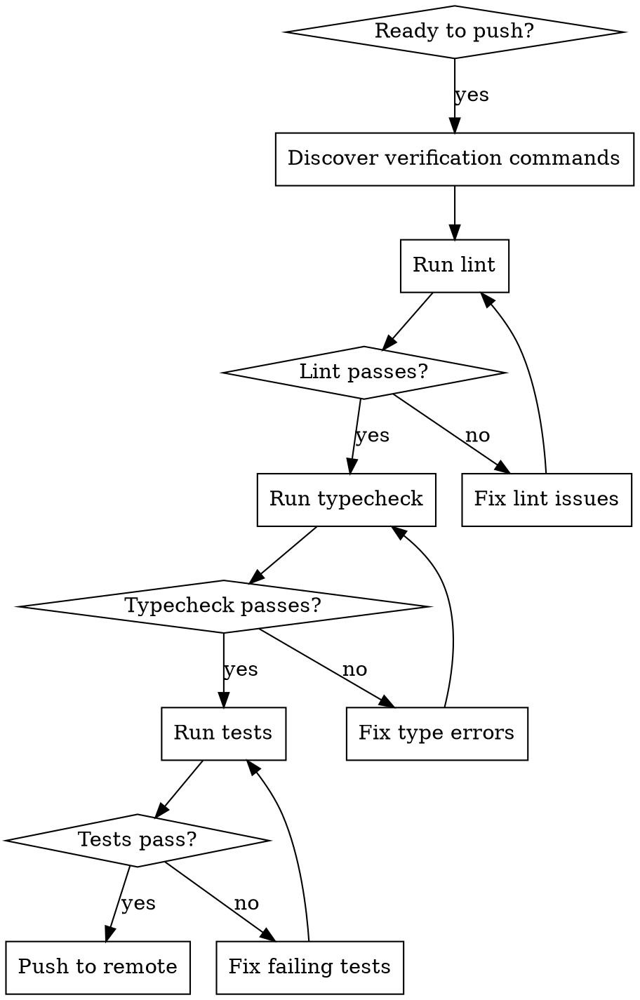

# Local Verification

Run lint, typecheck, and tests locally before every push. Never push code that fails local checks.

## Principles

1. **Verify locally first** — never push code that fails lint, typecheck, or tests
2. **Never skip git hooks** — never use `--no-verify` with git commands
3. **Fix before proceeding** — stop at the first failure, fix it, then continue

## Process



## Discovering Verification Commands

Projects use different tooling. Discover the available commands by checking these sources in order:

1. **`package.json` scripts** (Node.js projects):
   ```bash
   cat package.json | jq '.scripts | keys[]' 2>/dev/null
   ```
   Look for: `lint`, `typecheck`, `type-check`, `tsc`, `test`, `test:unit`, `check`

2. **`Makefile` targets**:
   ```bash
   grep -E '^[a-zA-Z_-]+:' Makefile 2>/dev/null
   ```
   Look for: `lint`, `check`, `test`, `verify`, `validate`

3. **Monorepo root** (if applicable):
   ```bash
   cat package.json | jq '.scripts' 2>/dev/null
   ```
   Look for workspace-level commands like `test:all`, `lint:all`, or use the package manager's workspace filter.

4. **Common patterns** if no scripts are found:

   | Tool | Lint | Typecheck | Test |
   |---|---|---|---|
   | npm/pnpm | `pnpm lint` | `pnpm typecheck` | `pnpm test` |
   | Turborepo | `pnpm turbo lint` | `pnpm turbo typecheck` | `pnpm turbo test` |
   | Make | `make lint` | `make typecheck` | `make test` |
   | Python (uv) | `uv run ruff check` | `uv run mypy .` | `uv run pytest` |
   | Go | `golangci-lint run` | (built into compile) | `go test ./...` |

## Running Verification

Run in this order — each stage catches different classes of issues:

1. **Lint** — catches style issues, unused imports, formatting
2. **Typecheck** — catches type errors, missing properties, wrong arguments
3. **Tests** — catches logic errors, regressions, broken integrations

Stop at the first failure. Fix it before proceeding to the next stage.

## Scope-Appropriate Verification

Not every change needs the full suite:

| Change type | Lint | Typecheck | Tests |
|---|---|---|---|
| Code changes | Yes | Yes | Yes — at minimum the affected test files |
| Config/YAML only | No | No | No (unless config affects runtime) |
| Documentation only | No | No | No |
| New dependencies added | Yes | Yes | Yes — full suite |

For the final push before PR creation, always run the full suite regardless of change type.
