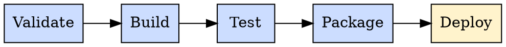
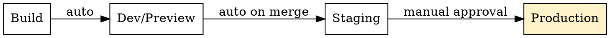
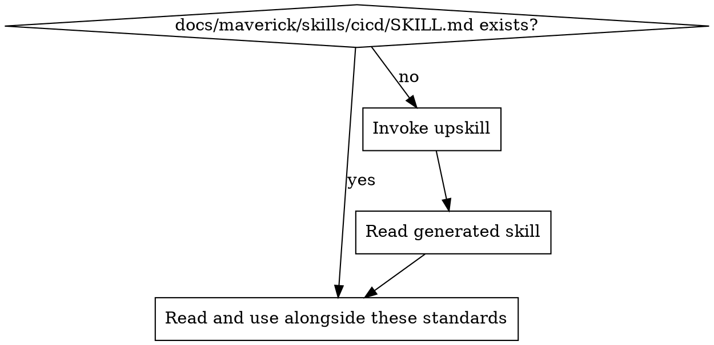

# CI/CD Standards

Ensure CI/CD pipelines enforce quality, promote safely, and remain maintainable. These standards apply regardless of platform (GitHub Actions, GitLab CI, Azure DevOps, etc.).

## Principles

1. **Pipeline as code** — pipeline definitions live in the repository, versioned alongside application code
2. **Fail fast** — cheapest checks run first (lint, typecheck), expensive checks last (integration tests, deploy)
3. **Immutable artifacts** — build once, promote the same artifact through environments. Never rebuild for production.
4. **Secrets never in code** — credentials, tokens, and keys come from the platform's secret store, never from the repository
5. **Deploy is human-gated** — automated pipelines prepare and validate; humans approve production deployments

## Pipeline Stages

Every pipeline should follow this stage order. Stages run sequentially; jobs within a stage may run in parallel.

| Stage | Purpose | Typical jobs | Fail behaviour |
| ----- | ------- | ------------ | -------------- |
| Validate | Catch syntax and style issues fast | Lint, typecheck, format check | Block all subsequent stages |
| Build | Compile and resolve dependencies | Build application, resolve packages | Block all subsequent stages |
| Test | Verify correctness | Unit tests, integration tests | Block packaging and deploy |
| Package | Create deployable artifact | Docker image, archive, bundle | Block deploy |
| Deploy | Release to environment | Deploy to staging/production | Human-gated for production |

### Stage Rules

- **Every stage gates the next** — if validate fails, build does not run
- **Parallelise within stages** — lint and typecheck can run concurrently in the validate stage
- **Never skip stages** — no `[skip ci]`, no conditional bypasses for "quick fixes"

## Quality Gates

Quality gates are pass/fail checks that block progression. Every pipeline must include:

### Mandatory Gates

| Gate | Stage | What it checks |
| ---- | ----- | -------------- |
| Lint | Validate | Zero linter errors (not warnings) |
| Type check | Validate | Zero type errors |
| Format check | Validate | Formatter reports no changes needed |
| Unit tests | Test | All pass, none skipped |
| Build succeeds | Build | Application compiles without errors |

### Recommended Gates

| Gate | Stage | What it checks |
| ---- | ----- | -------------- |
| Integration tests | Test | All pass against test infrastructure |
| Security scan | Test | No critical/high vulnerabilities |
| Bundle/image size | Package | Below defined threshold |

### Gate Principles

- Gates are binary — pass or fail, no "pass with warnings"
- Gate thresholds are defined in config, not hardcoded in the pipeline
- Flaky gates are fixed immediately — a flaky gate erodes trust in the entire pipeline

## Environment Promotion

Artifacts promote through environments, never rebuild between them.

| Environment | Trigger | Approval |
| ----------- | ------- | -------- |
| Dev/Preview | Push to feature branch or PR | Automatic |
| Staging | Merge to main/develop | Automatic |
| Production | Promotion from staging | Manual approval required |

### Promotion Rules

- **Same artifact** — the binary/image/bundle deployed to production is the exact one tested in staging
- **Environment-specific config only** — the artifact is identical; only environment variables and secrets change
- **Rollback capability** — every deployment must support rolling back to the previous artifact
- **No hotfix bypasses** — hotfixes follow the same pipeline, just on an expedited branch

## Secrets Management

### Rules

- **Never commit secrets** — no API keys, tokens, passwords, or connection strings in the repository
- **Use platform secret stores** — GitHub Secrets, GitLab CI Variables (masked/protected), Azure DevOps Variable Groups (secret type)
- **Scope secrets narrowly** — environment-level secrets over organisation-level where possible
- **Rotate regularly** — secrets should have expiry and rotation procedures
- **Audit access** — limit who can read/write pipeline secrets

### Secret Patterns

| Do | Don't |
| -- | ----- |
| Reference secrets from platform store | Hardcode in pipeline YAML |
| Use environment-specific secrets | Share production secrets with dev |
| Mask secrets in logs | Print secrets for debugging |
| Use short-lived tokens where possible | Use long-lived static credentials |

## Caching and Performance

### What to Cache

- **Package manager caches** — `node_modules`, `.pip`, `~/.cargo`, Go module cache
- **Build caches** — compiler output, incremental build artifacts
- **Docker layer caches** — for image builds

### Cache Rules

- Cache keys include lock file hashes — cache invalidates when dependencies change
- Caches are scoped per branch with fallback to main/default branch
- Never cache secrets or environment-specific config
- Monitor cache hit rates — a cache that never hits is overhead

## Pipeline Maintenance

### Keep Pipelines Fast

- Target under 10 minutes for the full pipeline on a standard PR
- Profile slow steps — identify and optimise the bottleneck
- Parallelise independent jobs within stages
- Use caching aggressively for dependency installation

### Keep Pipelines Maintainable

- Extract repeated steps into reusable templates/composites/includes
- Pin action/image versions explicitly (not `latest`)
- Document non-obvious pipeline steps with inline comments
- Review pipeline changes with the same rigour as application code

## Boundaries

### Never Do Without Explicit Instruction

- Create or modify pipeline configuration files
- Add, remove, or change pipeline stages or jobs
- Modify deployment configurations or environment promotion rules
- Change secrets or environment variables in the CI platform
- Disable or skip quality gates
- Trigger production deployments

### Always Do

- Monitor CI status after pushing (see platform-specific skills)
- Fix CI failures before declaring work complete
- Report CI failures clearly if you cannot fix them
- Run local verification before pushing (see mav-local-verification skill)

## Project Implementation Lookup

Before applying these standards, load the project-specific CI/CD implementation:

1. Check for `docs/maverick/skills/cicd/SKILL.md`
2. If missing, invoke the `upskill` skill with topic: cicd
3. Read the project skill to determine which platform is in use, then load the corresponding platform skill (`cicd-github`, `cicd-gitlab`, `cicd-azure`)

## Detecting CI/CD Issues in Code Review

| Pattern | Issue | Fix |
| ------- | ----- | --- |
| No CI pipeline in repository | No automated quality enforcement | Add pipeline with validate/build/test stages |
| Pipeline has no lint/typecheck stage | Style and type errors reach main | Add validate stage before build |
| Tests run but failures don't block merge | False confidence | Make test stage a required gate |
| Secrets in pipeline YAML or repo files | Security risk | Move to platform secret store |
| Pipeline rebuilds for each environment | Inconsistent artifacts | Build once, promote artifact |
| No manual gate for production deploy | Risk of unreviewed production changes | Add manual approval step |
| Pipeline takes >15 minutes | Developer productivity drain | Profile and optimise, add caching |
| Unpinned action/image versions | Non-reproducible builds | Pin to specific versions/SHAs |
