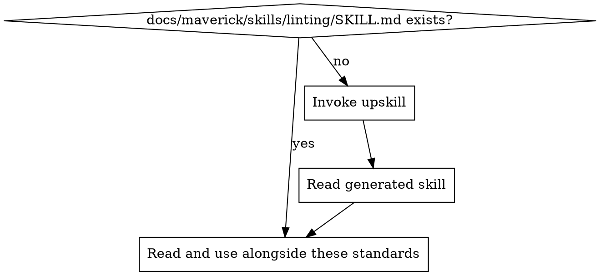

# Linting Standards

Ensure code quality is enforced automatically through static analysis and formatting. Linting catches bugs, prevents style drift, and reduces code review friction.

## Principles

1. **Automate, don't debate** — style decisions are made once in config, then enforced by tooling. No manual style policing in reviews.
2. **Lint on save, format on commit** — developers see issues immediately; formatting is guaranteed before code enters the repository
3. **Errors, not warnings** — warnings are ignored. If a rule matters, it's an error. If it doesn't matter, disable it.
4. **One config per project** — a single source of truth for lint rules, no per-directory overrides unless structurally necessary (e.g., test files)
5. **Separate concerns** — linting (correctness, bugs, best practices) and formatting (whitespace, semicolons, quotes) are handled by separate tools

## Tool Separation

| Concern | Tool type | What it does | Examples |
| ------- | --------- | ------------ | -------- |
| Linting | Static analyser | Catches bugs, enforces best practices, flags anti-patterns | ESLint, Ruff, Clippy, golangci-lint, RuboCop |
| Formatting | Code formatter | Enforces consistent whitespace, line length, quote style | Prettier, Ruff format, gofmt, rustfmt, Black |

**Do not use linters for formatting** — disable all style/formatting rules in the linter and delegate to the formatter. This eliminates conflicts between tools.

### Language-Specific Defaults

| Language | Linter | Formatter | Notes |
| -------- | ------ | --------- | ----- |
| TypeScript/JavaScript | ESLint | Prettier | Use flat config (`eslint.config.js`). Disable all ESLint formatting rules. |
| Python | Ruff | Ruff format | Ruff replaces both flake8/pylint and Black in a single tool |
| Rust | Clippy | rustfmt | Both ship with the Rust toolchain |
| Go | golangci-lint | gofmt | gofmt is non-negotiable in Go |
| Ruby | RuboCop | RuboCop | RuboCop handles both; separate configs for cops |

## Rule Configuration

### Error-Only Policy

All enabled rules must be set to `error`, never `warn`. A warning-level rule is noise — developers learn to ignore it, and CI doesn't catch it.

- If a rule matters: set it to `error`
- If a rule doesn't matter: disable it entirely
- If a rule has too many false positives: disable it and find a better alternative

### Recommended Presets

Start from a well-maintained preset and override selectively:

- **TypeScript**: `@eslint/js` recommended + `typescript-eslint` recommended
- **React**: Add `eslint-plugin-react-hooks` (essential), `eslint-plugin-jsx-a11y` (if accessibility matters)
- **Python**: Ruff defaults (equivalent to flake8 + isort + pyupgrade)
- **Go**: golangci-lint defaults

Do not start from scratch. Presets encode community knowledge about what matters.

### When to Disable Rules

Acceptable reasons to disable a rule:

- Conflicts with another tool (e.g., formatting conflicts)
- False positives in a specific pattern the project uses
- Rule is too opinionated for the team's context

Unacceptable reasons:

- "It's annoying" — fix the code instead
- "It flags too many existing violations" — fix incrementally or use a baseline
- Inline disables to silence warnings — fix the root cause

### Inline Disables

- **Require a comment** — every inline disable must explain why
- **Minimise scope** — disable for one line, not a whole file
- **Review inline disables in code review** — treat them as technical debt

## Project Structure

### Config File Location

Lint and format configs live at the project root:

- `eslint.config.js` (flat config, not `.eslintrc`)
- `prettier.config.js` or `.prettierrc`
- `ruff.toml` or `pyproject.toml [tool.ruff]`
- `.golangci.yml`

### Ignore Files

- Use `.eslintignore` / `.prettierignore` or the config's ignore patterns
- Ignore generated code (build output, codegen, vendor)
- Never ignore source code to avoid fixing lint errors

## Automation

### Editor Integration

Developers should have:

- **Lint on save** — see errors immediately without running a command
- **Format on save** — code is always formatted in the editor
- **Inline diagnostics** — errors shown at the relevant line

Include recommended editor settings in the project (e.g., `.vscode/settings.json` for VS Code).

### Pre-Commit Hooks

Format staged files before commit to guarantee consistency:

- Use `lint-staged` (JS/TS) or `pre-commit` (Python) to run only on changed files
- Format only, don't lint in the hook — linting is slower and should run in CI
- Never skip hooks (`--no-verify`) — if a hook is too slow, fix the hook

### CI Pipeline

CI is the final gate. It must:

1. **Run the linter** — fail the build on any error
2. **Check formatting** — run the formatter in check mode (no auto-fix), fail if files would change
3. **Run on all files** — not just changed files, to catch config changes that affect existing code

## Project Implementation Lookup

Before applying these standards, load the project-specific linting implementation:

1. Check for `docs/maverick/skills/linting/SKILL.md`
2. If missing, invoke the `upskill` skill with:
   - topic: linting
   - scan hints:
     - dependencies: eslint, prettier, ruff, clippy, golangci-lint, rubocop, stylelint, lint-staged, husky
     - grep: `eslint|prettier|ruff|lint-staged|formatOnSave|"lint":|"format":`
     - files: `eslint.config.*`, `.eslintrc*`, `.prettierrc*`, `prettier.config.*`, `ruff.toml`, `.golangci.yml`, `.stylelintrc*`
3. Read the project skill and apply these best practices in the context of the project's specific technology

## Detecting Linting Issues in Code Review

| Pattern | Issue | Fix |
| ------- | ----- | --- |
| No linter config in project | No automated quality checks | Add linter + formatter with recommended presets |
| Warnings in linter config | Warnings are ignored | Change to errors or disable |
| Formatting rules in linter | Conflicts with formatter | Disable formatting rules, use a dedicated formatter |
| Many inline disables without comments | Suppressed issues without justification | Require explanation or fix the violations |
| No CI lint step | Lint issues merge to main | Add lint + format check to CI pipeline |
| Lint config uses legacy format | Maintenance burden | Migrate to current format (e.g., ESLint flat config) |
| No pre-commit formatting | Style inconsistency across commits | Add lint-staged or equivalent |
| Linter running on generated/vendor code | False positives, slow runs | Update ignore patterns |
