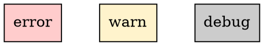
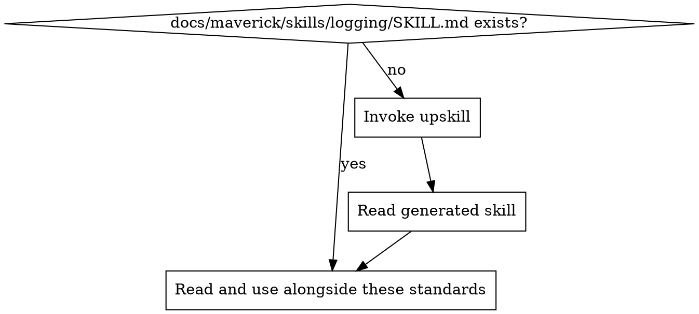

# Logging Standards

Ensure all logging is meaningful, structured, and routed to centralised services. Noise-free, error-focused, actionable.

## Principles

1. **Log errors, not events** — logging should capture failures and anomalies, not routine operations
2. **Structure over strings** — JSON-formatted logs with consistent fields, not ad-hoc string concatenation
3. **Centralise, don't scatter** — route logs to aggregation services, not local files or stdout
4. **One logger per project** — use the same logger instance everywhere, no mixing approaches
5. **Context enables diagnosis** — every error log should contain enough context to diagnose without reproducing

## Log Levels



| Level   | When to use                                                                                                | Example                                                                                  |
| ------- | ---------------------------------------------------------------------------------------------------------- | ---------------------------------------------------------------------------------------- |
| `error` | Failures requiring attention — unhandled exceptions, failed external calls, data corruption, auth failures | `Database connection failed`, `Payment processing error`, `Unhandled promise rejection`  |
| `warn`  | Recoverable issues that may indicate a problem — retries, fallbacks, deprecated usage, approaching limits  | `Rate limit approaching (80%)`, `Retry 2/3 for S3 upload`, `Deprecated API version used` |
| `debug` | Development diagnostics — removed or disabled in production                                                | `Request payload: {...}`, `Cache miss for key: x`, `Query took 230ms`                    |

### What NOT to Log

- **Do not use `info` level** — it creates noise. If something is important enough to log in production, it's either a `warn` or an `error`. If it's only useful during development, it's `debug`.
- **Do not log routine success** — "User logged in", "Request completed", "File saved" are not useful in production logs. They inflate log volume without aiding diagnosis.
- **Do not log sensitive data** — passwords, tokens, API keys, PII, credit card numbers. Mask or omit these entirely.
- **Do not use `console.log`** in application code — use the project's structured logger. `console.log` is acceptable only in build scripts, CLI tools, and one-off debugging (removed before commit).

## Structured Log Format

All application logs must be JSON-formatted with consistent fields.

### Required Fields

```json
{
  "timestamp": "2024-01-15T10:30:00.000Z",
  "level": "error",
  "message": "Failed to process payment",
  "service": "payment-service",
  "context": {}
}
```

### Contextual Fields (per log entry)

Include relevant context to enable diagnosis:

```json
{
  "timestamp": "2024-01-15T10:30:00.000Z",
  "level": "error",
  "message": "Failed to process payment",
  "service": "payment-service",
  "context": {
    "requestId": "req-abc-123",
    "userId": "user-456",
    "paymentId": "pay-789",
    "amount": 2500,
    "currency": "USD",
    "provider": "stripe",
    "errorCode": "card_declined",
    "attempt": 1
  },
  "error": {
    "name": "StripeCardError",
    "message": "Your card was declined",
    "stack": "Error: Your card was declined\n    at ..."
  }
}
```

### HTTP Access Logs

For HTTP request/response logging (access logs), use either:

- **JSON format** (preferred for structured aggregation):

  ```json
  {
    "timestamp": "2024-01-15T10:30:00.000Z",
    "method": "POST",
    "path": "/api/payments",
    "statusCode": 500,
    "duration": 1230,
    "requestId": "req-abc-123",
    "userAgent": "Mozilla/5.0..."
  }
  ```

- **Apache Combined Log Format** (acceptable for HTTP-specific logs):
  ```
  127.0.0.1 - user [15/Jan/2024:10:30:00 +0000] "POST /api/payments HTTP/1.1" 500 1230 "-" "Mozilla/5.0..."
  ```

## Backend Logging

### Logger Initialisation

Every backend project should have a single logger module that all other modules import.

```typescript
// src/lib/logger.ts — example structure
import { createLogger } from "<logging-library>";

export const logger = createLogger({
  level: process.env.LOG_LEVEL || "error",
  format: "json",
  service: process.env.SERVICE_NAME || "api",
  // Transport configuration from project logging guide
});
```

### Usage Patterns

```typescript
// GOOD: Structured error with context
logger.error("Payment processing failed", {
  requestId,
  userId,
  paymentId,
  error: err.message,
  stack: err.stack,
});

// GOOD: Warning with actionable context
logger.warn("Rate limit approaching", {
  current: rateLimitCount,
  limit: MAX_RATE_LIMIT,
  percentUsed: (rateLimitCount / MAX_RATE_LIMIT) * 100,
  windowResetAt: resetTimestamp,
});

// GOOD: Debug for development only
logger.debug("Query executed", {
  table: "grades",
  duration: queryDuration,
  rowCount: results.length,
});

// BAD: Noise
logger.info("Processing request");
logger.info("Request completed successfully");
console.log("here");
console.log(JSON.stringify(data));
```

### Error Handling Integration

Log errors at the boundary where they are handled, not at every level they propagate through:

```typescript
// GOOD: Log once at the handler level
app.setErrorHandler((error, request, reply) => {
  logger.error("Unhandled request error", {
    requestId: request.id,
    method: request.method,
    url: request.url,
    error: error.message,
    stack: error.stack,
  });
  reply.status(500).send({ error: "Internal server error" });
});

// BAD: Logging at every level
async function getUser(id: string) {
  try {
    return await db.users.findById(id);
  } catch (err) {
    logger.error("Failed to get user", { id, err }); // Logged here
    throw err; // AND logged again by the caller, and again by the handler
  }
}
```

### Centralised Transport

Backend logs should be routed to a centralised logging service. The specific transport depends on the deployment environment and is defined in the project's logging guidance document.

Common transports:

| Environment | Service         | Transport                             |
| ----------- | --------------- | ------------------------------------- |
| AWS         | CloudWatch Logs | stdout → CloudWatch agent, or AWS SDK |
| AWS Lambda  | CloudWatch Logs | stdout (automatic)                    |
| Generic     | Datadog         | datadog-transport or stdout → agent   |
| Generic     | ELK Stack       | stdout → Filebeat, or direct HTTP     |
| Docker/K8s  | Any             | stdout → container log driver         |

## Frontend Logging

Frontend logging has different constraints: logs are in the user's browser, sensitive data must never be exposed, and transport requires a reporting service.

### Error Capture

```typescript
// Error boundary (React example)
class ErrorBoundary extends React.Component {
  componentDidCatch(error: Error, errorInfo: React.ErrorInfo) {
    errorReporter.captureError(error, {
      componentStack: errorInfo.componentStack,
      userId: getCurrentUserId(),
      route: window.location.pathname,
    });
  }
}

// Global unhandled errors
window.addEventListener("unhandledrejection", (event) => {
  errorReporter.captureError(event.reason, {
    type: "unhandled_promise_rejection",
    userId: getCurrentUserId(),
  });
});
```

### Frontend Rules

- **Never log sensitive data** — no tokens, passwords, PII, or API keys in browser console or error reports
- **Use error reporting services** — Sentry, CloudWatch RUM, Datadog RUM, LogRocket — not `console.error`
- **Capture context** — user ID, route, component stack, browser info
- **Rate limit client-side reporting** — avoid flooding the reporting service with duplicate errors
- **Remove `console.log` before commit** — debug logging in frontend code must not be committed

### Frontend Transport

| Service         | Use case                                        |
| --------------- | ----------------------------------------------- |
| Sentry          | Error tracking with source maps and breadcrumbs |
| CloudWatch RUM  | AWS-native real user monitoring                 |
| Datadog RUM     | Full-stack observability                        |
| Custom endpoint | POST errors to your own API → centralised logs  |

## Project Implementation Lookup

Before applying these standards, load the project-specific logging implementation:



1. Check for `docs/maverick/skills/logging/SKILL.md`
2. If missing, invoke the `upskill` skill with:
   - topic: logging
   - scan hints:
     - dependencies: pino, winston, bunyan, log4js, morgan, structlog, loguru, slog, tracing
     - grep: `createLogger|getLogger|logger\.|console\.error|LOG_LEVEL|logging\.basicConfig`
     - files: `**/logger.*`, `**/logging.*`
3. Read the project skill and apply these best practices in the context of the project's specific technology

## Detecting Logging Issues in Code Review

When reviewing code, flag these patterns:

| Pattern                                            | Issue                         | Fix                                          |
| -------------------------------------------------- | ----------------------------- | -------------------------------------------- |
| `console.log(...)`                                 | Unstructured, not centralised | Replace with `logger.debug(...)` or remove   |
| `logger.info(...)`                                 | Creates noise                 | Evaluate: is it `warn`, `error`, or `debug`? |
| `logger.error('Error')`                            | No context                    | Add contextual metadata                      |
| `catch (err) { logger.error(err) }` then re-throws | Duplicate logging             | Log at the boundary only                     |
| Logging PII/secrets                                | Security risk                 | Mask or remove                               |
| Different loggers in different files               | Inconsistency                 | Use single logger module                     |
| `try/catch` that silently swallows                 | Lost errors                   | Log or re-throw                              |
