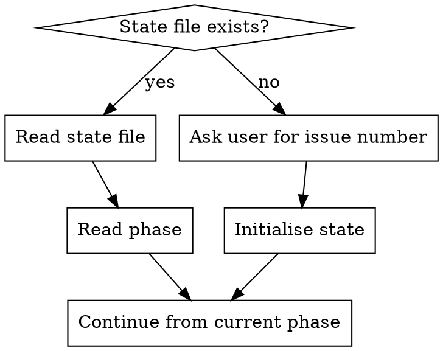

**Depends on:** mav-git-workflow

# GitHub Issue Workflow Patterns

Reusable patterns for GitHub issue interactions. Workflow skills (e.g., do-issue-guided, do-issue-solo) reference this skill for consistent GitHub operations.

## Issue State File

Maintain a local state file at `.claude/issue-state.json` to track progress across sessions and subagents. This file MUST be gitignored.

### Structure

```json
{
  "issue": 42,
  "repo": "owner/repo",
  "branch": "feat/42-short-description",
  "phase": "understand|design|plan|branch|implement|complete",
  "comments": {
    "design": null,
    "plan": null,
    "completion": null
  }
}
```

### Initialise State

Create the state file at the start of work. Infer the repo from the current git remote.

```bash
REPO=$(gh repo view --json nameWithOwner -q '.nameWithOwner')
mkdir -p .claude
cat > .claude/issue-state.json << EOF
{
  "issue": $ISSUE_NUMBER,
  "repo": "$REPO",
  "branch": null,
  "phase": "understand",
  "comments": {
    "design": null,
    "plan": null,
    "completion": null
  }
}
EOF
```

### Read State

```bash
cat .claude/issue-state.json
```

### Update State Field

Use `jq` (or equivalent) to update individual fields:

```bash
# Update phase
jq '.phase = "design"' .claude/issue-state.json > .claude/issue-state.tmp && mv .claude/issue-state.tmp .claude/issue-state.json

# Update branch
jq '.branch = "feat/42-add-export"' .claude/issue-state.json > .claude/issue-state.tmp && mv .claude/issue-state.tmp .claude/issue-state.json
```

### Ensure Gitignore

Before creating the state file, ensure it is gitignored:

```bash
grep -q 'issue-state.json' .gitignore 2>/dev/null || echo '.claude/issue-state.json' >> .gitignore
```

## Reading an Issue

Always fetch structured JSON to get the full picture including comments.

```bash
gh issue view $ISSUE_NUMBER --json title,body,labels,assignees,milestone,comments,state
```

### Reading Specific Fields

```bash
# Just the body
gh issue view $ISSUE_NUMBER --json body -q '.body'

# Labels as comma-separated list
gh issue view $ISSUE_NUMBER --json labels -q '[.labels[].name] | join(", ")'

# Comment count
gh issue view $ISSUE_NUMBER --json comments -q '.comments | length'
```

## Posting Comments

Use one comment per artifact (design, plan, completion). Capture the comment ID so it can be updated later.

### Post and Capture ID

```bash
COMMENT_URL=$(gh issue comment $ISSUE_NUMBER --body "$(cat <<'EOF'
## Section Title

Content here

---
*Posted by Claude Code*
EOF
)" 2>&1)
```

Extract the comment ID from the URL for later updates:

```bash
# gh issue comment prints the URL to stdout, extract the numeric ID
COMMENT_ID=$(echo "$COMMENT_URL" | grep -o '[0-9]*$')
```

Then save to state:

```bash
jq ".comments.design = $COMMENT_ID" .claude/issue-state.json > .claude/issue-state.tmp && mv .claude/issue-state.tmp .claude/issue-state.json
```

### Post Design Comment

```bash
COMMENT_URL=$(gh issue comment $ISSUE_NUMBER --body "$(cat <<'DESIGN_EOF'
## Solution Design

### Approach
<high-level description>

### Areas Affected
- <list of packages/files>

### Key Decisions
- <architectural choices and rationale>

### Risks / Open Questions
- <anything that might complicate implementation>

---
*Posted by Claude Code*
DESIGN_EOF
)" 2>&1)

COMMENT_ID=$(echo "$COMMENT_URL" | grep -o '[0-9]*$')
jq ".comments.design = $COMMENT_ID | .phase = \"design\"" .claude/issue-state.json > .claude/issue-state.tmp && mv .claude/issue-state.tmp .claude/issue-state.json
```

### Post Plan Comment

```bash
COMMENT_URL=$(gh issue comment $ISSUE_NUMBER --body "$(cat <<'PLAN_EOF'
## Implementation Plan

1. **Step name**
   - Files: `path/to/file.ts`
   - Change: <what the change does>
   - Verify: <test command or check>

2. **Step name**
   - Files: `path/to/file.ts`
   - Change: <what the change does>
   - Verify: <test command or check>

---
*Posted by Claude Code*
PLAN_EOF
)" 2>&1)

COMMENT_ID=$(echo "$COMMENT_URL" | grep -o '[0-9]*$')
jq ".comments.plan = $COMMENT_ID | .phase = \"plan\"" .claude/issue-state.json > .claude/issue-state.tmp && mv .claude/issue-state.tmp .claude/issue-state.json
```

### Post Completion Comment

```bash
BRANCH=$(jq -r '.branch' .claude/issue-state.json)

COMMENT_URL=$(gh issue comment $ISSUE_NUMBER --body "$(cat <<DONE_EOF
## Implementation Complete

**Branch:** \`$BRANCH\`

### Changes Made
- <summary of changes>

### Verification
- [ ] Linting passes
- [ ] Tests pass

---
*Posted by Claude Code*
DONE_EOF
)" 2>&1)

COMMENT_ID=$(echo "$COMMENT_URL" | grep -o '[0-9]*$')
jq ".comments.completion = $COMMENT_ID | .phase = \"complete\"" .claude/issue-state.json > .claude/issue-state.tmp && mv .claude/issue-state.tmp .claude/issue-state.json
```

## Updating Comments

When a design or plan is revised, update the existing comment instead of posting a new one. Read the comment ID from the state file.

```bash
REPO=$(jq -r '.repo' .claude/issue-state.json)
COMMENT_ID=$(jq -r '.comments.design' .claude/issue-state.json)

gh api "repos/$REPO/issues/comments/$COMMENT_ID" \
  -X PATCH \
  -f body="$(cat <<'EOF'
## Solution Design (Revised)

<updated content>

---
*Posted by Claude Code*
EOF
)"
```

## Branching

Follow the mav-git-workflow skill for branch naming conventions, base branch identification, and branch creation.

After creating the branch, save to state:

```bash
jq ".branch = \"$BRANCH_NAME\" | .phase = \"branch\"" .claude/issue-state.json > .claude/issue-state.tmp && mv .claude/issue-state.tmp .claude/issue-state.json
```

## Pull Requests

### Create PR Referencing the Issue

```bash
ISSUE_NUMBER=$(jq -r '.issue' .claude/issue-state.json)
BRANCH=$(jq -r '.branch' .claude/issue-state.json)

git push -u origin $BRANCH

gh pr create --title "<concise title>" --body "$(cat <<PR_EOF
## Summary
<1-3 bullet points>

Closes #$ISSUE_NUMBER

## Test Plan
- [ ] <verification steps>

---
*Created by Claude Code*
PR_EOF
)"
```

Using `Closes #N` in the PR body automatically closes the issue when the PR is merged.

## Resuming Work

When resuming work on an issue (new session, after crash, subagent picking up):



1. Check if `.claude/issue-state.json` exists
2. If yes — read it, resume from the recorded phase
3. If no — this is a fresh start, initialise the state file
4. If comment IDs are present, verify they still exist on the issue before updating

## Cleanup

After the PR is created and the workflow is complete:

```bash
rm .claude/issue-state.json
```

Do not delete the state file until the PR is successfully created, as it is needed for crash recovery.
