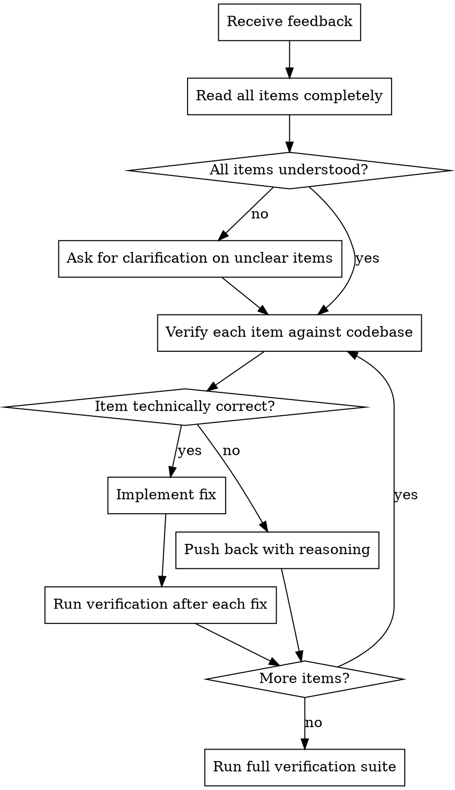

# Receiving Code Review

Code review feedback requires technical evaluation, not automatic agreement. Verify before implementing. Push back when the feedback is wrong.

## The Response Pattern



## Processing Review Feedback

### 1. Read All Items First

Read the complete review before acting on any single item. Items may be related — implementing one in isolation could conflict with another.

### 2. Clarify Before Implementing

If any item is unclear, ask for clarification on ALL unclear items before implementing ANY items.

```
Understand items 1, 2, 3, 6. Need clarification on items 4 and 5 before proceeding.
```

Do not implement the items you understand while waiting for clarification — partial understanding leads to partial (wrong) fixes.

### 3. Verify Against the Codebase

Before implementing each suggestion, verify it is technically correct for this codebase:

- Does the suggestion account for the full context? (The reviewer may not have seen all relevant code)
- Would implementing it break existing functionality?
- Is there a reason the current implementation is the way it is?
- Does it conflict with project conventions or architectural decisions?

### 4. Push Back When Wrong

Push back with technical reasoning when a suggestion is:

- Technically incorrect for this codebase
- Based on incomplete context (reviewer did not see related code)
- Over-engineering (adding abstraction for hypothetical requirements)
- Contradicting existing project patterns or conventions
- Violating YAGNI (suggesting features that are not needed)

**How to push back:**

```
Item 3: Reviewer suggests extracting a utility class.
Checked the codebase — this logic is used in one place only.
Extracting creates indirection without reuse benefit.
Keeping inline per YAGNI.
```

Do not push back defensively. State the technical facts.

### 5. Implement One at a Time

Process items in priority order:

1. **Critical issues** — must fix, blocks merge
2. **Important issues** — should fix before merge
3. **Minor issues** — fix if straightforward, note for later if not

After each fix, run verification (per the verification-before-completion skill). Do not batch multiple fixes without verifying between them.

## Handling Review Sources

### From the Code Reviewer Agent

The code-reviewer agent provides structured two-stage feedback (spec compliance + code quality). Process it as follows:

- **Spec compliance failures** — these are requirements gaps. Fix them before anything else.
- **Code quality criticals** — must fix before merge
- **Code quality importants** — should fix
- **Code quality minors** — evaluate individually

### From Human Reviewers (PR comments)

Human reviewers may have context the agent does not. However:

- Verify suggestions against the codebase before implementing
- If a suggestion conflicts with the project's established patterns, note this
- If a suggestion conflicts with the issue's requirements, flag it
- Reply in the PR comment thread, not as a top-level comment:
  ```bash
  gh api repos/{owner}/{repo}/pulls/{pr}/comments/{id}/replies \
    -f body="Fixed — extracted validation to boundary layer."
  ```

### From CI/Automated Checks

CI failures are not suggestions — they are facts. Fix them. Use the local-verification and ci-awareness skills to diagnose and resolve.

## What Not to Do

| Anti-pattern                            | Why it fails                               | Instead                         |
| --------------------------------------- | ------------------------------------------ | ------------------------------- |
| Implement everything without checking   | Incorrect suggestions break code           | Verify each item first          |
| Implement some items, ask about others  | Partial understanding leads to wrong fixes | Clarify all unclear items first |
| Ignore review feedback                  | Issues accumulate and compound             | Process every item              |
| Add extra improvements while fixing     | Scope creep, muddies the review cycle      | Fix only what was flagged       |
| Batch all fixes, verify once at the end | Cannot isolate which fix broke something   | Verify after each fix           |

## Integration

When receiving review during a do-issue workflow:

1. Process the review per this skill
2. Implement fixes
3. Run verification per the verification-before-completion skill
4. If the review came from the code-reviewer agent and had spec compliance failures, request a re-review after fixing
5. Update the plan comment on the issue if fixes changed the implementation approach
