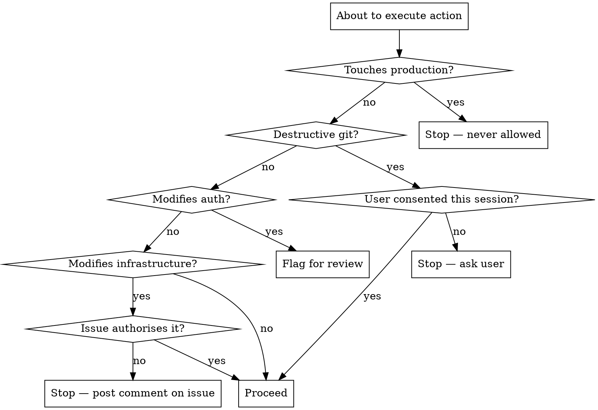

# Scope Boundaries

Hard limits on what Claude Code may do autonomously. These boundaries apply to all workflows, skills, and agents regardless of context.

## Principle

**When in doubt, don't.** The cost of pausing to ask is low. The cost of an unauthorised destructive action is high.

## Restricted Actions

### 1. Infrastructure Changes

**Do not** modify CI/CD pipelines, deployment configs, or infrastructure-as-code unless the GitHub issue explicitly instructs it.

**Restricted:**
- `.github/workflows/` files (GitHub Actions)
- `Dockerfile`, `docker-compose.yml`
- Terraform, CDK, CloudFormation, Pulumi files
- Deployment scripts (`deploy.sh`, `release.yml`)
- Environment variable configuration in CI settings
- Kubernetes manifests, Helm charts
- Nginx, Apache, or reverse proxy configs

**How authorisation works:**
- The GitHub issue must explicitly request the infrastructure change
- General instructions like "set up the project" or "make it work" do not constitute authorisation
- If the issue says "update the CI workflow to add a lint step", that is authorisation for that specific change

**If an infrastructure change seems necessary but is not in the issue:**
- Post a comment on the issue explaining what change is needed and why
- Wait for human approval before proceeding
- Or create a new issue for the infrastructure change

### 2. Authentication and Authorisation

**Do not** alter auth systems, permissions, or access controls without human review.

**Restricted:**
- Auth middleware or guards
- Role/permission definitions
- OAuth, JWT, or session configuration
- API key generation or rotation
- User creation, deletion, or privilege changes
- CORS policies
- Security headers
- Password hashing or validation rules

**Even if the issue requests auth changes:**
- Implement the change but flag it for human review before merge
- Post a comment on the issue highlighting the security implications
- Never auto-merge PRs that modify auth systems

### 3. Destructive Git Operations

**Do not** perform destructive git operations without explicit user consent in the current session.

**Restricted:**
- `git push --force` or `git push --force-with-lease`
- `git reset --hard`
- `git checkout .` or `git restore .` (discards uncommitted changes)
- `git clean -f` (deletes untracked files)
- `git branch -D` (force-deletes branches)
- `git push origin --delete` (deletes remote branches — except during post-merge cleanup when explicitly part of the workflow)
- `git rebase` on shared/pushed branches
- Amending published commits

**Note:** Consent in the GitHub issue is not sufficient for destructive git operations. The user must consent in the current Claude Code session because these actions affect local and remote state immediately.

### 4. Production Systems

**Never** interact with production systems, regardless of authorisation level.

**Restricted — no exceptions:**
- Production databases (read or write)
- Production APIs or services
- Production secrets or credentials
- Production deployment triggers
- Production monitoring/alerting configuration
- Production DNS or routing changes

**If a task requires production access:**
- Stop and report to the user
- Suggest using staging/development environments instead
- Create an issue for human-only production operations if needed

## Detecting Boundary Violations

Before executing any action, check:



## Escalation Patterns

When a boundary prevents you from completing work:

### For Infrastructure

```markdown
## Infrastructure Change Needed

This issue requires a change to `<file>` that is outside the scope of autonomous work.

**What:** <description of the change>
**Why:** <why it's needed to complete this issue>
**Suggested change:** <brief description or diff>

Please approve this change or create a separate issue for it.

---
*Posted by Claude Code*
```

### For Security-Sensitive Changes

```markdown
## Security Review Required

This PR modifies authentication/authorisation code that requires human review before merge.

**Files changed:**
- `<file>` — <what changed>

**Security implications:**
- <impact description>

---
*Posted by Claude Code*
```

### For Production Access

```markdown
## Production Access Required

This task requires interaction with a production system that Claude Code cannot perform.

**What's needed:** <description>
**Suggested approach:** <staging alternative or manual steps>

---
*Posted by Claude Code*
```
