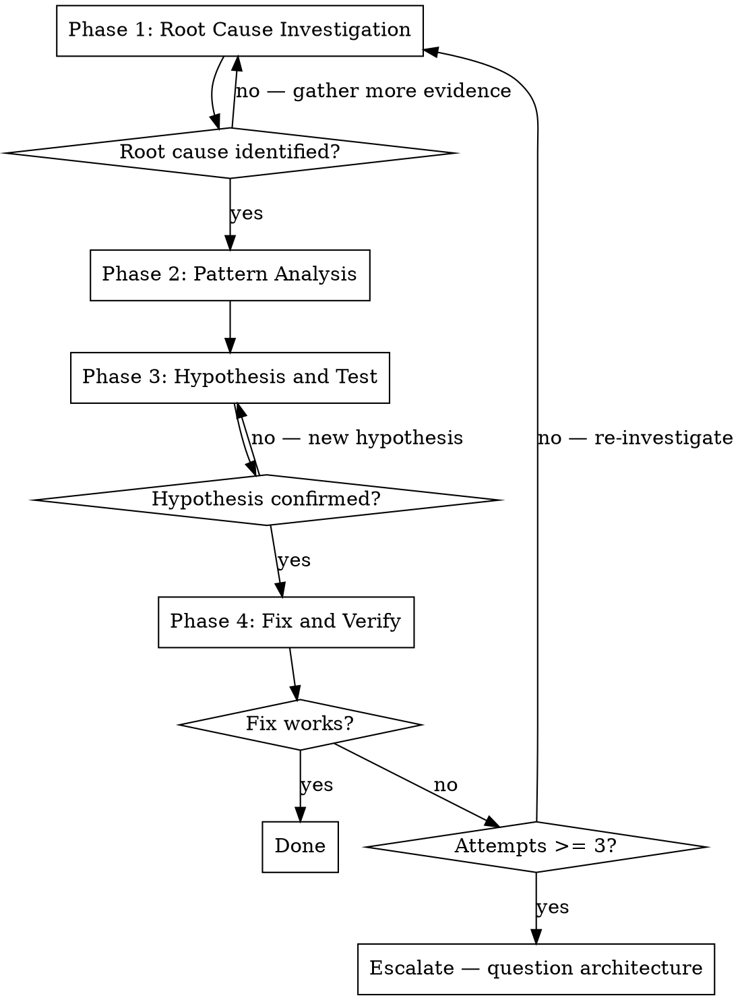

# Systematic Debugging

Find root cause before attempting fixes. Random fixes waste time, create new bugs, and mask underlying issues.

## The Iron Law

```
NO FIXES WITHOUT ROOT CAUSE INVESTIGATION FIRST
```

If you have not completed Phase 1, you cannot propose fixes.

## When to Use

Use for any technical issue encountered during implementation:
- Test failures
- Build errors
- Unexpected behaviour
- Integration issues
- Performance problems

Use this **especially** when:
- A fix attempt has already failed
- The issue seems "obvious" (obvious issues still have root causes)
- You are under pressure to move to the next step
- You do not fully understand the failure

## The Four Phases

Complete each phase before proceeding to the next.



### Phase 1: Root Cause Investigation

Before attempting any fix:

**1. Read error messages carefully**
- Read stack traces completely — do not skip or skim
- Note line numbers, file paths, error codes
- Error messages frequently contain the exact solution

**2. Reproduce consistently**
- Can you trigger the failure reliably?
- What are the exact steps or commands?
- If not reproducible, gather more data — do not guess

**3. Check recent changes**
- What changed that could cause this? (`git diff`, recent commits)
- New dependencies, config changes, environment differences
- Did the code work before a specific commit?

**4. Gather evidence in multi-component systems**

When the system has multiple layers (API → service → database, CI → build → deploy):

```
For EACH component boundary:
  - Log what data enters the component
  - Log what data exits the component
  - Verify environment/config at each layer

Run once to gather evidence showing WHERE it breaks.
THEN analyse evidence to identify the failing component.
THEN investigate that specific component.
```

Use the project's logging standards (structured JSON, `logger.debug()`) for diagnostic instrumentation. Remove diagnostic logging before committing.

**5. Trace data flow**
- Where does the bad value originate?
- What called this function with the bad value?
- Keep tracing backward through the call stack until you find the source
- Fix at the source, not at the symptom

### Phase 2: Pattern Analysis

Find the pattern before fixing:

1. **Find working examples** — locate similar working code in the same codebase
2. **Compare** — what is different between working and broken?
3. **List every difference** — do not assume "that cannot matter"
4. **Understand dependencies** — what settings, config, or environment does this code require?

### Phase 3: Hypothesis and Test

Apply the scientific method:

1. **Form a single hypothesis** — "I think X is the root cause because Y"
2. **Test minimally** — make the smallest possible change to test the hypothesis. One variable at a time.
3. **Verify** — did it work?
   - Yes → proceed to Phase 4
   - No → form a new hypothesis. Do not add more fixes on top.

### Phase 4: Fix and Verify

Fix the root cause, not the symptom:

1. **Create a failing test** — a test that reproduces the bug. This proves the fix actually addresses the issue and prevents regression.
2. **Implement a single fix** — address the root cause identified. One change at a time. No "while I'm here" improvements.
3. **Verify the fix** — run the test. Run the full verification suite. Confirm no regressions.
4. **If the fix does not work** — count how many fixes you have attempted:
   - Fewer than 3: return to Phase 1 with the new information
   - 3 or more: **stop and escalate** (see below)

### Escalation: 3+ Failed Fixes

If three or more fix attempts have failed, this is likely an architectural problem, not a code bug.

**Indicators of an architectural problem:**
- Each fix reveals new issues in different places
- Fixes require large-scale refactoring to implement
- Each fix creates new symptoms elsewhere
- Shared state or tight coupling keeps surfacing

**Action:**
- Stop attempting fixes
- Document what you have tried and what happened
- Post a comment on the GitHub issue explaining the situation and the evidence gathered
- Ask the user for direction — the approach may need to change

## Anti-Patterns

| Temptation | Why it fails |
|---|---|
| "Quick fix, investigate later" | Later never comes. The quick fix becomes permanent. |
| "Just try changing X" | Without understanding why, you cannot know if the fix is correct. |
| "Add multiple changes, see what works" | Cannot isolate what helped. Introduces new bugs. |
| "It is probably X, let me fix that" | Seeing symptoms is not understanding root cause. |
| "Skip the test, manually verify" | Manual verification does not prevent regression. |
| "One more fix attempt" (after 2+ failures) | 3+ failures means the problem is architectural. |
| "Increase the timeout" | Timeouts mask the real issue. Find why it is slow. |

## Integration with Workflow

When debugging occurs during plan execution (do-issue workflows):

1. **Do not skip the failing step** — the task-decomposition skill requires verification to pass before moving on
2. **Do not mark the step as complete** — the issue plan comment should not be checked off until the step genuinely works
3. **Log diagnostic findings** — if the bug reveals a design issue, update the solution design comment on the issue
4. **Time-box debugging** — if Phase 1 takes more than 30 minutes without progress, escalate to the user rather than continuing to investigate alone
