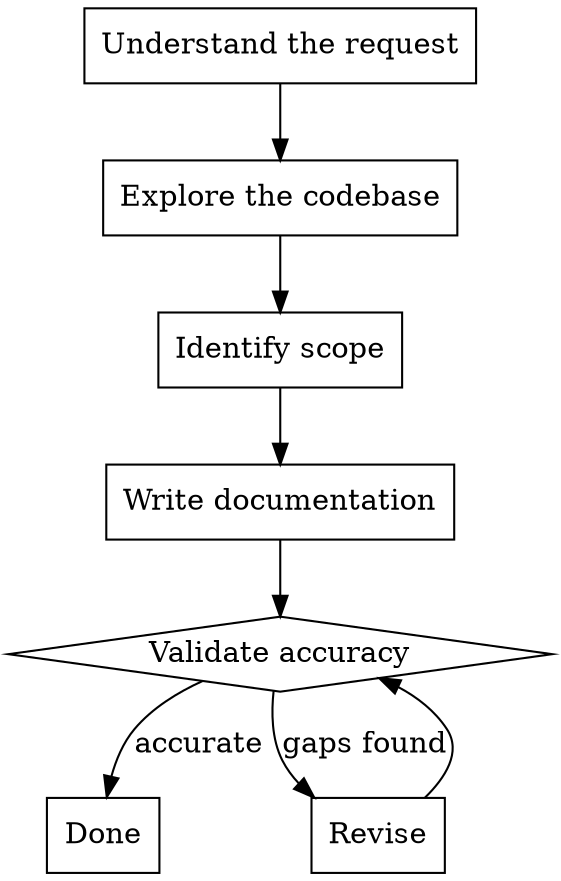

# Technical Documentation

Produce technical documentation that explains **what** systems do, **how** they interact, and **why** specific choices were made.

**Primary audience: LLMs.** These docs will be loaded into LLM context windows during development tasks. Every token must earn its place. Write for machine comprehension first — dense, precise, and structurally consistent. Avoid prose padding, narrative flow, and filler sentences that a human might appreciate but an LLM gains nothing from.

Avoid documenting business processes or product capabilities.

## Process



### 1. Understand the Request

Clarify what needs documenting:

- A specific component, service, or subsystem
- An architectural overview or cross-cutting concern
- A design decision or technology choice
- An update to existing documentation after a change

### 2. Explore the Codebase

Before writing anything, read the relevant source code:

- Use Glob, Grep, Read, and subagents to understand actual behaviour
- Check existing documentation to avoid duplication
- Examine dependency files to understand the technology stack
- Review configuration and infrastructure files for deployment context
- Look at test files to understand expected behaviours and edge cases

### 3. Identify Scope

Determine the documentation boundary:

- What is being documented (and what is explicitly out of scope)
- Where the documentation should live (co-located with code or in a central docs directory)
- Whether this is a new document or an update to an existing one

### 4. Write Documentation

Follow the structure and standards below.

### 5. Validate Accuracy

Cross-reference every factual claim with the source code. If you cannot verify something, say so rather than guessing.

## Documentation Principles

### Include

- **Purpose and function**: What each component does and why it exists
- **Technology choices**: What is used and why it was selected
- **Integration points**: How components communicate and depend on each other
- **Data flow**: How data moves through the system
- **Architectural patterns**: Design patterns employed and their rationale
- **Mermaid diagrams**: Every document describing interactions or flows must include at least one diagram

### Exclude

- **Code examples**: Describe behaviour in prose, not code snippets
- **Infrastructure configuration**: No CDK, Terraform, Docker Compose, or config file content
- **CLI commands**: No terminal commands or deployment scripts
- **API endpoint definitions**: No route paths, request/response schemas, or curl examples

If tempted to include any of the above, describe the concept or behaviour in prose instead.

## Document Structure

Every document must start with a YAML frontmatter block. This gives an LLM immediate context about what the document covers without reading the full body.

```markdown
---
title: <descriptive title>
scope: <component | service | architecture | decision>
relates-to: [list of other doc filenames this connects to]
last-verified: <YYYY-MM-DD when last checked against source code>
---

## Overview

<1-2 sentences: what this covers, stated as facts not narrative.>

## <Core Content>

<Main documentation. Use H2/H3 headings as section labels. Prefer bullet points and tables over paragraphs. Each section should be independently useful — an LLM may retrieve a single section, not the whole document.>

## Integration Points

<How this component connects to others. Include a Mermaid diagram.>

## Design Decisions

<Decision: rationale format. No preamble.>
```

### Token Budget

Docs are loaded into LLM context alongside code, conversation history, and tool results. Context is finite and expensive.

- **Target: 200-500 lines per document.** If a document exceeds this, split it.
- Use bullet points and tables instead of paragraphs — same information, fewer tokens
- State facts directly: "Auth uses JWT with RS256" not "The authentication system has been designed to utilise JSON Web Tokens using the RS256 algorithm"
- Define terms inline on first use with parenthetical notation: "The gateway (API entry point handling routing and auth) forwards requests to..."
- Omit transition sentences, introductory phrasing, and summaries of what was just said
- Prefer structured lists over prose for enumerating components, dependencies, or flows

### File Organisation

- Store all documentation under `docs/technical/`
- Create **separate files** for distinct topics rather than monolithic documents
- Use `kebab-case.md` naming (e.g. `authentication-architecture.md`)
- Each file should be self-contained but may cross-reference others via `relates-to` in frontmatter
- Maintain an `index.md` in `docs/technical/` listing all documents with one-line descriptions — this serves as the entry point for LLM context loading

### Sizing

| Task size                           | Documentation depth                                |
| ----------------------------------- | -------------------------------------------------- |
| Trivial (config, minor change)      | 2-3 sentences in an existing doc or commit message |
| Small (single component)            | Overview + core content (under 200 lines)          |
| Medium (feature, service)           | Full document structure (200-500 lines)            |
| Large (cross-cutting, architecture) | Split into multiple focused documents              |

## Mermaid Diagram Standards

Use diagrams to visualise:

- **Service interactions**: `sequenceDiagram` or `flowchart`
- **Data flows**: `flowchart` or `sequenceDiagram`
- **Architecture overviews**: `flowchart` or `C4Context`
- **State transitions**: `stateDiagram-v2`

Guidelines:

- Every diagram must have a descriptive title
- Use clear, descriptive node labels — not abbreviations or internal variable names
- Keep diagrams focused on one concept; prefer multiple simple diagrams over one complex one
- Aim for no more than 15-20 nodes per diagram

## Writing Style

- **Dense, not verbose**: State facts. Skip introductions, transitions, and conclusions. An LLM does not need to be "eased into" a topic.
- **Precise**: Use exact technology names and versions. "PostgreSQL 16 with row-level security" not "a relational database with access controls".
- **Consistent terminology**: Use the same term for the same concept everywhere. Define domain terms inline on first use.
- **Structured over narrative**: Prefer `key: value` patterns, bullet lists, and tables. Reserve prose for explaining *why* — rationale that cannot be expressed as a list.

## Validation Checklist

Before finalising documentation:

- [ ] All factual claims verified against source code
- [ ] Mermaid diagrams render correctly (valid syntax)
- [ ] No code examples, config snippets, or CLI commands included
- [ ] Cross-references use correct relative paths
- [ ] Document is under 500 lines (split if larger)
- [ ] YAML frontmatter present with title, scope, relates-to, last-verified
- [ ] `docs/technical/index.md` updated if this is a new document
- [ ] Bullet points and tables used instead of prose where possible
