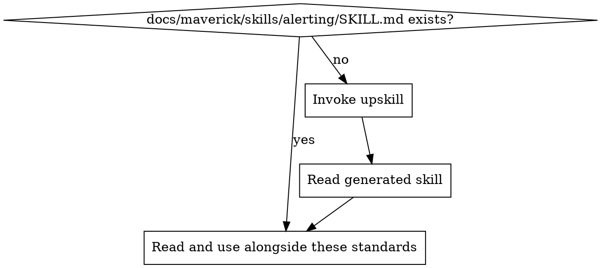

# Alerting Standards

Ensure fatal errors trigger alerts that reach operations teams. Alerting is not logging — logs record what happened, alerts demand attention.

## Principles

1. **Alert on failures, not events** — only unrecoverable errors and critical degradations warrant alerts
2. **Context enables response** — every alert must contain enough information to begin investigation immediately
3. **Avoid alert fatigue** — too many alerts means none are acted on. Be selective.
4. **Centralise, don't scatter** — route all alerts through a single notification service
5. **Respect project guidance** — if the project's alerting guide says alerting is handled independently, do not add application-level alerting

## Project Implementation Lookup

Before applying these standards, load the project-specific alerting implementation:

1. Check for `docs/maverick/skills/alerting/SKILL.md`
2. If missing, invoke the `upskill` skill with:
   - topic: alerting
   - scan hints:
     - dependencies: @aws-sdk/client-sns, @pagerduty, @opsgenie, nodemailer, sentry
     - grep: `sendAlert|publish|PagerDuty|Opsgenie|alertService|notify|Sentry\.capture`
     - files: `**/alert*.*`, `**/notify*.*`
3. Read the project skill and apply these best practices in the context of the project's specific technology

## Severity Levels

| Severity   | When to alert                                       | Response expectation                   | Example                                                                                                            |
| ---------- | --------------------------------------------------- | -------------------------------------- | ------------------------------------------------------------------------------------------------------------------ |
| `critical` | System down, data loss, complete service failure    | Immediate — wake someone up            | Database connection pool exhausted, payment processing completely down, data corruption detected                   |
| `high`     | Degraded service, partial failures, repeated errors | Within the hour — investigate promptly | Third-party API returning errors for 5+ minutes, error rate exceeds threshold, authentication service intermittent |
| `warning`  | Emerging issues, threshold approaching              | Next business day — monitor and plan   | Disk usage above 80%, API rate limit at 90%, certificate expiring in 7 days                                        |

### What NOT to Alert On

- Individual transient errors (a single 500 that recovers)
- Expected conditions (user enters wrong password, validation failure)
- Recoverable retries (first retry of a network request)
- Debug/development issues
- Routine operations (deployments, cron jobs completing normally)

## Alert Context

Every alert must include sufficient context for the responder to begin investigation without needing to search for information.

### Required Fields

| Field         | Purpose                                                    | Example                                                              |
| ------------- | ---------------------------------------------------------- | -------------------------------------------------------------------- |
| `severity`    | Urgency classification                                     | `critical`, `high`, `warning`                                        |
| `service`     | Which service raised the alert                             | `payment-service`, `auth-api`                                        |
| `environment` | Which environment                                          | `production`, `staging`                                              |
| `message`     | Human-readable description of what happened and its impact | `Payment processing failed — all checkout requests returning errors` |
| `timestamp`   | When it happened (ISO 8601 UTC)                            | `2024-01-15T10:30:00.000Z`                                           |
| `context`     | Structured metadata for investigation                      | Error count, window, affected endpoint                               |
| `logPointer`  | Where to find detailed logs                                | Log group, filter query, or dashboard link                           |

### Key Principles

- **Include the "so what"** — not just "error occurred" but "payment processing is down, customers cannot check out"
- **Include how to investigate** — log group, filter query, or dashboard link
- **Include scope** — how many users/requests are affected, how long it has been happening
- **Do not include sensitive data** — no tokens, passwords, PII in alert payloads

## When to Trigger Alerts

Alert at the **outermost error boundary**, not inside individual functions:

- **Global/top-level error handlers** — unhandled exceptions, uncaught promise rejections, framework error hooks
- **Threshold breaches** — error rate exceeds a limit over a time window
- **Health check failures** — critical dependency is unreachable

Do **not** alert inside low-level functions (database queries, HTTP calls). Let errors propagate to the boundary where impact and scope can be assessed.

## Deduplication and Rate Limiting

Do not flood the alerting service with duplicate alerts for the same ongoing issue:

- **Deduplication key** — combine severity and message to identify duplicate alerts
- **Cooldown period** — suppress duplicate alerts for a window (e.g., 5 minutes)
- **First alert wins** — send the first occurrence, suppress subsequent duplicates until the cooldown expires

The implementation of dedup depends on your language and runtime — check the project skill for the specific technology in use.

## Frontend Alerting

Frontend applications generally do **not** send alerts directly. Instead:

1. **Error reporting services** (Sentry, CloudWatch RUM, Datadog RUM) capture frontend errors
2. **The reporting service** triggers alerts based on error rate thresholds
3. **Application code** only needs to report errors to the service (covered by the mav-bp-logging skill)

If the project requires frontend-initiated alerts (e.g., critical workflow failures):

- Send to a backend API endpoint that handles alerting
- Never call alerting services directly from the browser
- Never include credentials for alerting services in frontend code

## Integration with Logging

Alerting and logging are complementary but separate concerns:

| Concern   | Logging                                    | Alerting                                               |
| --------- | ------------------------------------------ | ------------------------------------------------------ |
| Purpose   | Record what happened                       | Demand attention                                       |
| Volume    | Every error, warn, debug                   | Only critical/high issues                              |
| Audience  | Developers investigating after the fact    | Operations team responding now                         |
| Transport | Log aggregation (CloudWatch, Datadog, ELK) | Notification service (SNS, PagerDuty, Opsgenie, Slack) |
| Timing    | Continuous                                 | Event-driven with deduplication                        |

**Always log first, then alert.** The log provides the investigation trail. The alert demands attention.

## Detecting Alerting Issues in Code Review

| Pattern                                          | Issue                       | Fix                                        |
| ------------------------------------------------ | --------------------------- | ------------------------------------------ |
| Fatal error with no alert                        | Silent failure              | Add alert at the error boundary            |
| Alert inside a loop or retry                     | Alert flood                 | Move alert outside loop, add dedup         |
| Alert with no context                            | Unactionable                | Add service, error, scope, log pointer     |
| Alert on expected conditions                     | Alert fatigue               | Remove — only alert on unexpected failures |
| Different alerting mechanisms in different files | Inconsistency               | Use single alerter module                  |
| Alert but no log                                 | Missing investigation trail | Always log before alerting                 |
| Frontend calling alerting service directly       | Security risk               | Route through backend API                  |
