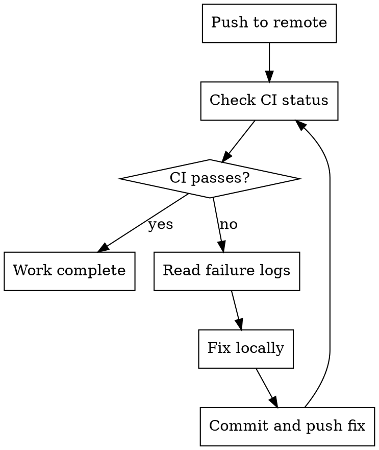

# CI Awareness — GitHub Actions

After pushing, monitor GitHub Actions pipelines and do not declare work complete until CI passes. This skill implements the platform-specific behaviours defined in the `mav-bp-cicd` skill.

## Principles

1. **Monitor CI after push** — check GitHub Actions status and wait for results
2. **Respect existing pipelines** — work within existing CI/CD workflows, never modify them without explicit instruction
3. **Deploy is human-gated** — never trigger production deployments autonomously

## Check CI Status

```bash
# Watch the CI run in real-time (blocks until complete)
gh run watch

# Or check the most recent run's status
gh run list --branch $(git branch --show-current) --limit 1

# View details of a specific run
gh run view <run-id>

# View failed step logs
gh run view <run-id> --log-failed
```

## Process After Push



1. After pushing, run `gh run watch` to monitor the CI run
2. If CI passes — work is complete
3. If CI fails:
   - Read the failure logs with `gh run view <run-id> --log-failed`
   - Fix the issue locally
   - Run local verification again (see mav-local-verification skill)
   - Commit the fix and push
   - Monitor CI again
4. Do not declare work complete until CI passes

## Common CI Failures Not Caught Locally

| CI failure | Why it wasn't caught locally | Fix |
|---|---|---|
| Different Node/Python version | CI uses a specific version | Check CI workflow for version, use matching local version |
| Missing environment variable | CI has different env | Check workflow for required env vars |
| Platform-specific issue | CI runs on Linux, local is macOS | Investigate platform-specific code paths |
| Dependency resolution | Lock file out of date | Run `pnpm install` / `npm ci` and commit lock file |
| Parallel test interference | Tests pass serially but fail in parallel | Fix test isolation |

## Boundaries

### Never Do Without Explicit Instruction

- Modify `.github/workflows/` files
- Add, remove, or change CI pipeline steps
- Modify deployment configurations
- Change environment variables in CI settings
- Disable or skip CI checks (e.g., `[skip ci]` in commit messages)
- Trigger deployment pipelines or release workflows

### Always Do

- Monitor CI status after pushing
- Fix CI failures before declaring work complete
- Report CI failures clearly if you cannot fix them
