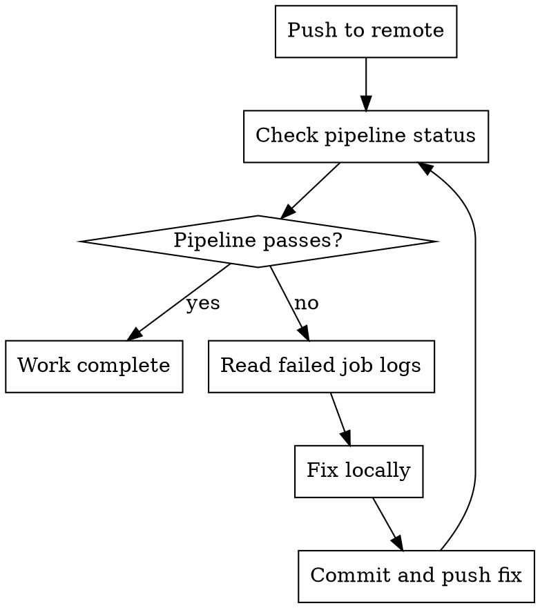

# CI Awareness — GitLab CI

After pushing, monitor GitLab CI/CD pipelines and do not declare work complete until CI passes. This skill implements the platform-specific behaviours defined in the `mav-bp-cicd` skill.

## Prerequisites

- GitLab CLI (`glab`) installed and authenticated
- Or direct API access via `curl` with a GitLab personal access token

## Check CI Status

```bash
# View pipelines for current branch
glab ci list --branch $(git branch --show-current)

# Watch the latest pipeline in real-time
glab ci view

# View a specific pipeline's jobs
glab ci view <pipeline-id>

# View failed job logs
glab ci trace <job-id>

# Retry a failed job
glab ci retry <job-id>
```

### Without glab CLI

```bash
# Using GitLab API directly
PROJECT_ID="<project-id>"
BRANCH=$(git branch --show-current)

# List pipelines for branch
curl --header "PRIVATE-TOKEN: $GITLAB_TOKEN" \
  "https://gitlab.com/api/v4/projects/$PROJECT_ID/pipelines?ref=$BRANCH&per_page=1"

# Get pipeline jobs
curl --header "PRIVATE-TOKEN: $GITLAB_TOKEN" \
  "https://gitlab.com/api/v4/projects/$PROJECT_ID/pipelines/<pipeline-id>/jobs"

# Get job log
curl --header "PRIVATE-TOKEN: $GITLAB_TOKEN" \
  "https://gitlab.com/api/v4/projects/$PROJECT_ID/jobs/<job-id>/trace"
```

## Process After Push



1. After pushing, run `glab ci view` to monitor the pipeline
2. If pipeline passes — work is complete
3. If pipeline fails:
   - Identify the failed job with `glab ci view`
   - Read the job log with `glab ci trace <job-id>`
   - Fix the issue locally
   - Run local verification again (see mav-local-verification skill)
   - Commit the fix and push
   - Monitor the pipeline again
4. Do not declare work complete until the pipeline passes

## Common CI Failures Not Caught Locally

| CI failure | Why it wasn't caught locally | Fix |
| --- | --- | --- |
| Different runtime version | CI uses a specific image version | Check `.gitlab-ci.yml` for image tags |
| Missing CI/CD variable | CI has different env vars | Check project Settings > CI/CD > Variables |
| Docker-in-Docker issues | Local Docker differs from CI runner | Check services configuration in `.gitlab-ci.yml` |
| Cache miss/stale cache | CI cache key changed | Check cache key config, clear cache if needed |
| Runner-specific issue | Shared vs dedicated runners | Check runner tags and availability |

## GitLab CI Concepts

| Concept | Description |
| ------- | ----------- |
| Pipeline | Full CI/CD run triggered by a push or merge request |
| Stage | Sequential phase (build, test, deploy) — jobs within a stage run in parallel |
| Job | Individual task within a stage |
| Runner | Machine that executes jobs (shared or project-specific) |
| Artifact | File produced by a job, available to downstream jobs/stages |
| Cache | Dependency cache persisted across pipeline runs |
| Environment | Deployment target tracked by GitLab |
| Merge request pipeline | Pipeline that runs on the merged result of source and target branches |

## Boundaries

### Never Do Without Explicit Instruction

- Modify `.gitlab-ci.yml` or CI include files
- Add, remove, or change pipeline stages or jobs
- Modify deployment configurations or environments
- Change CI/CD variables in project settings
- Disable or skip CI checks
- Trigger deployment or release pipelines
- Modify runner configurations or tags

### Always Do

- Monitor pipeline status after pushing
- Fix CI failures before declaring work complete
- Report CI failures clearly if you cannot fix them
