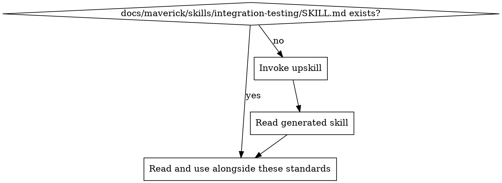

# Integration Testing Standards

Ensure integration tests verify that components work together correctly across real boundaries — APIs, databases, file systems, and third-party services.

## Principles

1. **Test real interactions** — integration tests exercise actual wiring between components, not mocked substitutes
2. **Isolate test runs** — each test controls its own data and state; parallel runs never collide
3. **Repeatable environments** — tests produce the same result regardless of when or where they run
4. **Acceptable speed** — integration tests are slower than unit tests but must not be wastefully slow; keep each test under a few seconds where possible
5. **Complement, don't duplicate** — integration tests cover cross-boundary behaviour that unit tests cannot; don't re-test pure logic already covered by unit tests

## Test Scope

### What to Test

- **API contracts** — HTTP endpoints return correct status codes, headers, and response shapes for valid and invalid inputs
- **Database interactions** — queries, transactions, migrations, and constraints behave correctly against a real (or containerised) database
- **Service-to-service calls** — upstream/downstream services communicate correctly over real protocols (HTTP, gRPC, message queues)
- **File system operations** — reads, writes, and path handling work in realistic directory structures
- **Authentication and authorisation flows** — tokens, sessions, and permission checks work end-to-end
- **Configuration loading** — the application starts and behaves correctly with real configuration files and environment variables

### What NOT to Test

- **Pure business logic** — already covered by unit tests
- **Third-party library internals** — trust the library; test your usage of it
- **UI rendering** — that belongs in end-to-end or visual regression tests
- **Performance benchmarks** — use dedicated performance tests, not integration tests

## External Dependencies

### Strategies (prefer in order)

| Strategy | When to use | Example |
| -------- | ----------- | ------- |
| Containerised real service | Database, cache, message broker | Testcontainers, Docker Compose |
| Local server | Lightweight service your code controls | In-process HTTP server, embedded DB |
| Sandbox / test account | Third-party API with sandbox mode | Stripe test mode, AWS LocalStack |
| Contract test + stub | External API you cannot control | Pact, WireMock with recorded responses |

### Rules

- **Never hit production services** — integration tests use sandboxes, containers, or stubs
- **Pin dependency versions** — lock the image tag or service version to avoid surprise breakages
- **Start dependencies before tests** — use setup scripts, Docker Compose, or framework hooks to guarantee services are ready
- **Health-check before running** — wait for dependencies to be healthy, don't rely on sleep timers

## Test Data & Isolation

### Data Rules

- **Each test owns its data** — create what you need in setup, clean up in teardown
- **Use unique identifiers** — prefix or randomise names/IDs so parallel tests never collide
- **Never depend on seed data** — tests must work against a clean environment
- **Transaction rollback where possible** — wrap each test in a transaction that rolls back, avoiding manual cleanup

### Environment Isolation

- **Separate test database** — never share the development or production database
- **Isolated network** — containerised tests run in their own network namespace
- **Clean state between suites** — reset shared resources (queues, caches) between test suites if rollback is not possible

## Test Structure

### Setup and Teardown

1. **Suite setup** — start containers, run migrations, seed minimal reference data
2. **Test setup** — create test-specific data
3. **Act** — execute the integration scenario
4. **Assert** — verify outcomes across all affected systems (response + side effects)
5. **Test teardown** — remove test-specific data
6. **Suite teardown** — stop containers, drop test database

### Naming Convention

- Test names describe the integration scenario: `should persist order and publish event when checkout completes`
- Group by integration boundary using `describe` blocks: `describe('POST /orders')`

### Timeouts

- Set explicit timeouts per test — integration tests may wait for external systems
- Fail fast on dependency unavailability rather than hanging until a global timeout

## Test Organisation

- Keep integration tests in a dedicated directory (e.g., `tests/integration/`, `__tests__/integration/`)
- Separate from unit tests so they can run independently with different commands
- Shared fixtures and helpers in a dedicated test utilities directory
- Configuration for test environments in a dedicated config file or environment variables

## Project Implementation Lookup

Before applying these standards, load the project-specific testing implementation:

1. Check for `docs/maverick/skills/integration-testing/SKILL.md`
2. If missing, invoke the `upskill` skill with:
   - topic: integration-testing
   - scan hints:
     - dependencies: supertest, testcontainers, docker-compose, pytest, httpx, rest-assured, wiremock, pact, localstack
     - grep: `describe\(|it\(|test\(|expect\(|assert|@SpringBootTest|@IntegrationTest|TestContainers`
     - files: `**/integration/**`, `**/e2e/**`, `**/*.integration.*`, `**/docker-compose*.test*`
3. Read the project skill and apply these best practices in the context of the project's specific technology

## Detecting Integration Testing Issues in Code Review

| Pattern | Issue | Fix |
| ------- | ----- | --- |
| Test hits production service | Risk of side effects and flakiness | Use container, sandbox, or stub |
| No cleanup after test | Data leaks between tests | Add teardown or use transaction rollback |
| Sleep-based waits for dependencies | Flaky timing | Use health-check polling with timeout |
| Test duplicates unit test coverage | Wasted execution time | Delete and rely on unit test |
| Shared mutable test data across tests | Order-dependent failures | Each test creates its own data |
| No timeout set | Hanging test blocks CI | Set explicit per-test timeout |
| Hard-coded connection strings | Breaks in different environments | Use environment variables or config |
| Test requires manual environment setup | Not reproducible | Automate with containers or scripts |
