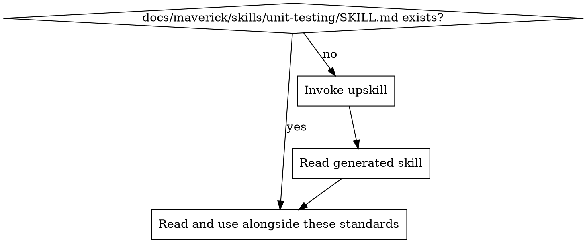

# Unit Testing Standards

Ensure unit tests are meaningful, fast, and maintainable. Tests verify behaviour, not implementation.

## Principles

1. **Test behaviour, not implementation** — tests verify what code does, not how it does it internally
2. **One reason to fail** — each test tests one logical concept; when it fails, the cause is obvious
3. **Isolate the unit** — external dependencies (APIs, databases, file system) are replaced with test doubles
4. **Fast and deterministic** — unit tests run in milliseconds, never depend on timing, network, or shared state
5. **Tests are documentation** — test names and structure describe expected behaviour clearly enough to understand the contract without reading the implementation

## Test Design

### What to Test

- **Public API / exported functions** — the contract other code depends on
- **Edge cases** — boundary values, empty inputs, null/undefined, error paths
- **Business logic** — calculations, transformations, state transitions, validation rules
- **Error handling** — thrown exceptions, error return values, fallback behaviour

### What NOT to Test

- **Private/internal implementation details** — if you need to test it, extract it to its own unit
- **Framework behaviour** — don't test that your ORM saves to a database, or that a router routes requests
- **Trivial code** — simple getters/setters, pass-through functions, type definitions
- **External services directly** — use test doubles; integration tests cover real service interaction

### Test Structure (Arrange-Act-Assert)

Every test follows three phases:

1. **Arrange** — set up test data and dependencies
2. **Act** — call the function under test
3. **Assert** — verify the result

One act per test. If you need multiple acts, you need multiple tests.

## Test Isolation & Mocking Discipline

### Test Double Types

| Type | Purpose | When to use |
| ---- | ------- | ----------- |
| Stub | Returns canned data | Replace a dependency that provides input to the unit |
| Mock | Verifies interactions | Verify the unit calls a dependency correctly (use sparingly) |
| Fake | Simplified implementation | Replace complex infrastructure (in-memory DB, fake HTTP server) |
| Spy | Records calls to real implementation | Verify a side effect while keeping real behaviour |

### Mocking Rules

- **Mock at the boundary** — mock external dependencies (APIs, DB, file system), not internal modules
- **Prefer stubs over mocks** — test what the code returns, not what it calls
- **Never mock what you own** — if you control the code, test it directly or refactor the design
- **One mock per test is ideal** — if a test needs many mocks, the unit has too many dependencies
- **Always restore** — clean up mocks/spies in afterEach to prevent test pollution

### Test Data

- Use factory functions or builders for test data, not raw object literals repeated across tests
- Keep test data minimal — only set fields relevant to the test
- Avoid shared mutable state between tests

## Test Naming & Organisation

### Naming Convention

- Test names describe the behaviour: `should return empty array when no items match filter`
- Group by unit (function/class) using `describe` blocks
- Structure: `describe('functionName', () => { it('should [behaviour] when [condition]') })`

### File Organisation

- Test files live alongside or mirror source files (determined by project skill)
- One test file per source module
- Shared test utilities in a dedicated test helpers directory

### Test Hygiene

- **No logic in tests** — no conditionals, loops, or try/catch in test bodies. Tests are linear.
- **No test interdependence** — tests must pass in any order, in isolation
- **Delete flaky tests** — a flaky test is worse than no test. Fix the flakiness or remove it.
- **Keep tests fast** — if a unit test takes >100ms, something is wrong (likely hitting real I/O)
- **Coverage is a signal, not a goal** — high coverage with weak assertions is worse than moderate coverage with strong assertions. Don't write tests just to hit a number.

## Project Implementation Lookup

Before applying these standards, load the project-specific testing implementation:

1. Check for `docs/maverick/skills/unit-testing/SKILL.md`
2. If missing, invoke the `upskill` skill with:
   - topic: unit-testing
   - scan hints:
     - dependencies: vitest, jest, mocha, pytest, unittest, junit, rspec, go test, testing
     - grep: `describe\(|it\(|test\(|expect\(|assert|@Test|func Test`
     - files: `**/*.test.*`, `**/*.spec.*`, `**/test_*.*`
3. Read the project skill and apply these best practices in the context of the project's specific technology

## Detecting Unit Testing Issues in Code Review

| Pattern | Issue | Fix |
| ------- | ----- | --- |
| Test with no assertions | False confidence | Add meaningful assertions |
| Mocking internal modules | Brittle tests | Mock at boundaries only |
| Test name describes implementation | Couples to internals | Describe behaviour instead |
| Shared mutable state between tests | Test pollution | Use beforeEach/factory functions |
| Test catches and swallows errors | Hidden failures | Let errors propagate or assert on them |
| >3 mocks in one test | Unit has too many dependencies | Refactor the unit's design |
| Test duplicates implementation logic | Tautological test | Assert on outputs, not reimplemented logic |
| Commented-out tests | Dead tests hiding failures | Delete or fix |
