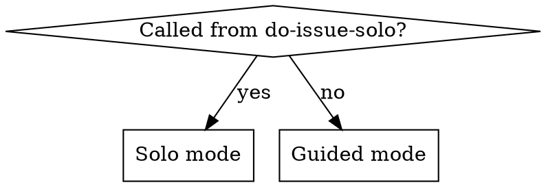
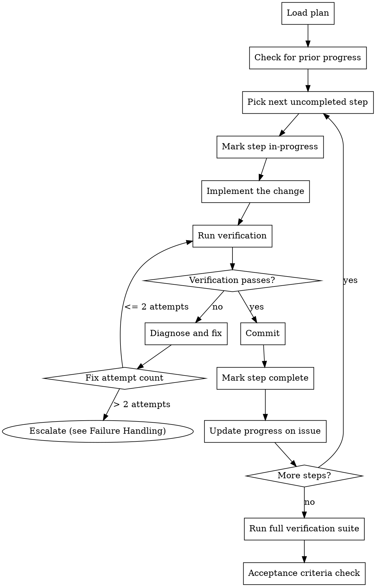
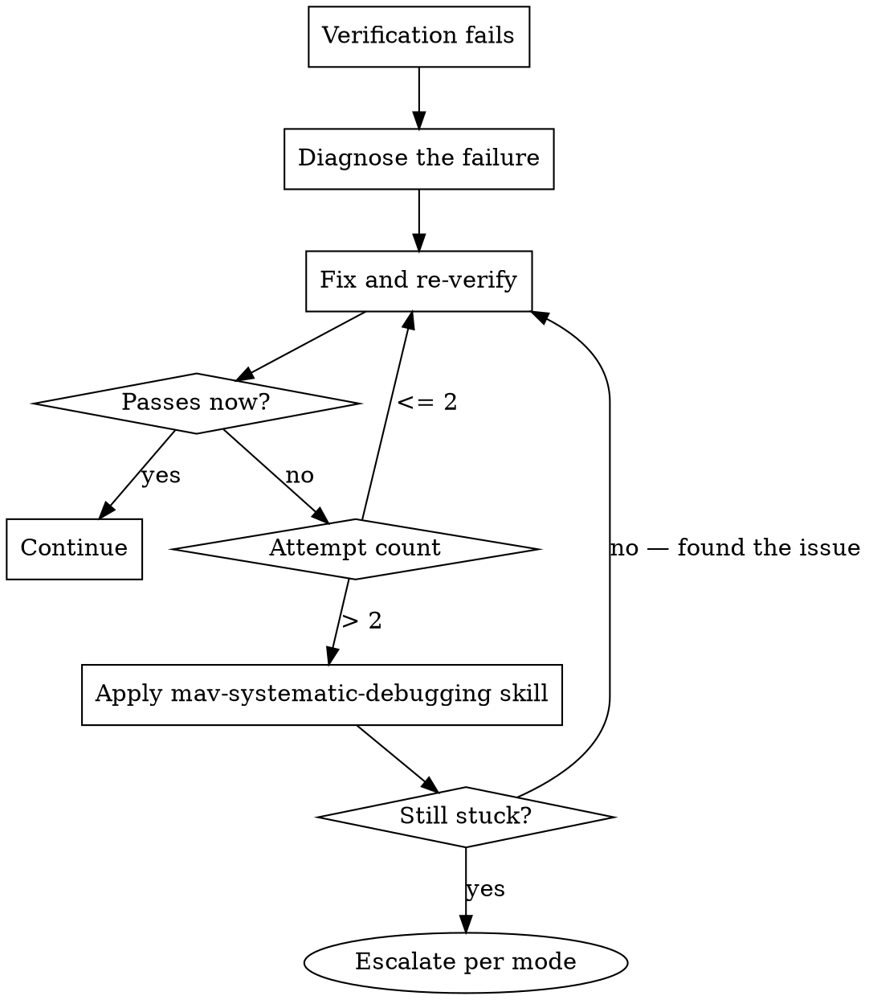

# Plan Execution

Execute an implementation plan step-by-step. Each step is implemented, verified, and committed before moving to the next. Progress is tracked persistently so it survives session loss.

## Execution Mode

This skill adapts its behaviour based on how it was invoked:

- **Solo mode** (called from do-issue-solo): work autonomously. Only pause when genuinely blocked or when the issue is ambiguous. Press through recoverable problems.
- **Guided mode** (called from do-issue-guided, or invoked standalone): provide checkpoints to the user. Pause when uncertain, report progress at natural break points.



## Execution Loop



### 1. Load the Plan

Read the implementation plan from one of:
- The plan comment on the GitHub issue (if working from do-issue)
- A TodoWrite task list (if working from a plan file)
- The plan document directly (if invoked standalone)

### 2. Check for Prior Progress

If resuming after a crash or new session, determine where to pick up:
- Read the plan comment and parse checkboxes (`- [x]` = done, `- [ ]` = pending)
- Cross-reference with `git log` — if commits exist for steps that aren't checked off, the comment update was lost. Check them off now.
- Resume from the first genuinely unchecked step.

```bash
# Read plan comment
REPO=$(jq -r '.repo' .claude/issue-state.json)
COMMENT_ID=$(jq -r '.comments.plan' .claude/issue-state.json)
gh api "repos/$REPO/issues/comments/$COMMENT_ID" --jq '.body'
```

### 3. Execute Each Step

For each step in the plan:

1. **Mark in-progress** — update TodoWrite or note which step you are on
2. **Implement** — make the change described in the step
3. **Verify** — run the verification command specified in the plan
4. **Fix if needed** — if verification fails, diagnose and fix (see Failure Handling)
5. **Commit** — descriptive message referencing the issue number, using conventional commits
6. **Mark complete** — update TodoWrite and the plan comment on the issue

Never batch multiple steps into one commit unless they are trivially related (e.g. a one-line change and its import).

### 4. Update Progress on GitHub Issue

After completing each step, update the plan comment to check off the step:

```bash
REPO=$(jq -r '.repo' .claude/issue-state.json)
COMMENT_ID=$(jq -r '.comments.plan' .claude/issue-state.json)

CURRENT_BODY=$(gh api "repos/$REPO/issues/comments/$COMMENT_ID" --jq '.body')
UPDATED_BODY=$(echo "$CURRENT_BODY" | sed 's/- \[ \] \*\*Step N:/- [x] **Step N:/')

gh api "repos/$REPO/issues/comments/$COMMENT_ID" \
  -X PATCH \
  -f body="$UPDATED_BODY"
```

This ensures progress survives session failures, VM loss, or subagent crashes.

### 5. Run Full Verification Suite

After all steps are complete, run the project's full verification suite:
- Lint
- Type checking
- All tests

Fix any issues found. Do not proceed to acceptance criteria with failing checks.

## Failure Handling



### Escalation by Mode

| Situation | Solo | Guided |
|---|---|---|
| Step fails after 2 fix attempts | Apply mav-systematic-debugging skill. If still stuck, ask user for help. | Ask user for help immediately. |
| Design assumption proves wrong | Reassess against the design. Adjust approach if confident. Only ask user if the change is fundamental. | Pause and discuss with user before adjusting. |
| External blocker (API down, missing dependency) | Document the blocker and ask user. | Document the blocker and ask user. |
| Unsure about implementation approach | Try the most likely approach. If it doesn't work, try the alternative. Ask user only as last resort. | Ask user which approach to take. |

### What NOT to Do

- **Do not skip a failing verification.** Fix it first.
- **Do not move to the next step with a broken codebase.** Each commit must leave the codebase working.
- **Do not silently change the design.** If the plan needs to change, update the plan comment and (in guided mode) inform the user.
- **Do not retry the same fix repeatedly.** If the same fix fails twice, the diagnosis is wrong. Step back and think differently.

## Guided Mode Checkpoints

In guided mode, provide brief progress checkpoints at natural break points:

- **After every 3-4 steps:** "Steps 1-4 complete. Moving to steps 5-8. Everything on track."
- **When something unexpected happens:** "Step 3 revealed that the API response format differs from what the design assumed. I've adjusted the parsing logic. Continuing."
- **After all steps complete:** "All 7 steps complete. Full verification suite passes. Ready for acceptance criteria check?"

Keep checkpoints brief — one or two sentences. Do not ask for approval to continue unless something went wrong.

## Acceptance Criteria Check

After all steps are complete and the full verification suite passes:

1. Re-read the original issue requirements
2. Walk through each acceptance criterion and confirm it is satisfied by the implementation
3. If any criterion is not met:
   - Identify what is missing
   - Add additional steps to address it
   - Execute those steps using the same loop above
4. Run the full verification suite again after any additions

Do not proceed to code review until every acceptance criterion is met and all checks pass.
