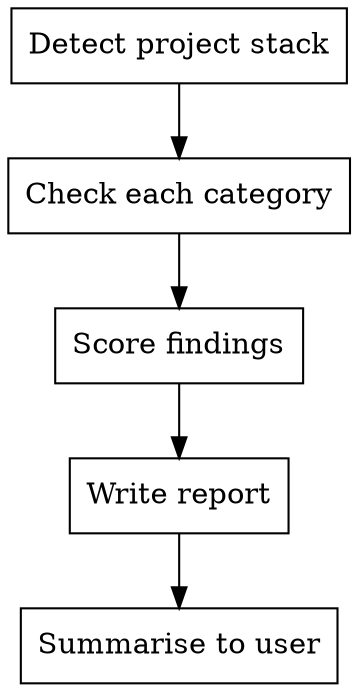

# Codebase Audit

Analyze the current project's codebase against Maverick standard practices and write a findings report to `docs/maverick-audit.md`.

## When to Run

- User invokes `/maverick:codebase-audit`
- May also be triggered automatically by the Maverick plugin when no `.maverick/` directory exists in the project root (first session in an uninitialised project)

## Process



### Step 1: Detect project stack

Identify the project type by checking for key files:

- `package.json` -> Node.js (check dependencies for react, fastify, etc.)
- `tsconfig.json` -> TypeScript
- `pyproject.toml` or `requirements.txt` -> Python
- `build.gradle.kts` -> Kotlin
- `Dockerfile` -> Docker

Record the detected stack for the report header.

**Monorepos:** If `workspaces` is defined in `package.json`, or `pnpm-workspace.yaml` / `nx.json` / `turbo.json` exists, treat the root config as the primary audit target. Note per-package gaps in the Details section but do not produce a separate report per package.

### Step 2: Check each category

Run the checks below in order. For each category, determine a status:

- **PASS** -- meets Maverick standards
- **WARN** -- partially meets standards, improvement needed
- **FAIL** -- does not meet standards

Record the evidence (file paths, dependency names, snippets) for each finding.

---

## Audit Categories

### 1. Linting

**Search for:**

| What              | Where to look                                                                                   |
| ----------------- | ----------------------------------------------------------------------------------------------- |
| ESLint config     | `.eslintrc*`, `eslint.config.*`                                                                 |
| Ruff config       | `[tool.ruff]` in `pyproject.toml`, `ruff.toml`, `.ruff.toml`                                    |
| Other linters     | `.flake8`, `.pylintrc`, `ktlint` in `build.gradle.kts`                                          |
| Linter dependency | `eslint` in `devDependencies`, `ruff`/`flake8`/`pylint` in Python deps                          |
| Lint script       | `"lint"` script in `package.json`, lint commands in `Makefile` or pyproject `[project.scripts]` |

**Scoring:**

| Status | Criteria                                                                                |
| ------ | --------------------------------------------------------------------------------------- |
| PASS   | Linter config exists AND linter is in dependencies AND a lint script/command is defined |
| WARN   | Linter is in dependencies but no config file or no lint script                          |
| FAIL   | No linter found in dependencies or config                                               |

### 2. Unit Tests

**Search for:**

| What        | Where to look                                                                                        |
| ----------- | ---------------------------------------------------------------------------------------------------- |
| Test files  | Glob: `**/*.test.ts`, `**/*.test.tsx`, `**/*.test.js`, `**/*.spec.*`, `**/test_*.py`, `**/*_test.py` |
| Test runner | `vitest`, `jest`, `mocha` in `devDependencies`; `pytest` in pyproject/requirements                   |
| Test script | `"test"` script in `package.json`; `[tool.pytest]` in `pyproject.toml`                               |

**Scoring:**

| Status | Criteria                                                                       |
| ------ | ------------------------------------------------------------------------------ |
| PASS   | Test files exist (3+) AND test runner is configured AND test script is defined |
| WARN   | Test files exist but no runner configured, or fewer than 3 test files          |
| FAIL   | No test files found                                                            |

**Additional detail:** Count the number of test files found and note their location pattern (co-located with source, or in a separate `tests/` directory).

### 3. Integration Tests

**Search for:**

| What                       | Where to look                                                                                    |
| -------------------------- | ------------------------------------------------------------------------------------------------ |
| Integration directories    | `tests/integration/`, `test/integration/`, `tests/e2e/`, `test/e2e/`, `e2e/`, `__integration__/` |
| Integration files          | `*.integration.test.*`, `*.integration.spec.*`, `*.e2e.test.*`, `*.e2e.spec.*`                   |
| Separation from unit tests | Integration tests in a distinct location from unit tests                                         |

**Scoring:**

| Status | Criteria                                                                |
| ------ | ----------------------------------------------------------------------- |
| PASS   | Dedicated integration or e2e test directory with test files inside      |
| WARN   | Files with integration/e2e in the name exist but no dedicated directory |
| FAIL   | No integration or e2e tests found                                       |

### 4. Documentation

**Search for:**

| What           | Where to look                                                                                |
| -------------- | -------------------------------------------------------------------------------------------- |
| README         | `README.md` at project root                                                                  |
| Docs directory | `docs/` directory with content                                                               |
| README quality | Read the README -- does it have more than 10 lines of meaningful content (not just a title)? |

**Scoring:**

| Status | Criteria                                                                                     |
| ------ | -------------------------------------------------------------------------------------------- |
| PASS   | README.md exists with meaningful content (10+ lines) AND `docs/` directory exists with files |
| WARN   | README.md exists but is minimal (under 10 lines), or no `docs/` directory                    |
| FAIL   | No README.md                                                                                 |

### 5. CI/CD

**Search for:**

| What             | Where to look                                                       |
| ---------------- | ------------------------------------------------------------------- |
| GitHub Actions   | `.github/workflows/*.yml` or `.github/workflows/*.yaml`             |
| Jenkins          | `Jenkinsfile`                                                       |
| Bitbucket        | `bitbucket-pipelines.yml`                                           |
| CircleCI         | `.circleci/config.yml`                                              |
| GitLab           | `.gitlab-ci.yml`                                                    |
| Pipeline content | Read the pipeline config -- does it run linting? Does it run tests? |

**Scoring:**

| Status | Criteria                                                                    |
| ------ | --------------------------------------------------------------------------- |
| PASS   | Pipeline config exists AND it runs both linting and tests                   |
| WARN   | Pipeline config exists but only runs one of linting/tests, or is incomplete |
| FAIL   | No pipeline configuration found                                             |

**Additional detail:** Note which CI/CD platform is used and what steps the pipeline runs.

---

## Step 3: Write the report

All scoring in Step 2 is based on the state of the project BEFORE this report is written. Creating the `docs/` directory for the report does not change the Documentation score.

Create `docs/maverick-audit.md` (create the `docs/` directory if it does not exist). Use this exact format:

```markdown
# Maverick Codebase Audit

**Project:** <project-name>
**Date:** <YYYY-MM-DD>
**Stack:** <detected stack, e.g. "Node.js, TypeScript, Vitest">

## Summary

| Category          | Status           | Finding            |
| ----------------- | ---------------- | ------------------ |
| Linting           | <PASS/WARN/FAIL> | <one-line summary> |
| Unit tests        | <PASS/WARN/FAIL> | <one-line summary> |
| Integration tests | <PASS/WARN/FAIL> | <one-line summary> |
| Documentation     | <PASS/WARN/FAIL> | <one-line summary> |
| CI/CD             | <PASS/WARN/FAIL> | <one-line summary> |

**Score: <N>/5 passing**

## Details

### Linting -- <STATUS>

<Evidence: config file paths, dependency names, script definitions>
<If WARN/FAIL: one-line recommendation>

### Unit Tests -- <STATUS>

<Evidence: number of test files, runner, script, file pattern>
<If WARN/FAIL: one-line recommendation>

### Integration Tests -- <STATUS>

<Evidence: directory/file paths found, or absence noted>
<If WARN/FAIL: one-line recommendation>

### Documentation -- <STATUS>

<Evidence: README line count, docs/ contents>
<If WARN/FAIL: one-line recommendation>

### CI/CD -- <STATUS>

<Evidence: platform, config file, steps found>
<If WARN/FAIL: one-line recommendation>

## Recommendations

<Numbered list of actionable recommendations for WARN and FAIL items only.
Each recommendation should be specific: what to create/change, where, and why.>
```

## Step 4: Summarise to user

After writing the report, print a brief summary:

- The score (e.g. "3/5 passing")
- Which categories are WARN or FAIL
- The path to the full report
